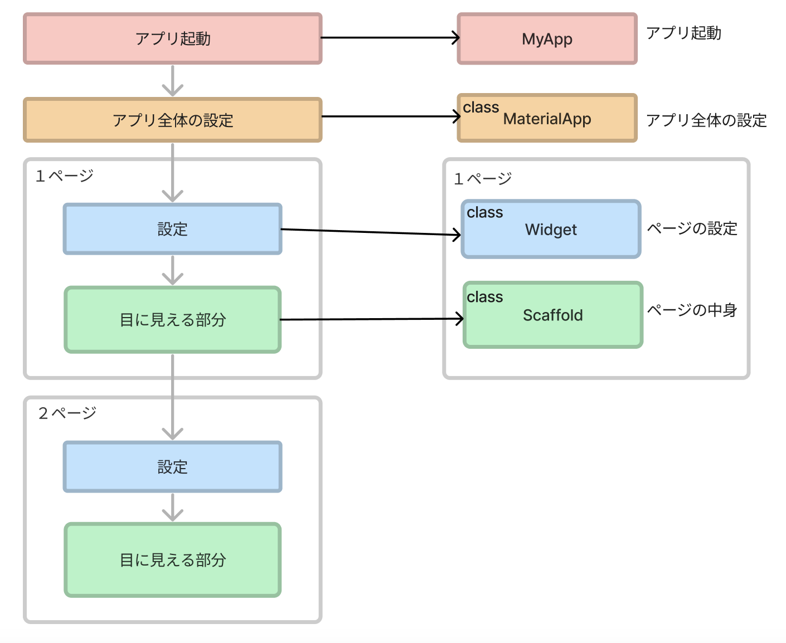

# **00_自己紹介アプリを作ろう**

widgetの練習として「自己紹介アプリ」を作ります。  
サンプルアプリを動かしてみよう。  
２ページ目は自由制作課題です。

<br>

https://webgakushu.com/flutter/profile/

<br>

## **プロジェクトを作る（復習）**

- VSCode>左下の歯車マーク＞設定＞コマンドパレット
- 検索＞flutterと入力＞「Flutter:New Project」＞「Application」
- 保存先を指定　src>projects
- アプリケーションの名前を「profile」に変更
- プロジェクトの完成
- lib>main.dartの中を全て削除　「Ctrl+A」の後、「backspace」

<br>

## **プロジェクトの構成**



<br>

## **演習**  

①上の図と下のソースコードを照らし合わせて構成を把握しよう 

プロジェクトを作ったら最初にやること  

②ソースコードをコピーしてmain.dartに貼り付けてベースを作る  
③アプリタイトルを設定  
④上のバー（appBar）に表示させるタイトルを設定  
⑤全体をCenterで中央揃えにする  
⑥実行してアプリを立ち上げる  

<br><br>

### **【ソースコード】**

```dart
// flutterパッケージを読み込み
import 'package:flutter/material.dart';

// アプリを起動
void main() => runApp(MyApp());

// アプリ全体の設定
class MyApp extends StatelessWidget {
  @override
  Widget build(BuildContext context) {
    return MaterialApp(
      // ★：③アプリタイトルを設定（ブラウザのタブに表示される）
      title: 'タイトル',
      theme: ThemeData(primarySwatch: Colors.blue),
      // ★：④上のバー（appBar）に表示させるタイトルを設定
      home: const MyHomePage(title: 'appBarタイトル'),
    );
  }
}

// MyHomePage の情報を入れるclass
class MyHomePage extends StatefulWidget {
  const MyHomePage({super.key, required this.title});
  final String title;

  @override
  State<MyHomePage> createState() => _MyHomePageState();
}

// MyHomePage の中身を入れるclass
class _MyHomePageState extends State<MyHomePage> {
  @override
  Widget build(BuildContext context) {
    return Scaffold(
      appBar: AppBar(
        title: Text(widget.title),
      ),
      body: Center(
        // ★：⑤全体をCenterで中央揃えに
        // ここにパーツ（Widget）を揃えていく
      ),
    );
  }
}

```

### **実行の仕方（復習）**  

- VSCode右下「No Device」をクリック （すでに実行している場合は「Chrome」などになっている）
- 上部で「Chrome」を選択
- 左側の上から４つ目のアイコン（▶︎に虫）をクリック
- 実行とデバックをクリック
  
