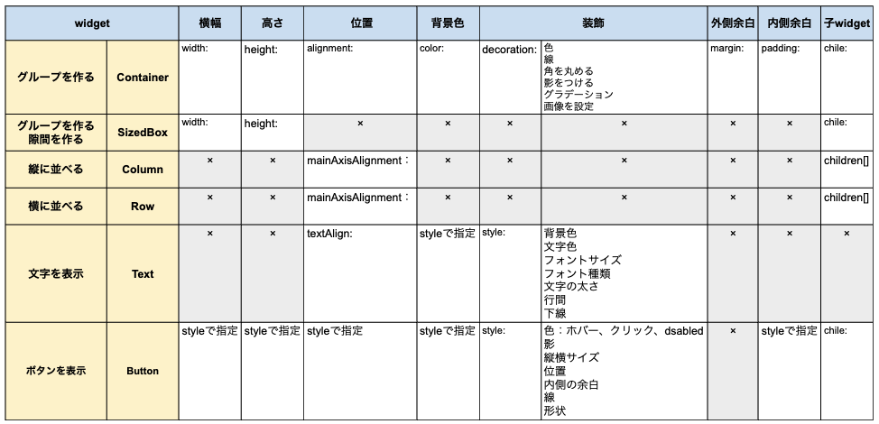

# **01_widgetの基本**

## **widgetを追加してみよう**

Widget（ウェジット）はFlutterのUIを構築しているパーツです。  
様々なWidgetを組み合わせることで複雑なUIを構築します。

 

※UI「User Interface（ユーザーインターフェイス）」・・・ユーザーとコンピューターの間で情報をやり取りするさまざまな機器や入力装置を指します。  
アプリのUIは、ボタン、入力フォーム、画像や文字、デザインなど画面に表示されるもの全般になります。

  

## **最初におさえておこう！**

- グループは「Container」
- 親子関係は「child:」
- 縦に並べるには「Column children」
- 横に並べるには「Row children」
- 間の余白は「SizedBox」
- 横幅・高さを指定できるのは「Container」「SizedBox」

 

## **`html/cssとwidgetの比較`**
コードの書き方はこれからの演習でやっていきます。まずはHTML/CSSとの違いをみてみましょう。

  
### **①「Container」（レイアウト/グループを作るwidget）**  

HTMLでグループを作るタグには`<header><nav><main><footer>
`などがありました。  
flutterでは`Container`widgetを使ってグループを作ります。

****

  

### **②「child:」widgetの中にwidgetを入れる（親子関係）**

widgetの中にwidgetを入れる場合は、中に入れる子のwidgetの前に`child:`をつけます。

  

### **③「Column」widgetを縦に並べる**

HTMLではタグを順番に書くだけで縦に配置できました。  
flutterでは`Column` widgetで囲う必要があります。

  

### **④「Row」widgetを横に並べる**

HTMLではCSSで「display:flex;」や「display:grid;」を使いました。  
flutterでは`Row` widgetを使います。

  

### **⑤「SizedBox」widgetとwidgetに余白を入れる** 

CSSの`margin`のような役割をしてくれるwidgetです

  

### **⑥「width」幅、「height」高さの指定（指定できるwidgetは限られている！）**

HTML/CSSではタグやクラス名を指定して幅・高さをつけることができました。  
flutterでは指定できるwidgetが限られています。  
例えば`Column`で縦に並べたwidgetに横幅・高さを指定したい場合、`Column`に直接指定することはできません。  

  

  

### **⑦widgetプロパティーまとめ**

これからの演習でよく使うWidgetプロパティ（状態・属性）をまとめています。  
「Column」「Row」のように`幅の指定やスタイルの指定ができないwidgetは「Container」で囲う`と覚えておきましょう。  
詳しい書き方はこれからの演習で勉強していきます。  

  

  
