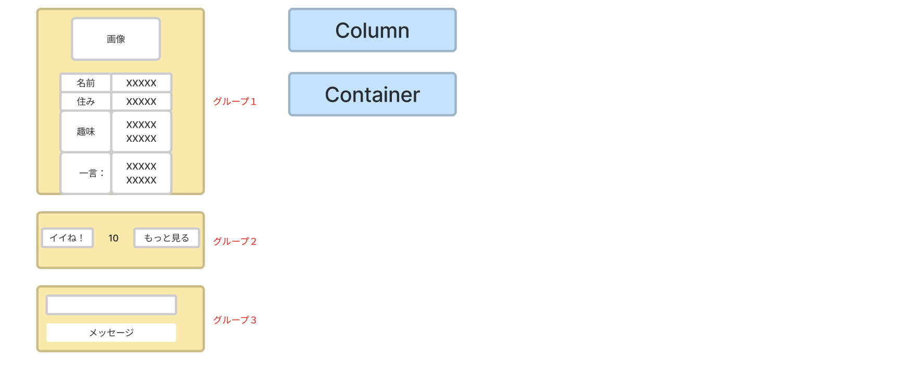
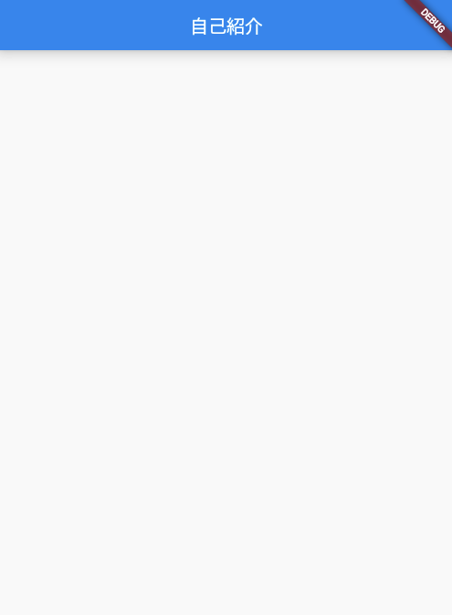

# **03_全体のグループを作る「Column」「Container」**

## **グループを作る**

<br>



<br><br>

## **実行結果** 

グループを作っただけなのでまだ何も表示されません  



<br><br>

## **演習** 

①Centerにchild:Columnを入れる  
②childrenにContainerを３つ入れる  

<br>

```dart
body: Center(
  child: Column(
    children: [
      //グループ１
      Container(),
      //グループ２
      Container(),
      //グループ３
      Container(),
    ],
  ),
),

```
### **【ソースコード】**

```dart
// flutterパッケージを読み込み
import 'package:flutter/material.dart';

// アプリを起動
void main() => runApp(MyApp());

// アプリ全体の設定
class MyApp extends StatelessWidget {
  @override
  Widget build(BuildContext context) {
    return MaterialApp(
      title: 'Profile',
      theme: ThemeData(primarySwatch: Colors.blue),
      home: const MyHomePage(title: '自己紹介'),
    );
  }
}

// MyHomePage の情報を入れるclass
class MyHomePage extends StatefulWidget {
  const MyHomePage({super.key, required this.title});
  final String title;

  @override
  State<MyHomePage> createState() => _MyHomePageState();
}

// MyHomePage の中身を入れるclass
class _MyHomePageState extends State<MyHomePage> {
  @override
  Widget build(BuildContext context) {
    return Scaffold(
      appBar: AppBar(
        title: Text(widget.title),
      ),
      body: Center(
        //①widgetの中にwidgetを入れるときは「child」をつける
        //Column children
        child: Column(
          children: [
            //②childrenの中にContainerを入れる
            //グループ１
            Container(),
            //グループ２
            Container(),
            //グループ３
            Container(),
          ],
        ),
      ),
    );
  }
}


```

