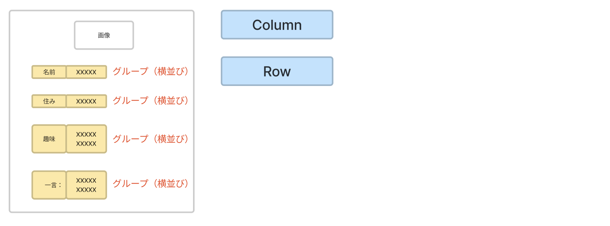

# **04_グループ1の中を作る「Row」**

## **グループを作る**

<br>



<br><br>

## **実行結果** 

グループを作っただけなのでまだ何も表示されません  


<br><br>

## **演習** 

①ContainerにColumnを入れる  

```dart
    //グループ１
    Container(
      child:Column(
        children:[

        ]
      )
    ),
```

②childrenにRowを入れる  

```dart
      //グループ１
      Container(
        child:Column(
          children:[
            Row(
              children:[

              ]
            ),
            Row(
              children:[
                
              ]
            ),
            Row(
              children:[
                
              ]
            ),
            Row(
              children:[
                
              ]
            ),
          ]
      ),
```
<br>

### **【ソースコード】**


```dart
// flutterパッケージを読み込み
import 'package:flutter/material.dart';

// アプリを起動
void main() => runApp(MyApp());

// アプリ全体の設定
class MyApp extends StatelessWidget {
  @override
  Widget build(BuildContext context) {
    return MaterialApp(
      title: 'Profile',
      theme: ThemeData(primarySwatch: Colors.blue),
      home: const MyHomePage(title: '自己紹介'),
    );
  }
}

// MyHomePage の情報を入れるclass
class MyHomePage extends StatefulWidget {
  const MyHomePage({super.key, required this.title});
  final String title;

  @override
  State<MyHomePage> createState() => _MyHomePageState();
}

// MyHomePage の中身を入れるclass
class _MyHomePageState extends State<MyHomePage> {
  @override
  Widget build(BuildContext context) {
    return Scaffold(
      appBar: AppBar(
        centerTitle: true,
        backgroundColor: Colors.blue,
        title: Text(widget.title),
      ),
      body: Center(
        child: Column(
          children: [
            //グループ１
            Container(
              //①ContainerにColumnを入れる
              child:Column(
                children:[
                  //②childrenにRowを入れる 
                  Row(
                    children:[

                    ]
                  ),
                  Row(
                    children:[
                      
                    ]
                  ),
                  Row(
                    children:[
                      
                    ]
                  ),
                  Row(
                    children:[
                      
                    ]
                  ),
                ]
              )
            ),
            //グループ２
            Container(),
            //グループ３
            Container(),
          ],
        ),
      ),
    );
  }
}


```
