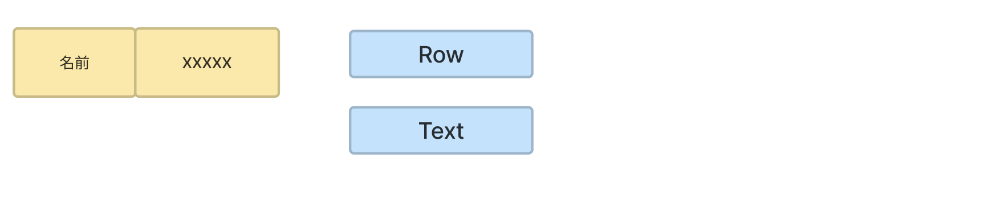
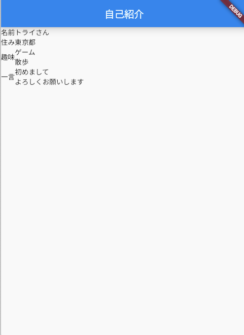

# **05_文字を表示「Text」**

## **文字を入れよう！**

文字を横並びに配置しよう  

<br>



<br><br>

## **実行結果** 



<br><br>

## **演習** 

①RowにTextを入れる  
②実行結果を見て２〜４個目のRowにTextを入れる  
③改行したい箇所に「\n」を入れる

```dart
      //グループ１
      Container(
        child:Columun(
          children:[
            Row(
              children:[
                Text("名前"),
                Text("自分の名前"),
              ]
            ),
            Row(
              children:[
                //②実行結果を見ていれよう
              ]
            )
            Row(
              children:[
                //②実行結果を見ていれよう　改行する場合は「\n」を入れよう
              ]
            )
            Row(
              children:[
                //②実行結果を見ていれよう　改行する場合は「\n」を入れよう
              ]
            )
          ]
        )
      ),
```

<br>

### **【ソースコード】**

```dart
// flutterパッケージを読み込み
import 'package:flutter/material.dart';

// アプリを起動
void main() => runApp(MyApp());

// アプリ全体の設定
class MyApp extends StatelessWidget {
  @override
  Widget build(BuildContext context) {
    return MaterialApp(
      title: 'Profile',
      theme: ThemeData(primarySwatch: Colors.blue),
      home: const MyHomePage(title: '自己紹介'),
    );
  }
}

// MyHomePage の情報を入れるclass
class MyHomePage extends StatefulWidget {
  const MyHomePage({super.key, required this.title});
  final String title;

  @override
  State<MyHomePage> createState() => _MyHomePageState();
}

// MyHomePage の中身を入れるclass
class _MyHomePageState extends State<MyHomePage> {
  @override
  Widget build(BuildContext context) {
    return Scaffold(
      appBar: AppBar(
        title: Text(widget.title),
      ),
      body: Center(
        child: Column(
          children: [
            //グループ１
            Container(
              child:Column(
                children:[
                  Row(
                    children:[
                      Text("名前"),
                      Text("トライさん"),
                    ]
                  ),
                  Row(
                    children:[
                      Text("住み"),
                      Text("東京都"),                      
                    ]
                  ),
                  Row(
                    children:[
                      Text("趣味"),
                      Text("ゲーム\n散歩"),                                            
                    ]
                  ),
                  Row(
                    children:[
                      Text("一言"),
                      Text("初めまして\nよろしくお願いします"),                                                                  
                    ]
                  ),
                ]
              )
            ),
            //グループ２
            Container(),
            //グループ３
            Container(),
          ],
        ),
      ),
    );
  }
}


```

