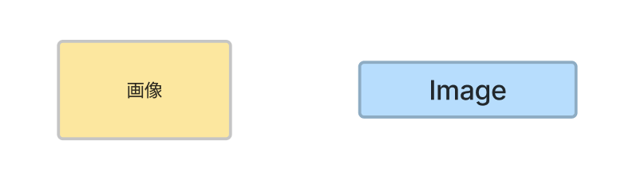
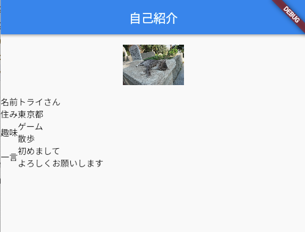
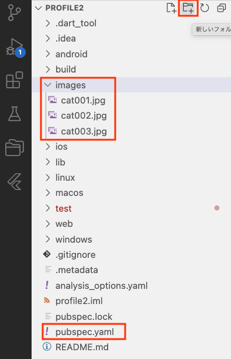
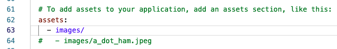
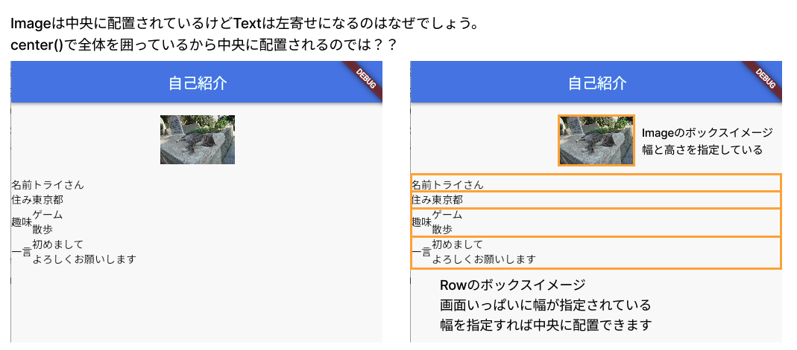

# **06_画像を入れよう**



## **実行結果**
 

<br>


## **演習** 
### **画像の準備**
①画像をアップロード  
「profile」フォルダの下に「images」フォルダを作成  
その中に使いたい画像を入れる  
教材フォルダ＞演習画像

 

<br>

②「pubspec.yaml」の設定  
一番下（flutter ブロックの中）のコメントアウトを外し、以下に修正

```dart
assets:
  - images/
```

  

③imageを追加

```dart
  Image.asset(
    "images/cat001.jpg",
    width: 100,
    height: 100,
  ),
```

<br>

## **よくある質問** 



### **【ソースコード】**


```dart
// flutterパッケージを読み込み
import 'package:flutter/material.dart';

// アプリを起動
void main() => runApp(MyApp());

// アプリ全体の設定
class MyApp extends StatelessWidget {
  @override
  Widget build(BuildContext context) {
    return MaterialApp(
      title: 'Profile',
      theme: ThemeData(primarySwatch: Colors.blue),
      home: const MyHomePage(title: '自己紹介'),
    );
  }
}

// MyHomePage の情報を入れるclass
class MyHomePage extends StatefulWidget {
  const MyHomePage({super.key, required this.title});
  final String title;

  @override
  State<MyHomePage> createState() => _MyHomePageState();
}

// MyHomePage の中身を入れるclass
class _MyHomePageState extends State<MyHomePage> {
  @override
  Widget build(BuildContext context) {
    return Scaffold(
      appBar: AppBar(
        title: Text(widget.title),
      ),
      body: Center(
        child: Column(
          children: [
            //グループ１
            Container(
              child:Column(
                children:[
                  //③画像を入れる
                  Image.asset(
                    "images/cat001.jpg",
                    width: 100,
                    height: 100,
                  ),
                  Row(
                    children:[
                      Text("名前"),
                      Text("トライさん"),
                    ]
                  ),
                  Row(
                    children:[
                      Text("住み"),
                      Text("東京都"),                      
                    ]
                  ),
                  Row(
                    children:[
                      Text("趣味"),
                      Text("ゲーム\n散歩"),                                            
                    ]
                  ),
                  Row(
                    children:[
                      Text("一言"),
                      Text("初めまして\nよろしくお願いします"),                                                                  
                    ]
                  ),
                ]
              )
            ),
            //グループ２
            Container(),
            //グループ３
            Container(),
          ],
        ),
      ),
    );
  }
}

```
