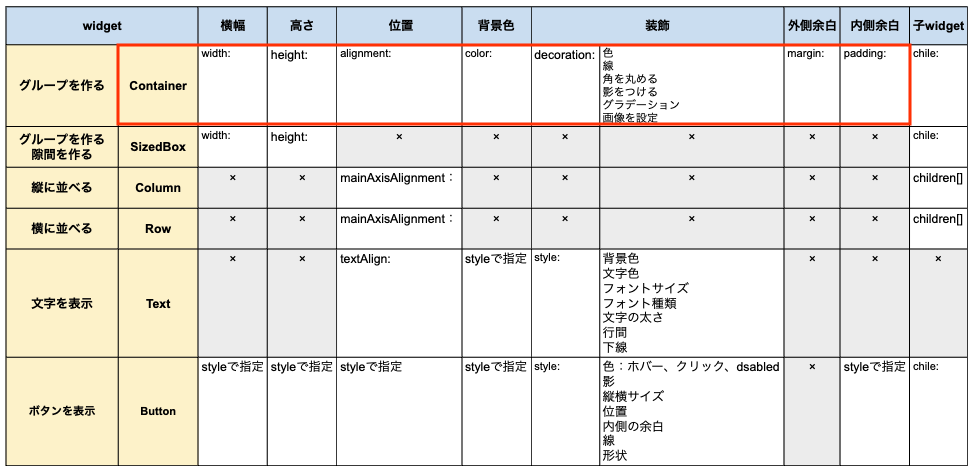
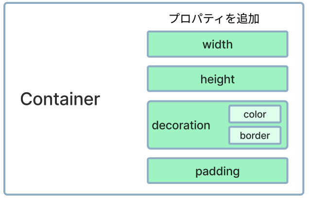
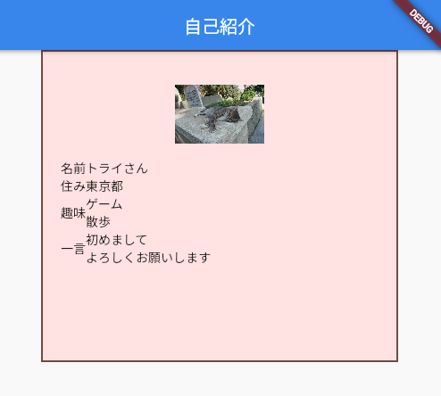

# **07_プロパティを追加しよう**

## **幅、高さ、色、線、余白をつけよう**

widgetによって追加できるプロパティ（状態・属性）が異なります。  
幅や高さの指定、装飾をしたい場合は「Container」Widgetを使いましょう。  



<br>

Containerにプロパティーを追加してwidgetを装飾しよう  



<br>

## **実行結果** 



<br>

## **演習** 

①幅と高さをつける  
②背景色と線をつける  
③内側の余白をつける

自由に値を書き換えて表示を確認してみよう！！

<br>

```dart
  //グループ１
  Container(
    //①幅と高さをつける
    width: 400,
    height: 350,
    //②背景色と線をつける
    decoration: BoxDecoration(
      color: const Color.fromARGB(255, 255, 229, 229),
      border: Border.all(color: Colors.brown, width: 2),
    ),
    //③内側の余白をつける
    padding: EdgeInsets.all(20),
    child: Column(children: [
      <省略>
    ])
  ),

```

### **【ソースコード】**


```dart
// flutterパッケージを読み込み
import 'package:flutter/material.dart';

// アプリを起動
void main() => runApp(MyApp());

// アプリ全体の設定
class MyApp extends StatelessWidget {
  @override
  Widget build(BuildContext context) {
    return MaterialApp(
      title: 'Profile',
      theme: ThemeData(primarySwatch: Colors.blue),
      home: const MyHomePage(title: '自己紹介'),
    );
  }
}

// MyHomePage の情報を入れるclass
class MyHomePage extends StatefulWidget {
  const MyHomePage({super.key, required this.title});
  final String title;

  @override
  State<MyHomePage> createState() => _MyHomePageState();
}

// MyHomePage の中身を入れるclass
class _MyHomePageState extends State<MyHomePage> {
  @override
  Widget build(BuildContext context) {
    return Scaffold(
      appBar: AppBar(
        title: Text(widget.title),
      ),
      body: Center(
        child: Column(
          children: [
            //グループ１
            Container(
              //①幅と高さをつける
              width: 400,
              height: 350,
              //②背景色と線をつける
              decoration: BoxDecoration(
                color: const Color.fromARGB(255, 255, 229, 229),
                border: Border.all(color: Colors.brown, width: 2),
              ),
              //③内側の余白をつける
              padding: EdgeInsets.all(20),
              child:Column(
                children:[
                  Image.asset(
                    "images/cat001.jpg",
                    width: 100,
                    height: 100,
                  ),
                  Row(
                    children:[
                      Text("名前"),
                      Text("トライさん"),
                    ]
                  ),
                  Row(
                    children:[
                      Text("住み"),
                      Text("東京都"),                      
                    ]
                  ),
                  Row(
                    children:[
                      Text("趣味"),
                      Text("ゲーム\n散歩"),                                            
                    ]
                  ),
                  Row(
                    children:[
                      Text("一言"),
                      Text("初めまして\nよろしくお願いします"),                                                                  
                    ]
                  ),
                ]
              )
            ),
            //グループ２
            Container(),
            //グループ３
            Container(),
          ],
        ),
      ),
    );
  }
}

```
