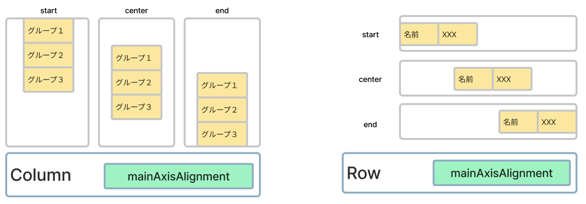
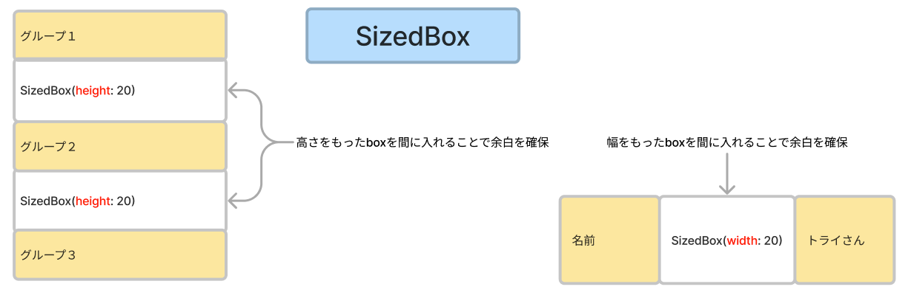
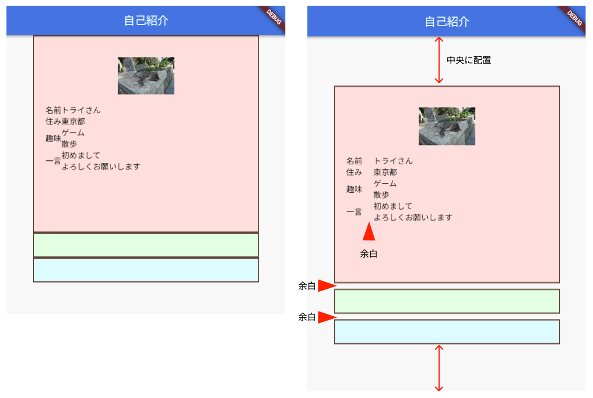
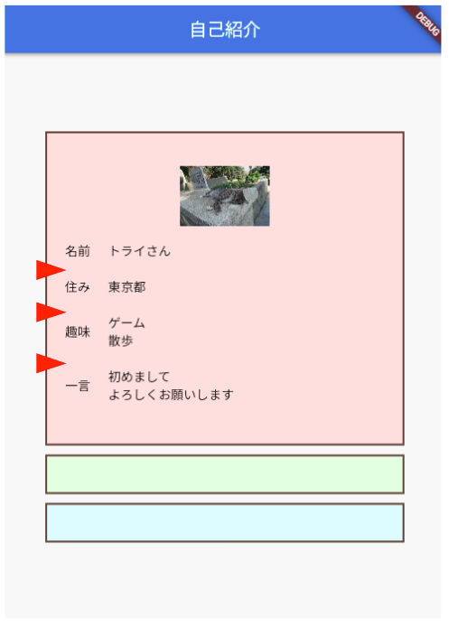

# **09_配置と余白**

## **位置あわせ**

 

<br>

## **外側の余白**

 

## **実行結果** 

 

<br>

## **演習** 

①全体を真ん中に表示  Columnとchildrenの間に書く 

```dart
  child: Column(
    mainAxisAlignment: MainAxisAlignment.center,
    children: [
      <省略>
    ],
  ),
```

Rowの中でも使える  
今回のアプリでは追加しない  
参考

```dart
  Row(
    mainAxisAlignment: MainAxisAlignment.start,
    children: [
    ],
  ),
```

<br>

②グループとグループの間の余白をつける  

<br>

```dart

  child: Column(
    mainAxisAlignment: MainAxisAlignment.center,
    children: [
      //グループ１
      Container(
        <省略>
      ),
      //余白
      SizedBox(height: 10),
      //グループ２
      Container(
        <省略>
      ),
      //余白
      SizedBox(height: 10),
      //グループ３
      Container(
        <省略>
      ),
    ]
  )  
```
<br>

③見出しと内容の間に余白をつける

<br>

```dart

  Row(
    children: [
      Text("名前"),
      //余白
      SizedBox(width: 20),
      Text("トライさん"),
    ]
  ),
  Row(children: [
      Text("住み"),
      //余白
      SizedBox(width: 20),
      Text("東京都"),
    ]
  ),
  Row(children: [
      Text("趣味"),
      //余白
      SizedBox(width: 20),
      Text("ゲーム\n散歩"),
    ]
  ),
  Row(children: [
      Text("一言"),
      //余白
      SizedBox(width: 20),
      Text("初めまして\nよろしくお願いします"),
    ]
  ),
```
<br>

④下の結果となるように余白を追加しよう  

「名前」と「住み」の間に余白（サイズ20）  
「住み」と「趣味」の間に余白（サイズ20）  
「趣味」と「一言」の間に余白（サイズ20）  


 


### **mainAxisAlignment**

|  種別  |  内容 |
| :----: | :----: |
|  center  |  中央寄せ  |
|  start  | Column:上寄せ Row:左寄せ  |
|  end  |  Column:下寄せ Row:右寄せ  |
|  spaceAround  |  先頭の子要素の前、末尾の子要素の後にスペースを空ける  |
|  spaceBetween  |  子要素の間に均等なスペースを空ける  |
|  spaceEvenly  |  先頭の子要素の前、末尾の子要素の後、または子要素の間に均等なスペース空ける  |


<br><br>

### **【ソースコード】**


```dart
// flutterパッケージを読み込み
import 'package:flutter/material.dart';

// アプリを起動
void main() => runApp(MyApp());

// アプリ全体の設定
class MyApp extends StatelessWidget {
  @override
  Widget build(BuildContext context) {
    return MaterialApp(
      title: 'Profile',
      theme: ThemeData(primarySwatch: Colors.blue),
      home: const MyHomePage(title: '自己紹介'),
    );
  }
}

// MyHomePage の情報を入れるclass
class MyHomePage extends StatefulWidget {
  const MyHomePage({super.key, required this.title});
  final String title;

  @override
  State<MyHomePage> createState() => _MyHomePageState();
}

// MyHomePage の中身を入れるclass
class _MyHomePageState extends State<MyHomePage> {
  @override
  Widget build(BuildContext context) {
    return Scaffold(
      appBar: AppBar(
        title: Text(widget.title),
      ),
      body: Center(
        child: Column(
          //①中央に配置
          mainAxisAlignment: MainAxisAlignment.center,
          children: [
            //グループ１
            Container(
                width: 400,
                height: 350,
                decoration: BoxDecoration(
                  color: const Color.fromARGB(255, 255, 229, 229),
                  border: Border.all(color: Colors.brown, width: 2),
                ),
                padding: EdgeInsets.all(20),
                child: Column(children: [
                  Image.asset(
                    "images/cat001.jpg",
                    width: 100,
                    height: 100,
                  ),
                  Row(children: [
                    Text("名前"),
                    SizedBox(width: 20),  //②余白
                    Text("トライさん"),
                  ]),
                  SizedBox(height: 20),  //③余白
                  Row(children: [
                    Text("住み"),
                    SizedBox(width: 20),  //②余白
                    Text("東京都"),
                  ]),
                  SizedBox(height: 20),  //③余白
                  Row(children: [
                    Text("趣味"),
                    SizedBox(width: 20),  //②余白
                    Text("ゲーム\n散歩"),
                  ]),
                  SizedBox(height: 20),  //③余白
                  Row(children: [
                    Text("一言"),
                    SizedBox(width: 20),  //②余白
                    Text("初めまして\nよろしくお願いします"),
                  ]),
                ])
            ),
            //②余白
            SizedBox(height: 10),
            //グループ２
            Container(
              width: 400,
              decoration: BoxDecoration(
                color: Color.fromARGB(255, 238, 255, 229),
                border: Border.all(color: Colors.brown, width: 2),
              ),
              padding: EdgeInsets.all(20),
            ),
            //②余白
            SizedBox(height: 10),
            //グループ３
            Container(
              width: 400,
              decoration: BoxDecoration(
                color: Color.fromARGB(255, 229, 254, 255),
                border: Border.all(color: Colors.brown, width: 2),
              ),
              padding: EdgeInsets.all(20),
            ),
          ],
        ),
      ),
    );
  }
}


```
