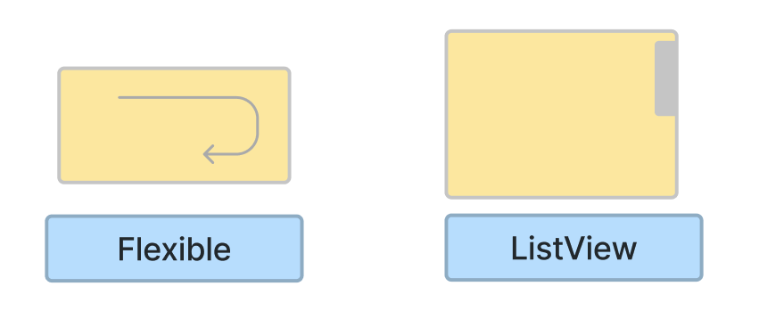
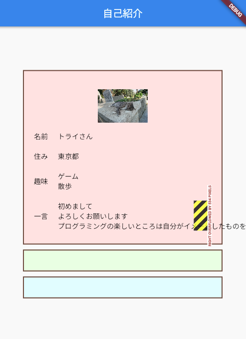
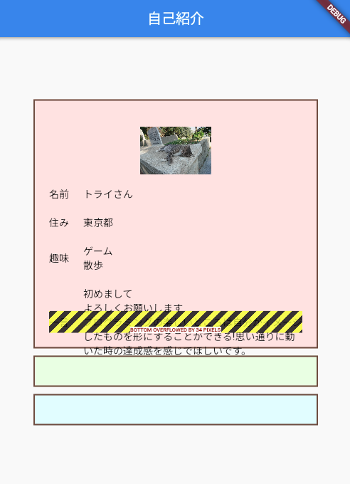
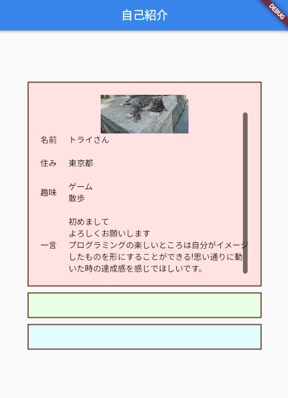

# **10_要素がはみ出さないようにする**

 

## **演習**

「一言」の文章を長くしてみましょう  
下のコードはコピーしてよいです。

```dart
  Row(children: [
    Text("一言"),
    SizedBox(width: 20),
    Text(
        "初めまして\nよろしくお願いします\nプログラミングの楽しいところは自分がイメージしたものを形にすることができる!思い通りに動いた時の達成感を感じでほしいです。"),
    ]
  )
```

 

 右側がはみ出てしまいエラーになっています。`Text`widgetは自動で折り返してくれません。  

①TextをFlexibleで囲う  

```dart
  Row(children: [
    Text("一言"),
    SizedBox(width: 20),
    Flexible(
      child:Text(
          "初めまして\nよろしくお願いします\nプログラミングの楽しいところは自分がイメージしたものを形にすることができる!思い通りに動いた時の達成感を感じでほしいです。"),
    ),
    ]
  )
```

 

折り返すことはできたけど今度は下がはみ出してエラーになります。  
スクロールできるようにしよう。  

②ColumnをListViewに変更

```dart
  //グループ１
  Container(
    <省略>
    child: ListView(
      children: [
        <省略>
      ]
    )
  ),  
```

 

<br><br>

### **【ソースコード】**

```dart
// flutterパッケージを読み込み
import 'package:flutter/material.dart';

// アプリを起動
void main() => runApp(MyApp());

// アプリ全体の設定
class MyApp extends StatelessWidget {
  @override
  Widget build(BuildContext context) {
    return MaterialApp(
      title: 'Profile',
      theme: ThemeData(primarySwatch: Colors.blue),
      home: const MyHomePage(title: '自己紹介'),
    );
  }
}

// MyHomePage の情報を入れるclass
class MyHomePage extends StatefulWidget {
  const MyHomePage({super.key, required this.title});
  final String title;

  @override
  State<MyHomePage> createState() => _MyHomePageState();
}

// MyHomePage の中身を入れるclass
class _MyHomePageState extends State<MyHomePage> {
  @override
  Widget build(BuildContext context) {
    return Scaffold(
      appBar: AppBar(
        title: Text(widget.title),
      ),
      body: Center(
        child: Column(
          mainAxisAlignment: MainAxisAlignment.center,
          children: [
            //グループ１
            Container(
              width: 400,
              height: 350,
              decoration: BoxDecoration(
                color: const Color.fromARGB(255, 255, 229, 229),
                border: Border.all(color: Colors.brown, width: 2),
              ),
              padding: EdgeInsets.all(20),
              //②Column→ListView
              child: ListView(
                children: [
                  Image.asset(
                    "images/cat001.jpg",
                    width: 100,
                    height: 100,
                  ),
                  Row(children: [
                    Text("名前"),
                    SizedBox(width: 20),
                    Text("トライさん"),
                  ]),
                  SizedBox(height: 20),
                  Row(children: [
                    Text("住み"),
                    SizedBox(width: 20),
                    Text("東京都"),
                  ]),
                  SizedBox(height: 20),
                  Row(children: [
                    Text("趣味"),
                    SizedBox(width: 20),
                    Text("ゲーム\n散歩"),
                  ]),
                  SizedBox(height: 20),
                  Row(children: [
                    Text("一言"),
                    SizedBox(width: 20),
                    //①TextをFlexibleで囲う
                    Flexible(
                      child: Text(
                          "初めまして\nよろしくお願いします\nプログラミングの楽しいところは自分がイメージしたものを形にすることができる!思い通りに動いた時の達成感を感じでほしいです。"),
                    ),
                  ]),
                ]
              )
            ),
            SizedBox(height: 10),
            //グループ２
            Container(
              width: 400,
              decoration: BoxDecoration(
                color: Color.fromARGB(255, 238, 255, 229),
                border: Border.all(color: Colors.brown, width: 2),
              ),
              padding: EdgeInsets.all(20),
            ),
            SizedBox(height: 10),
            //グループ３
            Container(
              width: 400,
              decoration: BoxDecoration(
                color: Color.fromARGB(255, 229, 254, 255),
                border: Border.all(color: Colors.brown, width: 2),
              ),
              padding: EdgeInsets.all(20),
            ),
          ],
        ),
      ),
    );
  }
}


```
