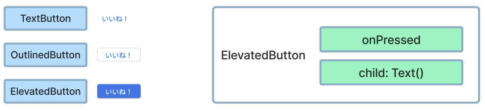
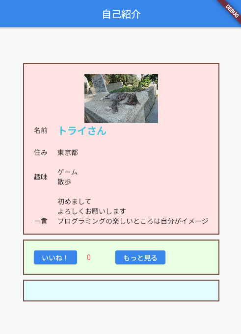
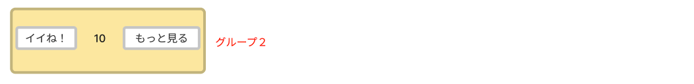

# **12_ボタンを追加**

## **ボタンを作ろう**
<br><br>

ボタンの種類
  

<br><br>

## **実行結果**

  

<br><br>


## **演習**

<br>

グループ２にボタンとテキストを横並びに配置しよう

 

①まずは横並びのグループを作る  
  どこに何widgetを追加したらよいだろう  
  まずは自分で考えてみよう！

<br><br><br>

　
```dart
  //グループ２
  Container(
    width: 400,
    padding: EdgeInsets.all(20),
    decoration: BoxDecoration(
      color: Color.fromARGB(255, 238, 255, 229),
      border: Border.all(color: Colors.brown, width: 2),
    ),
    //横並びのwidget
    child: Row(
      children: [
      
      ],
    )
  ),
```

②ElevatedButtonと横の余白を追加  

```Dart
//グループ２
  Container(
    width: 400,
    padding: EdgeInsets.all(20),
    decoration: BoxDecoration(
      color: Color.fromARGB(255, 238, 255, 229),
      border: Border.all(color: Colors.brown, width: 2),
    ),
    child: Row(
      children: [
        //②「いいね」ボタンを追加
        ElevatedButton(
          onPressed: () {
            //ボタンを押した時の処理をここに書きます
          },
          child: Text('いいね！'),
        ),
        SizedBox(width: 20),  //余白
      ],
    )
  ),
```

③カウントテキストと横の余白を追加　　

```Dart
//グループ２
  Container(
    width: 400,
    padding: EdgeInsets.all(20),
    decoration: BoxDecoration(
      color: Color.fromARGB(255, 238, 255, 229),
      border: Border.all(color: Colors.brown, width: 2),
    ),
    child: Row(
      children: [
        ElevatedButton(
          onPressed: () {
            //ボタンを押した時の処理をここに書きます
          },
          child: Text('いいね！'),
        ),
        SizedBox(width: 20),
        //③カウントテキストを追加
        Text(
          "0",
          style: TextStyle(color: Colors.red[400]),
        ),
        SizedBox(width: 50),  //余白
      ],
    )
  ),
```

④「もっと見る」ボタンを追加　　

```Dart
  //グループ２
  Container(
    width: 400,
    padding: EdgeInsets.all(20),
    decoration: BoxDecoration(
      color: Color.fromARGB(255, 238, 255, 229),
      border: Border.all(color: Colors.brown, width: 2),
    ),
    child: Row(
      children: [
        ElevatedButton(
          onPressed: () {
            //ボタンを押した時の処理をここに書きます
          },
          child: Text('いいね！'),
        ),
        SizedBox(width: 20),
        Text(
          "0",
          style: TextStyle(color: Colors.red[400]),
        ),
        SizedBox(width: 50),
        //④「もっと見る」ボタンを追加
        ElevatedButton(
          onPressed: () {
            //ボタンを押した時の処理をここに書きます
          },
          child: Text('もっと見る'),
        ),
      ],
    )
  ),
```

<br>

### **【ソースコード】**

```dart
// flutterパッケージを読み込み
import 'package:flutter/material.dart';

// アプリを起動
void main() => runApp(MyApp());

// アプリ全体の設定
class MyApp extends StatelessWidget {
  @override
  Widget build(BuildContext context) {
    return MaterialApp(
      title: 'Profile',
      theme: ThemeData(primarySwatch: Colors.blue),
      home: const MyHomePage(title: '自己紹介'),
    );
  }
}

// MyHomePage の情報を入れるclass
class MyHomePage extends StatefulWidget {
  const MyHomePage({super.key, required this.title});
  final String title;

  @override
  State<MyHomePage> createState() => _MyHomePageState();
}

// MyHomePage の中身を入れるclass
class _MyHomePageState extends State<MyHomePage> {
  @override
  Widget build(BuildContext context) {
    return Scaffold(
      appBar: AppBar(
        title: Text(widget.title),
      ),
      body: Center(
        child: Column(
          mainAxisAlignment: MainAxisAlignment.center,
          children: [
            //グループ１
            Container(
                width: 400,
                height: 350,
                decoration: BoxDecoration(
                  color: const Color.fromARGB(255, 255, 229, 229),
                  border: Border.all(color: Colors.brown, width: 2),
                ),
                padding: EdgeInsets.all(20),
                child: ListView(children: [
                  Image.asset(
                    "images/cat001.jpg",
                    width: 100,
                    height: 100,
                  ),
                  Row(children: [
                    Text("名前"),
                    SizedBox(width: 20),
                    Text(
                      "トライさん",
                      style: TextStyle(
                        fontSize: 20,
                        color: Colors.cyan[300],
                        fontWeight: FontWeight.bold,
                      ),
                    ),
                  ]),
                  SizedBox(height: 20),
                  Row(children: [
                    Text("住み"),
                    SizedBox(width: 20),
                    Text("東京都"),
                  ]),
                  SizedBox(height: 20),
                  Row(children: [
                    Text("趣味"),
                    SizedBox(width: 20),
                    Text("ゲーム\n散歩"),
                  ]),
                  SizedBox(height: 20),
                  Row(children: [
                    Text("一言"),
                    SizedBox(width: 20),
                    Flexible(
                      child: Text(
                          "初めまして\nよろしくお願いします\nプログラミングの楽しいところは自分がイメージしたものを形にすることができる!思い通りに動いた時の達成感を感じでほしいです。"),
                    ),
                  ]),
                ])),
            SizedBox(height: 10),
            //グループ２
            Container(
                width: 400,
                padding: EdgeInsets.all(20),
                decoration: BoxDecoration(
                  color: Color.fromARGB(255, 238, 255, 229),
                  border: Border.all(color: Colors.brown, width: 2),
                ),
                child: Row(
                  children: [
                    //②いいねボタン追加
                    ElevatedButton(
                      onPressed: () {

                      },
                      child: Text('いいね！'),
                    ),
                    SizedBox(width: 20),  //余白
                    //③カウントテキスト追加
                    Text(
                      "0",
                      style: TextStyle(color: Colors.red[400]),
                    ),
                    SizedBox(width: 50),  //余白
                    //④もっと見るボタン追加
                    ElevatedButton(
                      onPressed: () {
                        
                      },
                      child: Text('もっと見る'),
                    ),
                  ],
                )),
            SizedBox(height: 10),
            //グループ３
            Container(
              width: 400,
              decoration: BoxDecoration(
                color: Color.fromARGB(255, 229, 254, 255),
                border: Border.all(color: Colors.brown, width: 2),
              ),
              padding: EdgeInsets.all(20),
            ),
          ],
        ),
      ),
    );
  }
}


```
