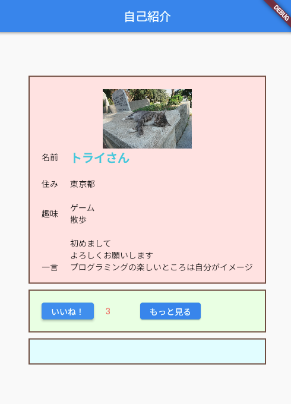

# **13_ボタンを押した時の処理**

## **いいねボタンの処理**

<br>

  

<br><br>
## **実行結果**

  

<br><br>

## **演習**

<br>

①変数goodを作り、初期値の0を入れる  

```dart
// MyHomePage の中身を入れるclass
class _MyHomePageState extends State<MyHomePage> {
  //①変数good追加
  var good = 0;

  @override
  Widget build(BuildContext context) {
    return Scaffold(
      appBar: AppBar(
        title: Text(widget.title),
      ),
      body: Center(
        <省略>
      ),
    );
  }
}
```

②onPressedの中に「いいね！」が押されたら1追加する処理を追加  
③いいねの数を表示

```dart
  child: Row(
    children: [
      ElevatedButton(
        onPressed: () {
          //②setStateの中でgoodに１を足す
          setState(() {
            good++;
          });
        },
        child: Text('いいね！'),
      ),
      SizedBox(width: 20),
      Text(
        //③good変数の値を表示
        "$good",
        style: TextStyle(color: Colors.red[400]),
      ),
      SizedBox(width: 50),
      ElevatedButton(
        onPressed: () {
          
        },
        child: Text('もっと見る'),
      ),
    ],
  ),
```  

<br>


### **【ソースコード】**

```dart
// flutterパッケージを読み込み
import 'package:flutter/material.dart';

// アプリを起動
void main() => runApp(MyApp());

// アプリ全体の設定
class MyApp extends StatelessWidget {
  @override
  Widget build(BuildContext context) {
    return MaterialApp(
      title: 'Profile',
      theme: ThemeData(primarySwatch: Colors.blue),
      home: const MyHomePage(title: '自己紹介'),
    );
  }
}

// MyHomePage の情報を入れるclass
class MyHomePage extends StatefulWidget {
  const MyHomePage({super.key, required this.title});
  final String title;

  @override
  State<MyHomePage> createState() => _MyHomePageState();
}

// MyHomePage の中身を入れるclass
class _MyHomePageState extends State<MyHomePage> {
  //①変数good追加
  var good = 0;

  @override
  Widget build(BuildContext context) {
    return Scaffold(
      appBar: AppBar(
        centerTitle: true,
        backgroundColor: Colors.blue,
        title: Text(widget.title),
      ),
      body: Center(
        child: Column(
          mainAxisAlignment: MainAxisAlignment.center,
          children: [
            //グループ１
            Container(
                width: 400,
                height: 350,
                decoration: BoxDecoration(
                  color: const Color.fromARGB(255, 255, 229, 229),
                  border: Border.all(color: Colors.brown, width: 2),
                ),
                padding: EdgeInsets.all(20),
                child: ListView(children: [
                  Image.asset(
                    "images/cat001.jpg",
                    width: 100,
                    height: 100,
                  ),
                  Row(children: [
                    Text("名前"),
                    SizedBox(width: 20),
                    Text(
                      "トライさん",
                      style: TextStyle(
                        fontSize: 20,
                        color: Colors.cyan[300],
                        fontWeight: FontWeight.bold,
                      ),
                    ),
                  ]),
                  SizedBox(height: 20),
                  Row(children: [
                    Text("住み"),
                    SizedBox(width: 20),
                    Text("東京都"),
                  ]),
                  SizedBox(height: 20),
                  Row(children: [
                    Text("趣味"),
                    SizedBox(width: 20),
                    Text("ゲーム\n散歩"),
                  ]),
                  SizedBox(height: 20),
                  Row(children: [
                    Text("一言"),
                    SizedBox(width: 20),
                    Flexible(
                      child: Text(
                          "初めまして\nよろしくお願いします\nプログラミングの楽しいところは自分がイメージしたものを形にすることができる!思い通りに動いた時の達成感を感じでほしいです。"),
                    ),
                  ]),
                ])),
            SizedBox(height: 10),
            //グループ２
            Container(
                width: 400,
                padding: EdgeInsets.all(20),
                decoration: BoxDecoration(
                  color: Color.fromARGB(255, 238, 255, 229),
                  border: Border.all(color: Colors.brown, width: 2),
                ),
                child: Row(
                  children: [
                    ElevatedButton(
                      onPressed: () {
                        //②setStateの中でgoodに１を足す
                        setState(() {
                          good++;
                        });
                      },
                      child: Text('いいね！'),
                    ),
                    SizedBox(width: 20),
                    Text(
                      //③good変数の値を表示
                      "${good}",
                      style: TextStyle(color: Colors.red[400]),
                    ),
                    SizedBox(width: 50),
                    ElevatedButton(
                      onPressed: () {},
                      child: Text('もっと見る'),
                    ),
                  ],
                )),
            SizedBox(height: 10),
            //グループ３
            Container(
              width: 400,
              padding: EdgeInsets.all(20),
              decoration: BoxDecoration(
                color: Color.fromARGB(255, 229, 254, 255),
                border: Border.all(color: Colors.brown, width: 2),
              ),
            ),
          ],
        ),
      ),
    );
  }
}


```
