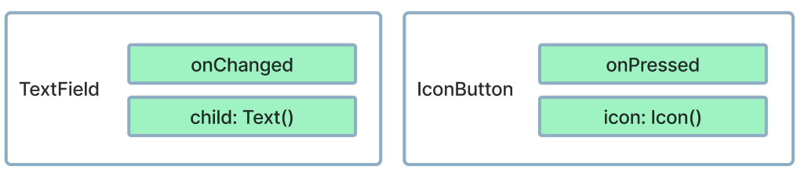
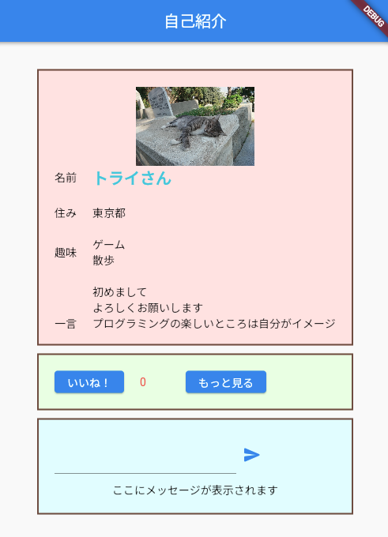
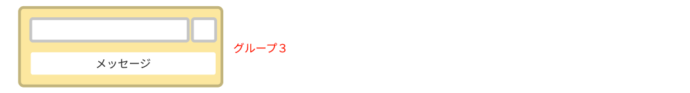
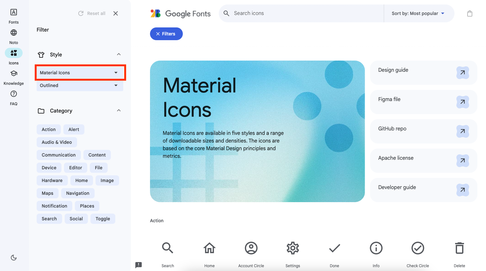
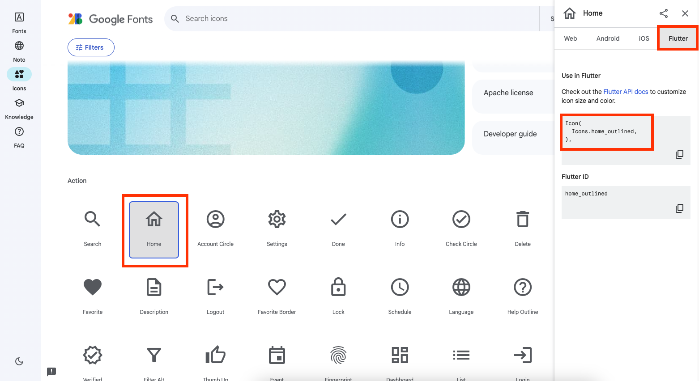

# **14_メッセージ入力**

## **メッセージ入力をつくろう**

 

<br>

## **実行結果**

 

## **演習**

グループ３にテキストエリアと送信アイコンを横並び、その下にメッセージ表示を配置しよう

①まずはグループを作る　　

 

どこに何widgetを追加したらよいだろう  
  まずは自分で考えてみよう！

<br><br><br>

```dart
  //グループ３
  Container(
    width: 400,
    padding: EdgeInsets.all(20),
    decoration: BoxDecoration(
      color: Color.fromARGB(255, 229, 254, 255),
      border: Border.all(color: Colors.brown, width: 2),
    ),
    child: Column(
      children: [
        Row(
          children: [
            //入力エリア
            //アイコンボタン
          ],
        ),
        //メッセージ表示
      ],
    ),
  ),

```

 ②Containerで横幅を指定し中にTextFieldを追加  
 ③送信アイコンを追加  

```dart

  child: Column(
    children: [
      Row(
        children: [
          //②幅をつけるためにContainerをつける
          Container(
            width: 230,
            //②入力エリアを作る
            child: TextField(
              onChanged: (String value) {
              },
              maxLines: 2,
              minLines: 1,
            ),
          ),
          //③アイコンボタンをつける
          IconButton(
            icon: Icon(
              Icons.send_rounded,
              color: Colors.blue,
            ),
            onPressed: () {

            },
          ),
        ],
      ),
    ],
  ),

```

 ④メッセージ表示を追加  

```dart
child: Column(
    children: [
      Row(
        children: [
          Container(
            width: 230,
            child: TextField(
              onChanged: (String value) {
              },
              maxLines: 2,
              minLines: 1,
            ),
          ),
          IconButton(
            icon: Icon(
              Icons.send,
              color: Colors.blue,
            ),
            onPressed: () {

            },
          ),
        ],
      ),
      SizedBox(height: 10), //余白
      //④メッセージ表示
      Text("ここにメッセージが表示されます"),
    ],
  ),
```
<br><br>

### **アイコンボタンの探し方**

Material Lcons(Google Font icons)を組み込むことができます  

https://fonts.google.com/icons

 
 

設置したい部分にコードを貼り付けるだけでOK

<br>

### **【ソースコード】**

```dart
// flutterパッケージを読み込み
import 'package:flutter/material.dart';

// アプリを起動
void main() => runApp(MyApp());

// アプリ全体の設定
class MyApp extends StatelessWidget {
  @override
  Widget build(BuildContext context) {
    return MaterialApp(
      title: 'Profile',
      theme: ThemeData(primarySwatch: Colors.blue),
      home: const MyHomePage(title: '自己紹介'),
    );
  }
}

// MyHomePage の情報を入れるclass
class MyHomePage extends StatefulWidget {
  const MyHomePage({super.key, required this.title});
  final String title;

  @override
  State<MyHomePage> createState() => _MyHomePageState();
}

// MyHomePage の中身を入れるclass
class _MyHomePageState extends State<MyHomePage> {
  var good = 0;

  @override
  Widget build(BuildContext context) {
    return Scaffold(
      appBar: AppBar(
        title: Text(widget.title),
      ),
      body: Center(
        child: Column(
          mainAxisAlignment: MainAxisAlignment.center,
          children: [
            //グループ１
            Container(
                width: 400,
                height: 350,
                decoration: BoxDecoration(
                  color: const Color.fromARGB(255, 255, 229, 229),
                  border: Border.all(color: Colors.brown, width: 2),
                ),
                padding: EdgeInsets.all(20),
                child: ListView(children: [
                  Image.asset(
                    "images/cat001.jpg",
                    width: 100,
                    height: 100,
                  ),
                  Row(children: [
                    Text("名前"),
                    SizedBox(width: 20),
                    Text(
                      "トライさん",
                      style: TextStyle(
                        fontSize: 20,
                        color: Colors.cyan[300],
                        fontWeight: FontWeight.bold,
                      ),
                    ),
                  ]),
                  SizedBox(height: 20),
                  Row(children: [
                    Text("住み"),
                    SizedBox(width: 20),
                    Text("東京都"),
                  ]),
                  SizedBox(height: 20),
                  Row(children: [
                    Text("趣味"),
                    SizedBox(width: 20),
                    Text("ゲーム\n散歩"),
                  ]),
                  SizedBox(height: 20),
                  Row(children: [
                    Text("一言"),
                    SizedBox(width: 20),
                    Flexible(
                      child: Text(
                          "初めまして\nよろしくお願いします\nプログラミングの楽しいところは自分がイメージしたものを形にすることができる!思い通りに動いた時の達成感を感じでほしいです。"),
                    ),
                  ]),
                ])),
            SizedBox(height: 10),
            //グループ２
            Container(
                width: 400,
                padding: EdgeInsets.all(20),
                decoration: BoxDecoration(
                  color: Color.fromARGB(255, 238, 255, 229),
                  border: Border.all(color: Colors.brown, width: 2),
                ),
                child: Row(
                  children: [
                    ElevatedButton(
                      onPressed: () {
                        setState(() {
                          good++;
                        });
                      },
                      child: Text('いいね！'),
                    ),
                    SizedBox(width: 20),
                    Text(
                      "${good}",
                      style: TextStyle(color: Colors.red[400]),
                    ),
                    SizedBox(width: 50),
                    ElevatedButton(
                      onPressed: () {},
                      child: Text('もっと見る'),
                    ),
                  ],
                )),
            SizedBox(height: 10),
            //グループ３
            Container(
              width: 400,
              padding: EdgeInsets.all(20),
              decoration: BoxDecoration(
                color: Color.fromARGB(255, 229, 254, 255),
                border: Border.all(color: Colors.brown, width: 2),
              ),
              //①グループを作る
              child: Column(
                children: [
                  Row(
                    children: [
                      //②幅をつけるためにContainerをつける
                      Container(
                        width: 230,
                        //②入力エリアを作る
                        child: TextField(
                          onChanged: (String value) {},
                          maxLines: 2,
                          minLines: 1,
                        ),
                      ),
                      //③アイコンボタンをつける
                      IconButton(
                        icon: Icon(
                          Icons.send,
                          color: Colors.blue,
                        ),
                        onPressed: () {},
                      ),
                    ],
                  ),
                  SizedBox(height: 10),
                  //④メッセージ表示
                  Text("ここにメッセージが表示されます"),
                ],
              ),
            ),
          ],
        ),
      ),
    );
  }
}


```
