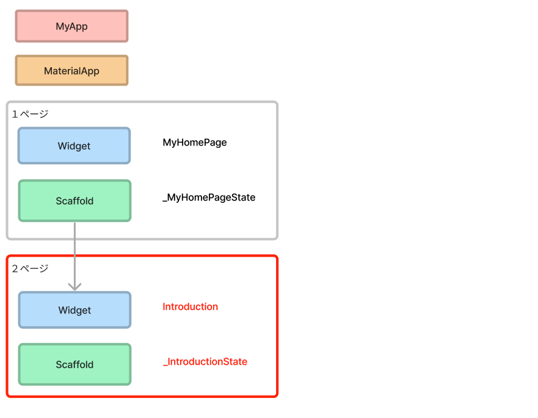
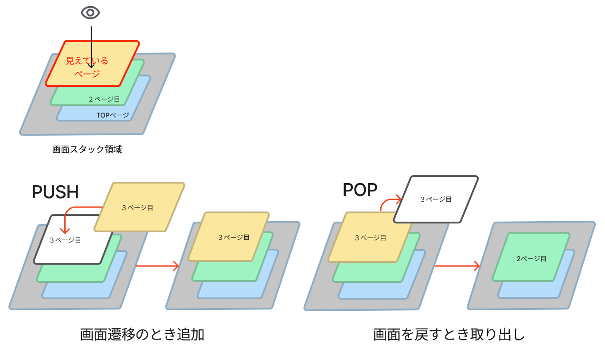
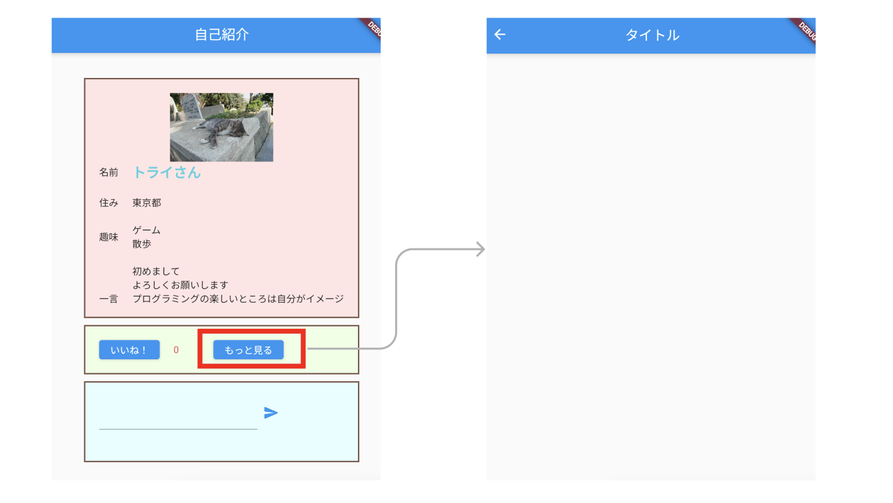

# **17_画面遷移と２ページ目**

## **２ページ目を作る**



<br><br>

## **実行結果**

変化なし
<br>

## **演習**


①２ページ目のベースを作る  
まずは下のベースコードをコピーしよう  

```dart

class MyHomePage extends StatefulWidget {
  const MyHomePage({super.key});
  @override
  State<MyHomePage> createState() => _MyHomePageState();
}
class _MyHomePageState extends State<MyHomePage> {
  @override
  Widget build(BuildContext context) {
    return Scaffold(
      appBar: AppBar(
        centerTitle: true,
        backgroundColor: Colors.blue,
        title: Text("タイトル"),
      ),
      body: Center(),
    );
  }
}
```

<br>

②「MyHomePage」の文字の部分を全て２ページ目のページ名に変更する  
ページ名「Introduction」  
Cntl + F（command + F）で「MyHomePage」を検索してから修正しよう  

```dart

class Introduction extends StatefulWidget {
  const Introduction({super.key});

  @override
  State<Introduction> createState() => _IntroductionState();
}

class _IntroductionState extends State<Introduction> {
  @override
  Widget build(BuildContext context) {
    return Scaffold(
      appBar: AppBar(
        title: Text("タイトル"),
      ),
      body: Center(      
        
      ),
    );
  }
}
```

## **画面遷移の仕組み**

画面のスタック領域に画面情報が重なり合っているイメージをしてみよう  
画面遷移（次のページに移る）は画面情報を重ねることで見ている情報が変わります  
PUSH・・・スタック領域に画面情報を入れる  
POP・・・スタック領域から画面情報を取り出す  



<br>

## **実行結果**



<br>

## **演習**

③１ページ目から２ページ目へ

```dart
  ElevatedButton(
    onPressed: () {
      //③次のページをPUSH
      Navigator.of(context).push(
        MaterialPageRoute(
          builder: (context) {
            return Introduction();
          },
        ),
      );
    },
    child: Text('もっと見る'),
  ),
```

<br>

### **【ソースコード】**

```dart
// flutterパッケージを読み込み
import 'package:flutter/material.dart';

// アプリを起動
void main() => runApp(MyApp());

// アプリ全体の設定
class MyApp extends StatelessWidget {
  @override
  Widget build(BuildContext context) {
    return MaterialApp(
      title: 'Profile',
      theme: ThemeData(primarySwatch: Colors.blue),
      home: const MyHomePage(title: '自己紹介'),
    );
  }
}

// MyHomePage の情報を入れるclass
class MyHomePage extends StatefulWidget {
  const MyHomePage({super.key, required this.title});
  final String title;

  @override
  State<MyHomePage> createState() => _MyHomePageState();
}

// MyHomePage の中身を入れるclass
class _MyHomePageState extends State<MyHomePage> {
  var good = 0;
  var text = "";
  final messageTextController = TextEditingController();

  @override
  Widget build(BuildContext context) {
    return Scaffold(
      appBar: AppBar(
        centerTitle: true,
        backgroundColor: Colors.blue,
        title: Text(widget.title),
      ),
      body: Center(
        child: Column(
          mainAxisAlignment: MainAxisAlignment.center,
          children: [
            //グループ１
            Container(
                width: 400,
                height: 350,
                decoration: BoxDecoration(
                  color: const Color.fromARGB(255, 255, 229, 229),
                  border: Border.all(color: Colors.brown, width: 2),
                ),
                padding: EdgeInsets.all(20),
                child: ListView(children: [
                  Image.asset(
                    "images/cat001.jpg",
                    width: 100,
                    height: 100,
                  ),
                  Row(children: [
                    Text("名前"),
                    SizedBox(width: 20),
                    Text(
                      "トライさん",
                      style: TextStyle(
                        fontSize: 20,
                        color: Colors.cyan[300],
                        fontWeight: FontWeight.bold,
                      ),
                    ),
                  ]),
                  SizedBox(height: 20),
                  Row(children: [
                    Text("住み"),
                    SizedBox(width: 20),
                    Text("東京都"),
                  ]),
                  SizedBox(height: 20),
                  Row(children: [
                    Text("趣味"),
                    SizedBox(width: 20),
                    Text("ゲーム\n散歩"),
                  ]),
                  SizedBox(height: 20),
                  Row(children: [
                    Text("一言"),
                    SizedBox(width: 20),
                    Flexible(
                      child: Text(
                          "初めまして\nよろしくお願いします\nプログラミングの楽しいところは自分がイメージしたものを形にすることができる!思い通りに動いた時の達成感を感じでほしいです。"),
                    ),
                  ]),
                ])),
            SizedBox(height: 10),
            //グループ２
            Container(
                width: 400,
                padding: EdgeInsets.all(20),
                decoration: BoxDecoration(
                  color: Color.fromARGB(255, 238, 255, 229),
                  border: Border.all(color: Colors.brown, width: 2),
                ),
                child: Row(
                  children: [
                    ElevatedButton(
                      onPressed: () {
                        setState(() {
                          good++;
                        });
                      },
                      child: Text('いいね！'),
                    ),
                    SizedBox(width: 20),
                    Text(
                      "${good}",
                      style: TextStyle(color: Colors.red[400]),
                    ),
                    SizedBox(width: 50),
                    ElevatedButton(
                      onPressed: () {
                        //③次のページをPUSH
                        Navigator.of(context).push(
                          MaterialPageRoute(
                            builder: (context) {
                              return Introduction();
                            },
                          ),
                        );
                      },
                      child: Text('もっと見る'),
                    ),
                  ],
                )),
            SizedBox(height: 10),
            //グループ３
            Container(
              width: 400,
              padding: EdgeInsets.all(20),
              decoration: BoxDecoration(
                color: Color.fromARGB(255, 229, 254, 255),
                border: Border.all(color: Colors.brown, width: 2),
              ),
              child: Column(
                children: [
                  Row(
                    children: [
                      Container(
                        width: 230,
                        child: TextField(
                          controller: messageTextController,
                          onChanged: (String value) {
                            text = value;
                          },
                          maxLines: 2,
                          minLines: 1,
                        ),
                      ),
                      IconButton(
                        icon: Icon(
                          Icons.send_rounded,
                          color: Colors.blue,
                        ),
                        onPressed: () {
                          messageTextController.clear();
                          setState(() {},);
                        },
                      ),
                    ],
                  ),
                  SizedBox(height: 10),
                  Text("$text"),
                ],
              ),
            ),
          ],
        ),
      ),
    );
  }
}

class Introduction extends StatefulWidget {
  const Introduction({super.key});

  @override
  State<Introduction> createState() => _IntroductionState();
}

class _IntroductionState extends State<Introduction> {
  @override
  Widget build(BuildContext context) {
    return Scaffold(
      appBar: AppBar(
        title: Text("タイトル"),
      ),
      body: Center(),
    );
  }
}


```
