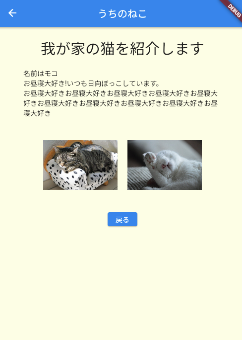

# **19_２ページ目を作ろう**

## **２ページ目を自由に作ろう！！**

いろいろなwidgetを使って、自由に作ってみよう  

まずはじめにグループを考えよう！

課題で扱ったwidgetをコピーしてもOK  

検索して調べてもOK 　

    

どうしたらよいか迷う場合はヒントをみて進めてみよう

|  ヒント  |    |
| :----: | :----: |
|  グループを考えよう | Column  Row |
|  文字を表示しよう | Text |
|  画像を表示しよう | Image |
|  幅や高さを指定しよう | Container width height |
|  背景色やテキストのデザイン | Container decoration |

   

