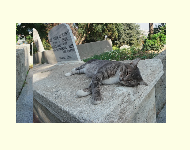

# **21_簡単なスライダー**


## **ライブラリを使ってみよう！**

「carousel_slider」ライブラリを使ってみよう  
ライブラリとは・・・よく使う機能を「部品」にして、簡単に使えるようにしたもの

<br>
【公式】  
https://qiita.com/yamaguchi_slj/items/82b5aa4d31cb89507c72
<br>

### **ライブラリの準備**

①pubspec.yamlにライブラリ追加

```dart

dependencies:
  flutter:
    sdk: flutter
  flutter_animate:
  carousel_slider: ^4.2.1　←ここ追加

```

インデントを合わせる  
[carousel_slider: ^4.2.1]の上に他のライブラリが指定されていることもあります

②「carousel_slider」をインポート

```dart
import 'package:carousel_slider/carousel_slider.dart';
```

importでエラーになる場合は、VSCode ターミナルに下記を打ってエンター
```dart
  flutter pub get
```

③スライダーを入れたい場所に設置
（使用例のようにcontainerに入れると使いやすい！！）

```
  CarouselSlider(
    items: [
      //スライドさせたいものをカンマ区切りで追加
      <widget①>,
      <widget②>,
      <widget③>,
    ],
    options: CarouselOptions(
      height: 300,//高さ
      initialPage: 0,//最初に表示されるページ
      autoPlay: true,//自動でスライドしてくれるか
      viewportFraction: 0.6,//各カードの表示される範囲の割合
      enableInfiniteScroll: true,//最後のカードから最初のカードへの遷移
      autoPlayInterval: Duration(seconds: 1),//カードのインターバル
      autoPlayAnimationDuration: Duration(milliseconds: 800),//スライドが始まって終わるまでの時間
    ),
  ),
```

使用例  

スライドが１つの画像  


```dart

//Containerに入れて横幅指定
Container(
  width: 150, //横幅指定（画像の幅に合わせる）
  child: CarouselSlider(
    items: [
      Image.asset(
        "images/cat001.jpg",
        width: 150,
        height: 150,
      ),
      Image.asset(
        "images/cat001.jpg",
        width: 150,
        height: 150,
      ),
      Image.asset(
        "images/cat001.jpg",
        width: 150,
        height: 150,
      ),
    ],
    options: CarouselOptions(
      height: 150, //高さ（画像に合わせる）
      initialPage: 0,
      autoPlay: true,
      viewportFraction: 1, //真ん中の画像が横幅いっぱい（１がmax）
      enableInfiniteScroll: true,
      autoPlayInterval: Duration(seconds: 1),
      autoPlayAnimationDuration:
      Duration(milliseconds: 800),
    ),
  ),
),

```

左右の画像が見えるバージョン  


```dart

Container(
  width: 300, //横幅指定
  child: CarouselSlider(
    items: [
      Image.asset(
        "images/cat001.jpg",
        width: 150,
        height: 150,
      ),
      Image.asset(
        "images/cat001.jpg",
        width: 150,
        height: 150,
      ),
      Image.asset(
        "images/cat001.jpg",
        width: 150,
        height: 150,
      ),
    ],
    options: CarouselOptions(
      height: 150,
      initialPage: 0,
      autoPlay: true,
      viewportFraction: 0.6, //真ん中の画像が横幅の6割
      enableInfiniteScroll: true,
      autoPlayInterval: Duration(seconds: 1),
      autoPlayAnimationDuration:
      Duration(milliseconds: 800),
    ),
  ),
),

```
