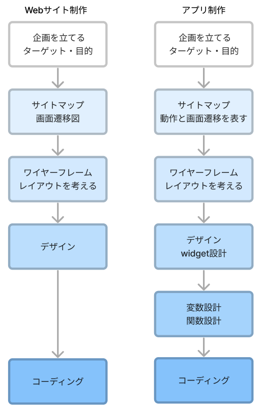
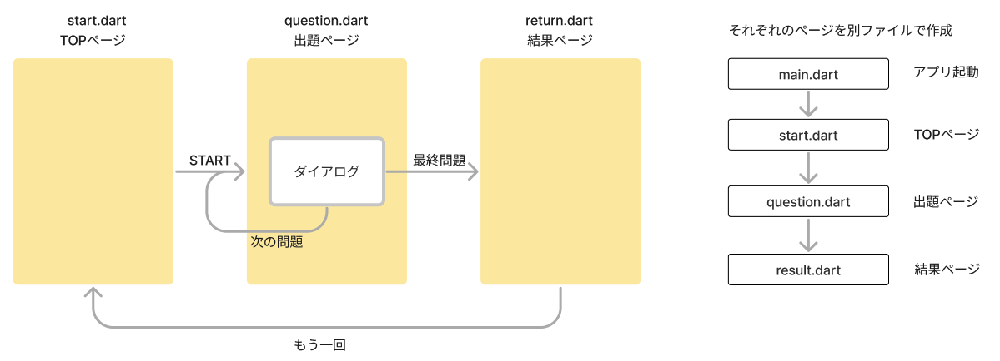
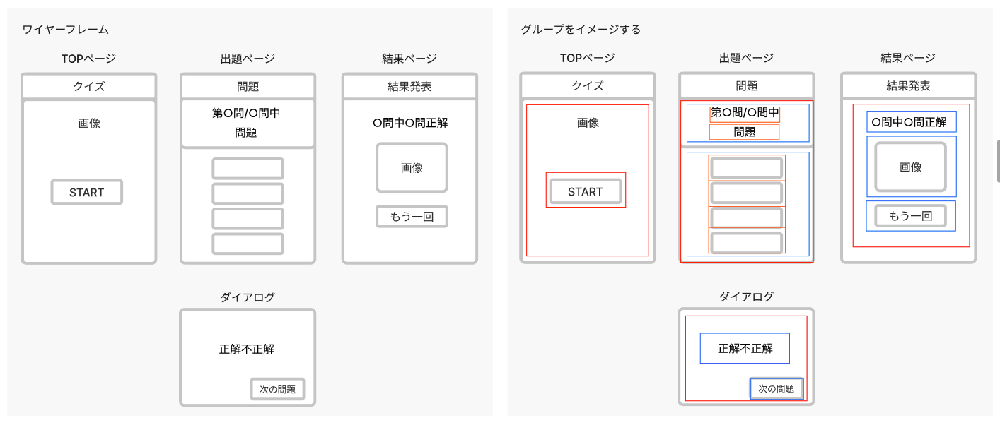
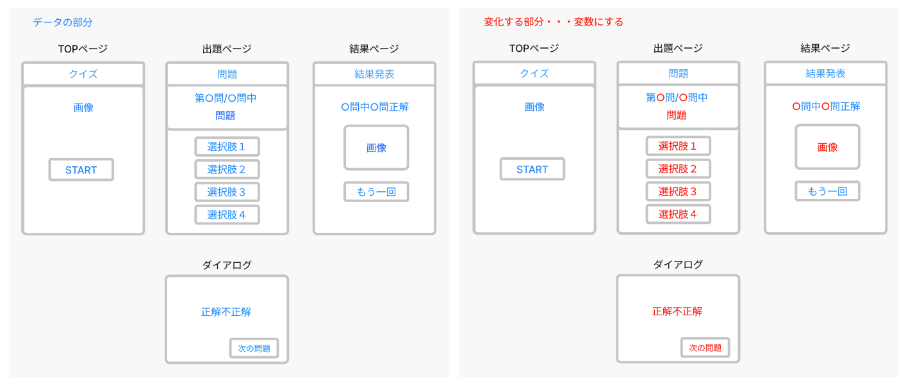
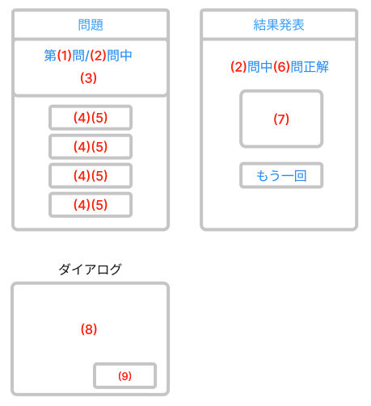

# **００_アプリ設計**

今まで習ってきたDart,Widgetを使って「クイズアプリ」を作ります。  
アプリを動かしてみよう。  

 

## **設計の流れを確認しよう**
クイズアプリを例に設計の流れを確認します。

 

## **①企画**

- クイズアプリ
- 全部で５問
- いろんなジャンルの問題を出題
- 最後に何問正解したか表示する
- 全問正解とそうでない場合で結果画像を切り替える

 

## **②サイトマップ**

- 画面遷移図（がめんせんいず）を作る
- どのような動作（イベント・タイミング）でどの画面に移動するか図で表す

 

## **③ワイヤーフレーム**

- widgetの配置を考える
- 大体のグループをイメージしておく（Column、Row、ListView、Container）
  
 

 

## **④デザイン（widget設計）**

- 組み込みたいwidgetを決める
- 画像や文章などの素材集め

決めておくこと
- 全体の配色
- 画像の種類（背景画像か普通の画像か）
- ボタンの種類（ボタンかアイコンか）

 

## **⑤変数設計・関数設計**

- データ部分の整理
- 変化する部分を洗い出す（変数にする部分）

 

 

### 変数にするもの

|  No |  変化するデータ  |  変数  |  型  |  その他  |
| :----: | :----: | :----: | :----: | :----: |
|  1 |  今何問目  |  変数  |  int  |    |
|  2 |  全問題数  |  変数  |  int  |    |
|  3 |  問題文  |  リスト  |  List Map  |  問題文と選択肢はセット  |
|  4 |  選択肢  |  リスト  |  List Map  |  どの選択肢が正解かデータで持つ  |
|  5 |  選択肢番号  |  変数  |  int  |    |
|  6 |  正解数  |  変数  |  int  |    |
|  7 |  画像パス  |  変数  |  String  |    |
|  8 |  正解不正解  |  変数  |  String  |    |
|  9 |  次の問題か結果発表か  |  変数  |  String  |    |

 

### 条件分岐の洗い出し

- 正解か不正解か
- 最後の問題かどうか
- 全問正解かどうか

 

## **⑥コーディング**

 

- グループを作る
- widgetを配置
- 変数の組み込み
- 関数作成

 

## **コーディングを始めよう！**
