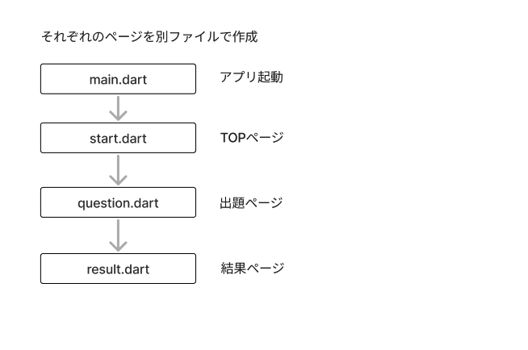
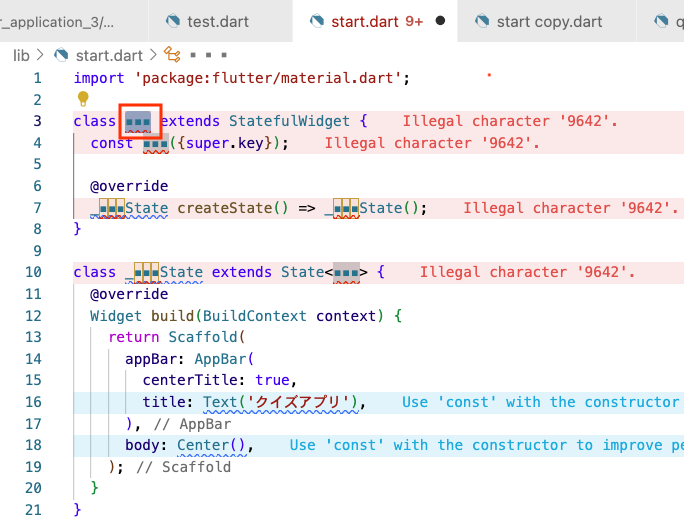
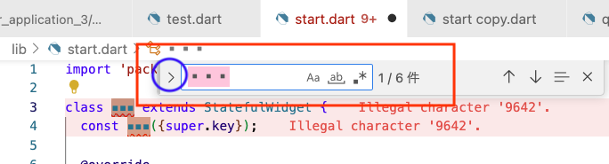
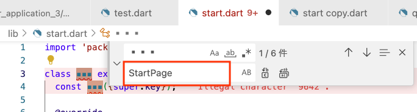
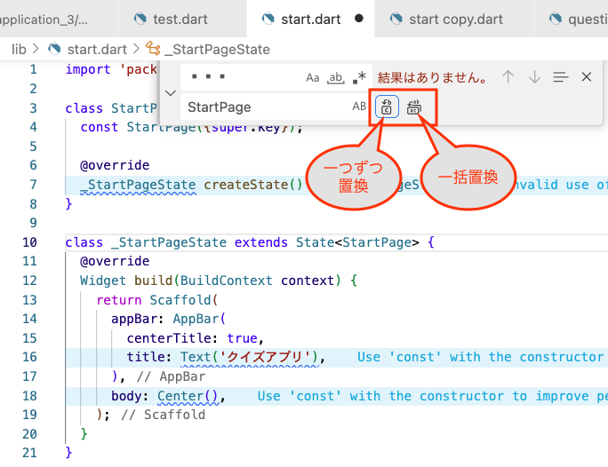
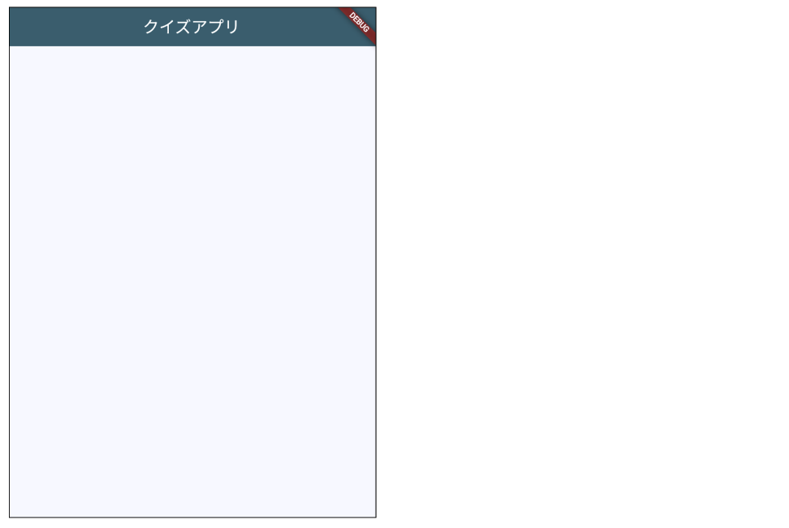

# **クイズアプリを作ろう 01**

## **ベースを作ろう**



<br>

①「start.dart」「question.dart」「result.dart」を新規作成

<br>

## **アプリ全体のベースを作る（main.dart アプリ起動）**

<br>

①ベースをコピー

```dart
// ＝＝＝＝＝アプリ起動ベースコード＝＝＝＝＝

import 'package:flutter/material.dart';

void main() {
  runApp(const MyApp());
}

class MyApp extends StatelessWidget {
  const MyApp({super.key});

  @override
  Widget build(BuildContext context) {
    return MaterialApp(
      title: "クイズアプリ",
      theme: ThemeData(
        colorScheme: ColorScheme.fromSeed(seedColor: Colors.blue),
        useMaterial3: true,
      ),
      home: ▪️▪️▪️(),
    );
  }
}

```

②start.dart をインポート  
- 「START」ボタンが押されたら、start.dartのStartPage.classに飛ぶ  

③TOPページのクラス名を指定

```dart

import 'package:flutter/material.dart';
//②start.dartをインポート
import 'start.dart';

void main() {
  runApp(const MyApp());
}

class MyApp extends StatelessWidget {
  const MyApp({super.key});
  @override
  Widget build(BuildContext context) {
    return MaterialApp(
      title: "クイズアプリ",
      theme: ThemeData(
        colorScheme: ColorScheme.fromSeed(seedColor: Colors.blue),
        useMaterial3: true,
      ),
      //③StartPageを追加
      home: const StartPage(),
    );
  }
}


```
<br>

## **各ページのベースを作る（start.dart TOPページ）**

<br>

①ベースコードをコピー

```dart

// ＝＝＝＝＝ページベースコード＝＝＝＝＝
import 'package:flutter/material.dart';

class ▪️▪️▪️ extends StatefulWidget {
  const ▪️▪️▪️({super.key});

  @override
  _▪️▪️▪️State createState() => _▪️▪️▪️State();
}

class _▪️▪️▪️State extends State<▪️▪️▪️> {
  @override
  Widget build(BuildContext context) {
    return Scaffold(
      appBar: AppBar(
        centerTitle: true,
        backgroundColor: Theme.of(context).colorScheme.surfaceTint,
        title: Text("クイズアプリ"),
      ),
      body: Center(),
    );
  }
}

```

②▪️▪️▪️の部分を「StartPage」で置き換える  
置換機能を使って書き換えてみよう

### 置換の仕方
<br>

- 置換したい文字列を選択し「Ctrl」＋F  
- 検索窓を表示  



<br>

- 左の「>」をクリック
  


<br>

- 置き換える文字列を下の枠に入力
- 「StartPage」と入力



<br>

- 置換ボタンをクリック
- １つずつ置換をクリック
- 一括置換は置き換えたくない文字も置換されてしまう可能性があるの注意！



<br>

```dart

import 'package:flutter/material.dart';

class StartPage extends StatefulWidget {
  const StartPage({super.key});

  @override
  _StartPageState createState() => _StartPageState();
}

class _StartPageState extends State<StartPage> {
  @override
  Widget build(BuildContext context) {
    return Scaffold(
      appBar: AppBar(
        centerTitle: true,
        backgroundColor: Theme.of(context).colorScheme.surfaceTint,
        title: Text("クイズアプリ"),
      ),
      body: Center(),
    );
  }
}

```

<br>

## **question.dart(出題ページ)**

<br>

①上のベースコード（＝＝＝＝＝ページベースコード＝＝＝＝＝の部分）をコピー  
②▪️▪️▪️の部分を「QuestionPage」で置き換える  
③タイトルを変更  

```dart

import 'package:flutter/material.dart';

class QuestionPage extends StatefulWidget {
  const QuestionPage({super.key});

  @override
  _QuestionPageState createState() => _QuestionPageState();
}

class _QuestionPageState extends State<QuestionPage> {
  @override
  Widget build(BuildContext context) {
    return Scaffold(
      appBar: AppBar(
        centerTitle: true,
        backgroundColor: Theme.of(context).colorScheme.surfaceTint,
        title: Text("問題"),
      ),
      body: Center(),
    );
  }
}


```
<br>

## **result.dart（結果ページ）**

<br>

①上のベースコード（＝＝＝＝＝ページベースコード＝＝＝＝＝の部分）をコピー  
②▪️▪️▪️の部分を「ResultPage」で置き換える  
③タイトルを変更  

```dart

import 'package:flutter/material.dart';

class ResultPage extends StatefulWidget {
  const ResultPage({super.key});

  @override
  _ResultPageState createState() => _ResultPageState();
}

class _ResultPageState extends State<ResultPage> {
  @override
  Widget build(BuildContext context) {
    return Scaffold(
      appBar: AppBar(
        centerTitle: true,
        backgroundColor: Theme.of(context).colorScheme.surfaceTint,
        title: Text("結果発表"),
      ),
      body: Center(),
    );
  }
}

```

<br>

## **実行結果**

アプリ起動からStartPageが表示されるところまで完成です

<br>


