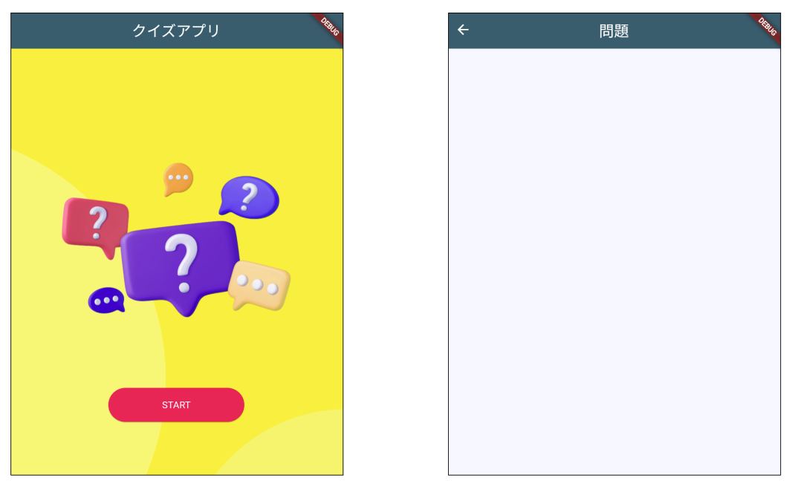

# **クイズアプリを作ろう 02**

## **スタートページをつくろう　　start.dart>StartPage.class**

<br>

## **実行結果**

<br>



## **演習**

<br>

①背景画像を表示  

- 「pubspec.yaml」の修正

```
  //pubspec.yaml
  assets:
    - images/
```

- 「images」フォルダ作成
- 背景画像を格納　（演習画像>quiz.png）
- `Container`widgetの`decoration`プロパティを追加
  
```dart
  body: Center(
    child: Container(
      decoration: const BoxDecoration(
        image: DecorationImage(
          image: AssetImage("images/quiz.png"),
          fit: BoxFit.cover,
        )
      ),
    ),
  ),
```
ここまでで実行結果をみてみよう

<br>

②「START」ボタンを追加  

- ボタンの装飾（色、大きさ）

```dart
  body: Center(
    child: Container(
      decoration: const BoxDecoration(
        image: DecorationImage(
          image: AssetImage("images/quiz.png"),
          fit: BoxFit.cover,
        )
      ),

      // ②CenterとElevatedButtonを追加
      child: Center(
        child: ElevatedButton(
        onPressed: () {
        },
        child: const Text("START"),
        style: ElevatedButton.styleFrom(
          backgroundColor: Colors.pink,
          foregroundColor: Colors.white,
          fixedSize: Size(200, 50),
        ),
      )),
    ),
  ),

```

③`question.dart`をインポート  
④出題ページに遷移する 

```dart
import 'package:flutter/material.dart';
//③インポート
import 'question.dart';

  <省略>
child: Center(
  child: ElevatedButton(
  onPressed: () {
    //④question.dartのQuestionPage.classに飛ばす
    Navigator.of(context).push(
      MaterialPageRoute(
        builder: (context) {
          return QuestionPage();
        },
      ),
    );
  },
  child: const Text("START"),
  style: ElevatedButton.styleFrom(
    backgroundColor: Colors.pink,
    foregroundColor: Colors.white,
    fixedSize: Size(200, 50),
  ),
)),

```

<br>

#### **【ソースコード】**

```dart

import 'package:flutter/material.dart';
import 'question.dart';

class StartPage extends StatefulWidget {
  const StartPage({super.key});

  @override
  _StartPageState createState() => _StartPageState();
}

class _StartPageState extends State<StartPage> {
  @override
  Widget build(BuildContext context) {
    return Scaffold(
      appBar: AppBar(
        centerTitle: true,
        backgroundColor: Theme.of(context).colorScheme.surfaceTint,
        title: Text("クイズアプリ"),
      ),
      body: Center(
        child: Container(
          decoration: const BoxDecoration(
              image: DecorationImage(
            image: AssetImage("images/quiz.png"),
            fit: BoxFit.cover,
          )),
          child: Center(
              child: ElevatedButton(
            onPressed: () {
              Navigator.of(context).push(
                MaterialPageRoute(
                  builder: (context) {
                    return QuestionPage();
                  },
                ),
              );
            },
            child: const Text("START"),
            style: ElevatedButton.styleFrom(
              backgroundColor: Colors.pink,
              foregroundColor: Colors.white,
              fixedSize: Size(200, 50),
            ),
          )),
        ),
      ),
    );
  }
}


```
