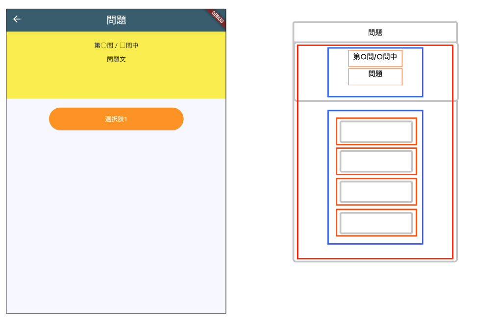

# **クイズアプリを作ろう 03**

## **クイズデータを作る question.dart QuestionPage.class**

<br>

## **実行結果**

<br>



## **演習**

①quizlist.dartを作成。  
問題情報を記載  
出題データは問題・解答選択肢・正解番号がセット  
Map型Listで作成   

<br>

#### **quizlist.dart**

```dart

// ①quizlist.dartを作成。問題情報を記載
//問題・選択肢の内容はコピペOK
//まずは１問目のデータを作ろう、２問目からはコピペOK
List<Map<String, dynamic>> quizlist = [
  {
    "question": "「カルピス」の名前の由来は何でしょう？", //問題文
    "answer1": "1カルシウム（calcium）とサルピス（salpis）", //選択肢１
    "answer2": "2カルボン酸（carboxylic acid）とピッチ（pitch）", //選択肢２
    "answer3": "3カロリー（calorie）とピストル（pistol）", //選択肢３
    "answer4": "4カルテット（quartet）とピアノ（piano）", //選択肢４
    "correct": 1 //回答番号
  },
  {
    "question": "キリンの舌の長さはどれくらいでしょう？",
    "answer1": "25cm",
    "answer2": "45cm",
    "answer3": "65cm",
    "answer4": "85cm",
    "correct": 2
  },
  {
    "question": "ニンジンは元々どの色だった？",
    "answer1": "赤",
    "answer2": "灰",
    "answer3": "緑",
    "answer4": "紫",
    "correct": 4
  },
  {
    "question": "ビール消費量世界1位のチェコでは、1年で1人あたり、ビール瓶何本分を消費するでしょう？",
    "answer1": "50本",
    "answer2": "100本",
    "answer3": "300本",
    "answer4": "600本",
    "correct": 3
  },
  {
    "question": "ペンギンの中で最も早く泳ぐことができるジェンツーペンギンの移動速度は？",
    "answer1": "時速10km",
    "answer2": "時速30km",
    "answer3": "時速60km",
    "answer4": "時速100km",
    "correct": 2
  },
];

// 省略
```
②question.dart上部に、quizlist.dartの読み込み設定を追加  

#### **question.dart**

```dart
// ②question.dart上部に、quizlist.dartの読み込み設定を追加
import 'package:flutter/material.dart';
import 'quizlist.dart'; // これを追加
  
```

③問題文を表示する枠を作成  

#### **question.dart QuestionPage**

```dart

class _QuestionPageState extends State<QuestionPage> {
  @override
  Widget build(BuildContext context) {
    return Scaffold(
      appBar: AppBar(
        centerTitle: true,
        backgroundColor: Theme.of(context).colorScheme.surfaceTint,
        title: Text("問題"),
      ),
      body: Center(
        child: Column(
          children: [
            Container(
              child: Column(
                children: [
                  Text("第○問 / □問中"),
                  Text("問題文"),
                ],
              ),
            ),
            ElevatedButton(
              onPressed: (){},
              child: Text("選択肢1"),
            ),
          ],
        ),
      ),
    );
  }
}
```

④widgetの装飾

```dart


class _QuestionPageState extends State<QuestionPage> {
  @override
  Widget build(BuildContext context) {
    return Scaffold(
      appBar: AppBar(
        centerTitle: true,
        backgroundColor: Theme.of(context).colorScheme.surfaceTint,
        title: Text("問題"),
      ),
      body: Center(
        child: Column(
          children: [
            Container(
              padding: const EdgeInsets.all(20),//④内側の余白
              width: double.infinity,           //④幅いっぱいに
              height: 150,                      //④高さ
              color: Colors.yellow,             //④背景色
              child: Column(
                children: [
                  Text("第○問 / □問中"),
                  SizedBox(height: 10),         //④外側の余白
                  Text("問題文"),
                ],
              ),
            ),
            SizedBox(height: 20),               //④外側の余白
            ElevatedButton(
              onPressed: (){},
              child: Text("選択肢1"),
              style: ElevatedButton.styleFrom(
                backgroundColor: Colors.orange, //④ボタンの背景色
                foregroundColor: Colors.white,  //④文字の色
                fixedSize: Size(200, 50),       //④横幅高さ
              ),
            ),
            SizedBox(height: 20),
          ],
        ),
      ),
    );
  }
}
```

