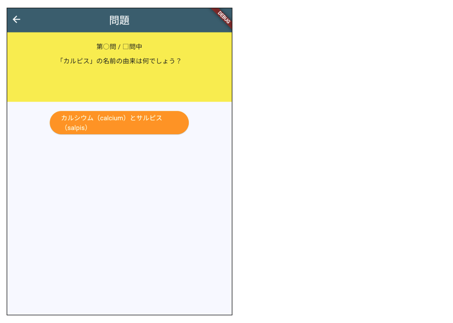

# **クイズアプリを作ろう 04**

## **問題を表示しよう QuestionPage.class**

<br>

## **実行結果**

<br>



## **演習**

① Listから１問目のデータを表示する  

```dart
<省略>
Container(
  padding: const EdgeInsets.all(20),
  width: double.infinity,
  height: 150,
  color: Colors.yellow,
  child: Column(
    children: [
      Text('第○問 / □問中'),
      SizedBox(height: 10),
      //① 問題文表示 Text()内を変更
      Text(quizlist[0]["question"]),
    ],
  ),
),

```

② Listから１問目の選択肢を表示する

```dart
<省略>
ElevatedButton(
  onPressed: () {},
  //選択肢表示 Text()内を変更
  child: Text(quizlist[0]["answer1"]),
  style: ElevatedButton.styleFrom(
    backgroundColor: Colors.orange,
    foregroundColor: Colors.white,
    fixedSize: Size(200, 50),
  ),
),

```

<br>

#### **【ソースコード】**

```dart
import 'package:flutter/material.dart';
import 'quizlist.dart';

class QuestionPage extends StatefulWidget {
  const QuestionPage({super.key});

  @override
  _QuestionPageState createState() => _QuestionPageState();
}

class _QuestionPageState extends State<QuestionPage> {
  @override
  Widget build(BuildContext context) {
    return Scaffold(
      appBar: AppBar(
        centerTitle: true,
        title: Text('問題'),
      ),
      body: Center(
        child: Column(
          children: [
            Container(
              padding: const EdgeInsets.all(20),
              width: double.infinity,
              height: 150,
              color: Colors.yellow,
              child: Column(
                children: [
                  Text('第○問 / □問中'),
                  SizedBox(height: 10),
                  //① 問題文表示 Text()内を変更
                  Text(quizlist[0]["question"]),
                ],
              ),
            ),
            SizedBox(height: 20),
            ElevatedButton(
              onPressed: () async {},
              //選択肢表示 Text()内を変更
              child: Text(quizlist[0]["answer1"]),
              style: ElevatedButton.styleFrom(
                backgroundColor: Colors.orange,
                foregroundColor: Colors.white,
                fixedSize: Size(200, 50),
              ),
            ),
            SizedBox(height: 20),
          ],
        ),
      ),
    );
  }
}


```
