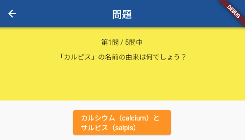
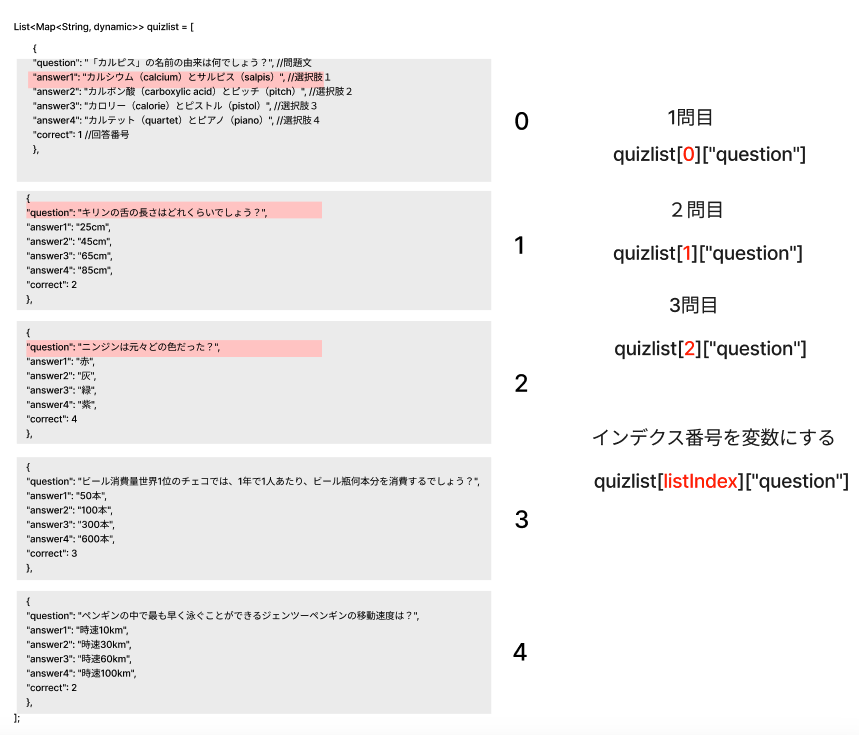

# **クイズアプリを作ろう 05**

## **変数を使って問題を表示しよう QuestionPage.class**

<br>

## **実行結果**

<br>



## **演習**
２問目３問目も表示できるようにする



①変数「_listIndex」を作成、初期値に０を代入  

```dart

class _QuestionPageState extends State<QuestionPage> {
  //① インデックス番号用の変数
  int _listIndex = 0;

@override
  Widget build(BuildContext context) {
    return Scaffold(
      appBar: AppBar(
        centerTitle: true,
        title: Text('問題'),
      ),
      body: Center(
        <省略>
      ),
    );
  }
}

```

②quizlistのインデックス番号を「_listIndex」に置き換える

```dart

body: Center(
  child: Column(
    children: [
      Container(
        padding: const EdgeInsets.all(20),
        width: double.infinity,
        height: 150,
        color: Colors.yellow,
        child: Column(
          children: [
            //② 1→${_listIndex + 1}して表示用にする
            Text('第${_listIndex + 1}問 / □問中'),
            SizedBox(height: 10),
            //② 0→_listIndex
            Text(quizlist[_listIndex]["question"]),
          ],
        ),
      ),
      SizedBox(height: 20),
      ElevatedButton(
        onPressed: () {},
        //② 0→_listIndex
        child: Text(quizlist[_listIndex]["answer1"]),
        style: ElevatedButton.styleFrom(
          backgroundColor: Colors.orange,
          foregroundColor: Colors.white,
          fixedSize: Size(200, 50),
        ),
      ),
      SizedBox(height: 20),
    ],
  ),
),

```

<br>

#### **【ソースコード】**

```dart

// 省略

import 'package:flutter/material.dart';
import 'quizlist.dart';

class QuestionPage extends StatefulWidget {
  const QuestionPage({super.key});

  @override
  _QuestionPageState createState() => _QuestionPageState();
}

class _QuestionPageState extends State<QuestionPage> {
  //① インデックス番号用の変数
  int _listIndex = 0;

  @override
  Widget build(BuildContext context) {
    return Scaffold(
      appBar: AppBar(
        centerTitle: true,
        title: Text('問題'),
      ),
      body: Center(
        child: Column(
          children: [
            Container(
              padding: const EdgeInsets.all(20),
              width: double.infinity,
              height: 150,
              color: Colors.yellow,
              child: Column(
                children: [
                  //② 1→${_listIndex + 1}して表示用にする
                  Text('第${_listIndex + 1}問 / □問中'),
                  SizedBox(height: 10),
                  //② 0→_listIndex
                  Text(quizlist[_listIndex]["question"]),
                ],
              ),
            ),
            SizedBox(height: 20),
            ElevatedButton(
              onPressed: () {},
              //② 0→_listIndex
              child: Text(quizlist[_listIndex]["answer1"]),
              style: ElevatedButton.styleFrom(
                backgroundColor: Colors.orange,
                foregroundColor: Colors.white,
                fixedSize: Size(200, 50),
              ),
            ),
            SizedBox(height: 20),
          ],
        ),
      ),
    );
  }
}


// 省略

```
