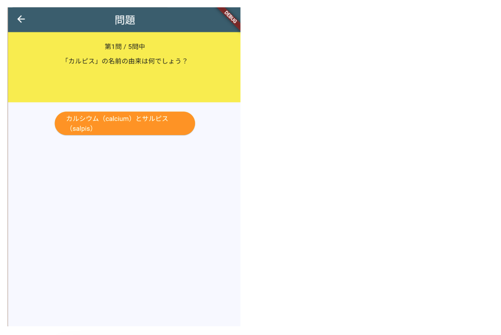

# **クイズアプリを作ろう 05**

## **変数を使って問題を表示しよう QuestionPage.class**

<br>

## **実行結果**

<br>



## **演習**
２問目３問目も表示できるようにする


①変数「listIndex」を作成、初期値に０を代入  
②変数「quizlistCnt」を作成、初期値に問題数を代入

`import`と`QuestionPage`の間に書く

```dart

import 'package:flutter/material.dart';
import 'quizlist.dart';

//① インデックス番号用の変数
int listIndex = 0;
//② 全問題数用の変数
int quizlistCnt = quizlist.length;

class QuestionPage extends StatefulWidget {
  const QuestionPage({super.key});

  @override
  _QuestionPageState createState() => _QuestionPageState();
}

```

③quizlistのインデックス番号を「listIndex」に置き換える
④全問題数を「quizlistCnt」に置き換える

```dart

body: Center(
  child: Column(
    children: [
      Container(
        padding: const EdgeInsets.all(20),
        width: double.infinity,
        height: 150,
        color: Colors.yellow,
        child: Column(
          children: [
            //③ 1→${_listIndex + 1}して表示用にする
            //④${_quizlistCnt}
            Text("第${listIndex + 1}問 / ${quizlistCnt}問中"),
            SizedBox(height: 10),
            //③ 0→_listIndex
            Text(quizlist[listIndex]["question"]),
          ],
        ),
      ),
      SizedBox(height: 20),
      ElevatedButton(
        onPressed: () {},
        //③ 0→listIndex
        child: Text(quizlist[listIndex]["answer1"]),
        style: ElevatedButton.styleFrom(
          backgroundColor: Colors.orange,
          foregroundColor: Colors.white,
          fixedSize: Size(300, 50),
        ),
      ),
      SizedBox(height: 20),
    ],
  ),
),

```

<br>

#### **【ソースコード】**

```dart

// 省略

import 'package:flutter/material.dart';
import 'quizlist.dart';

//① インデックス番号用の変数
int listIndex = 0;
//② 全問題数用の変数
int quizlistCnt = quizlist.length;

class QuestionPage extends StatefulWidget {
  const QuestionPage({super.key});

  @override
  _QuestionPageState createState() => _QuestionPageState();
}

class _QuestionPageState extends State<QuestionPage> {
  @override
  Widget build(BuildContext context) {
    return Scaffold(
      appBar: AppBar(
        centerTitle: true,
        foregroundColor: Colors.white,
        backgroundColor: Color.fromARGB(255, 65, 105, 121),
        title: Text("問題"),
      ),
      body: Center(
        child: Column(
          children: [
            Container(
              padding: const EdgeInsets.all(20),
              width: double.infinity,
              height: 150,
              color: Colors.yellow,
              child: Column(
                children: [
                  //③ 1→${listIndex + 1}して表示用にする
                  //④${quizlistCnt}
                  Text("第${listIndex + 1}問 / ${quizlistCnt}問中"),
                  SizedBox(height: 10),
                  //③ 0→listIndex
                  Text(quizlist[listIndex]["question"]),
                ],
              ),
            ),
            SizedBox(height: 20),
            ElevatedButton(
              onPressed: () {},
              //選択肢表示 Text()内を変更
              child: Text(quizlist[listIndex]["answer1"]),
              style: ElevatedButton.styleFrom(
                backgroundColor: Colors.orange,
                foregroundColor: Colors.white,
                fixedSize: Size(300, 50),
              ),
            ),
            SizedBox(height: 20),
          ],
        ),
      ),
    );
  }
}


```
