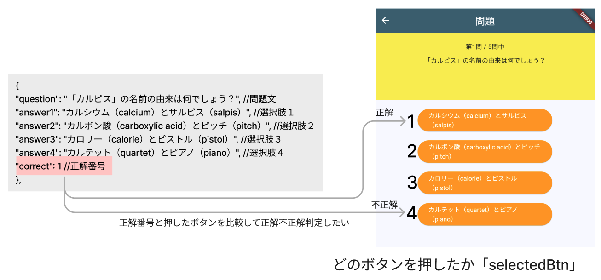

# **クイズアプリを作ろう 06**

## **選択肢ボタンの情報を管理しよう　QuizListPage.class**

<br>

## **実行結果**

<br>
画面変化なし
<!-- 
 -->

## **演習**



① 変数「_selectedBtn」を作成し、初期値に０を代入  

```dart

class _QuestionPageState extends State<QuestionPage> {
  int _listIndex = 0;
  int _quizlistCnt = quizlist.length;
  //①　選択肢ボタンの番号
  int _selectedBtn = 0;

@override
  Widget build(BuildContext context) {
    return Scaffold(
      appBar: AppBar(
        centerTitle: true,
        title: Text("問題"),
      ),
      body: Center(
        <省略>
      ),
    );
  }
}

```

② 選択肢ボタンが押されたら、ボタンの番号を_selectedBtnに代入する  

```dart

ElevatedButton(
  onPressed: () {
    //②　何番目のボタンが押されたか代入
    _selectedBtn = 1;
  },
  child: Text(quizlist[_listIndex]["answer1"]),
  style: ElevatedButton.styleFrom(
    backgroundColor: Colors.orange,
    foregroundColor: Colors.white,
    fixedSize: Size(200, 50),
  ),
),

```

<br>

#### **【ソースコード】**

```dart

// 省略

import 'package:flutter/material.dart';
import 'quizlist.dart';

class QuestionPage extends StatefulWidget {
  const QuestionPage({super.key});

  @override
  _QuestionPageState createState() => _QuestionPageState();
}

class _QuestionPageState extends State<QuestionPage> {
  int _listIndex = 0;
  int _quizlistCnt = quizlist.length;
  //①　選択肢ボタンの番号
  int _selectedBtn = 0;

  @override
  Widget build(BuildContext context) {
    return Scaffold(
      appBar: AppBar(
        centerTitle: true,
        backgroundColor: Theme.of(context).colorScheme.surfaceTint,
        title: Text("問題"),
      ),
      body: Center(
        child: Column(
          children: [
            Container(
              padding: const EdgeInsets.all(20),
              width: double.infinity,
              height: 150,
              color: Colors.yellow,
              child: Column(
                children: [
                  Text("第${_listIndex + 1}問 / ${_quizlistCnt}問中"),
                  SizedBox(height: 10),
                  Text(quizlist[_listIndex]["question"]),
                ],
              ),
            ),
            SizedBox(height: 20),
            ElevatedButton(
              onPressed: () {
                //②　何番目のボタンが押されたか代入
                _selectedBtn = 1;
              },
              child: Text(quizlist[_listIndex]["answer1"]),
              style: ElevatedButton.styleFrom(
                backgroundColor: Colors.orange,
                foregroundColor: Colors.white,
                fixedSize: Size(200, 50),
              ),
            ),
            SizedBox(height: 20),
          ],
        ),
      ),
    );
  }
}


// 省略

```
