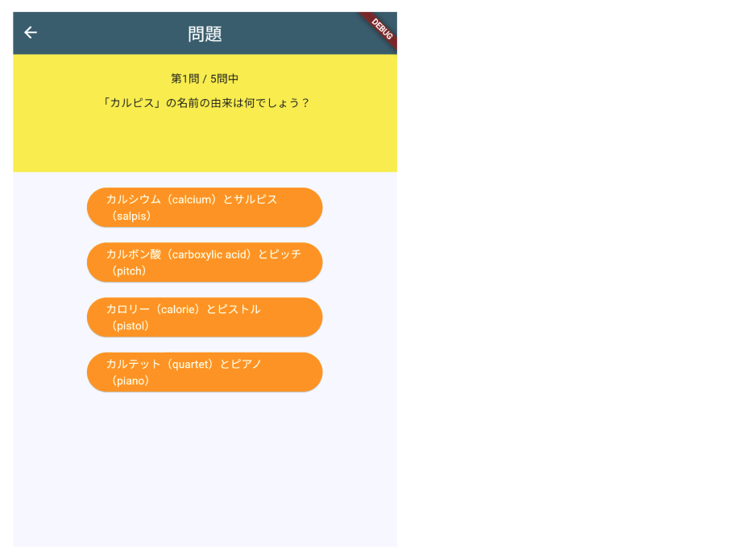

# **クイズアプリを作ろう 07**

## **選択肢を増やそう　 QuizListPage.class**

<br>

## **実行結果**

<br>



## **演習**

① for文を使って、選択肢ボタンを４つに増やす  

- `ElevatedButton` と`SizedBox`をfor文で囲う
- 繰り返し変数は「i」1~4まで繰り返す

② 「_selectedBtn」の値を`i`に置き換える  
③ Mapのkey「answer`1`」「answer`2`」「answer`3`」「answer`4`」の数字の部分を変数`i`に置き換える  

```dart

for (int i = 1; i <= 4; i++) ...{ //①追加
  ElevatedButton(
    onPressed: () {
      //②1→i
      _selectedBtn = i;
    },
    //③1→$i
    child: Text(quizlist[_listIndex]["answer$i"]),
    style: ElevatedButton.styleFrom(
      backgroundColor: Colors.orange,
      foregroundColor: Colors.white,
      fixedSize: Size(200, 50),
    ),
  ),
  SizedBox(height: 20),
},//①追加

```


<br>

#### **【ソースコード】**

```dart

// 省略

import 'package:flutter/material.dart';
import 'quizlist.dart';

class QuestionPage extends StatefulWidget {
  const QuestionPage({super.key});

  @override
  _QuestionPageState createState() => _QuestionPageState();
}

class _QuestionPageState extends State<QuestionPage> {
  int _listIndex = 0;
  int _selectedBtn = 0;

  @override
  Widget build(BuildContext context) {
    return Scaffold(
      appBar: AppBar(
        centerTitle: true,
        title: Text('問題'),
      ),
      body: Center(
        child: Column(
          children: [
            Container(
              padding: const EdgeInsets.all(20),
              width: double.infinity,
              height: 150,
              color: Colors.yellow,
              child: Column(
                children: [
                  Text('第${_listIndex + 1}問 / □問中'),
                  SizedBox(height: 10),
                  Text(quizlist[_listIndex]["question"]),
                ],
              ),
            ),
            SizedBox(height: 20),
            for (int i = 1; i <= 4; i++) ...{//①追加
              ElevatedButton(
                onPressed: () {
                  //②1→i
                  _selectedBtn = i;
                },
                //③1→$i
                child: Text(quizlist[_listIndex]["answer$i"]),
                style: ElevatedButton.styleFrom(
                  backgroundColor: Colors.orange,
                  foregroundColor: Colors.white,
                  fixedSize: Size(200, 50),
                ),
              ),
              SizedBox(height: 20),
            },//①追加
          ],
        ),
      ),
    );
  }
}


```
