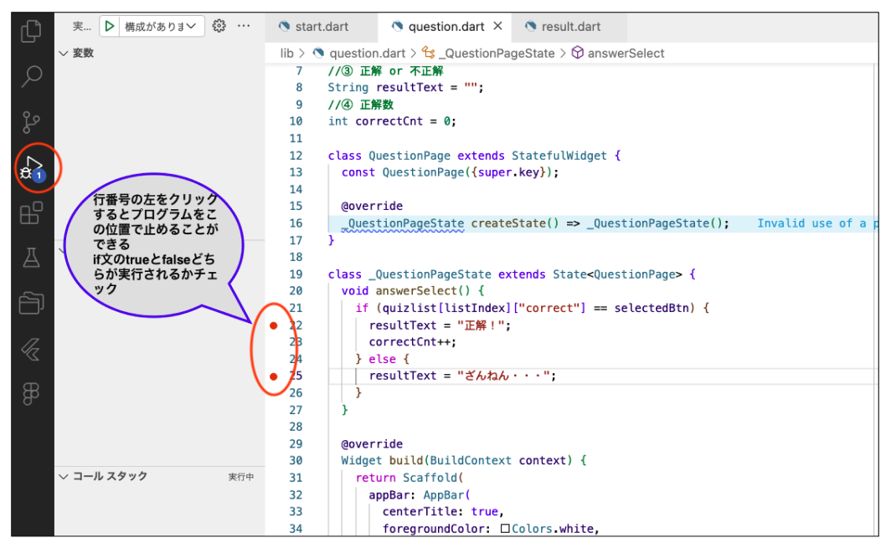
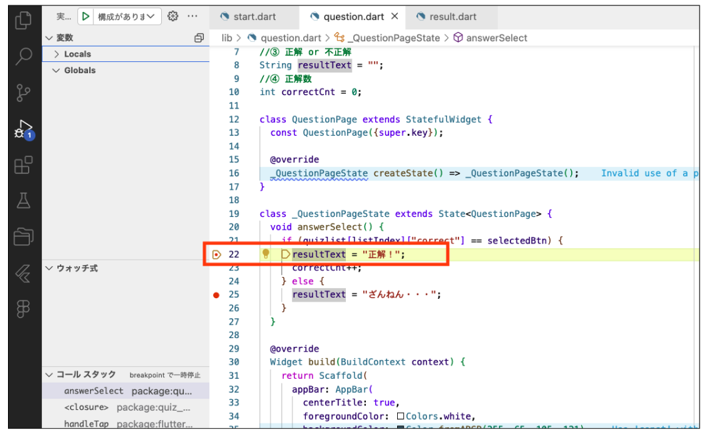
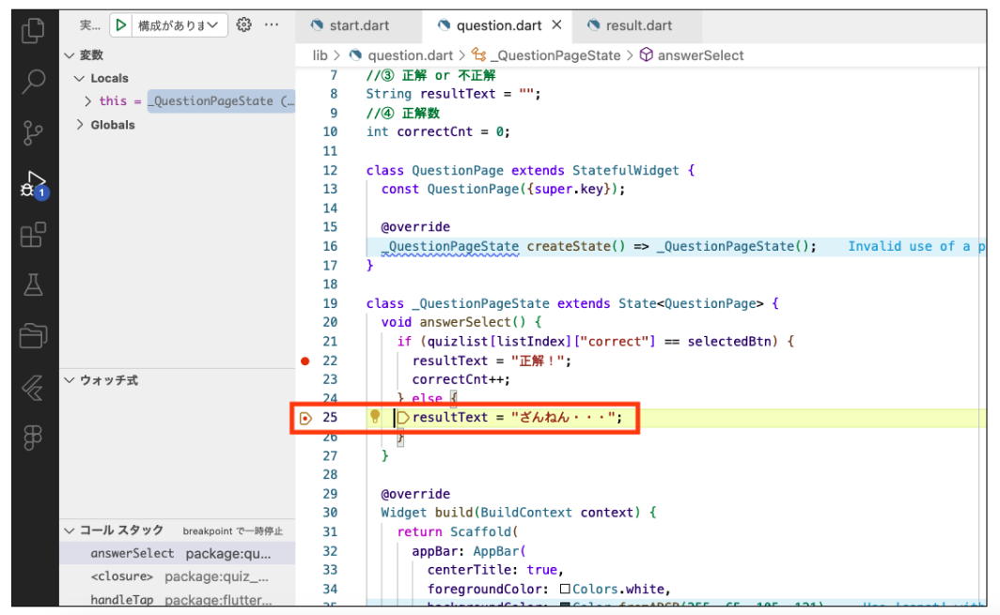

# **クイズアプリを作ろう 08**

## **回答後の処理をつくろう　関数にまとめる QuestionPage.class**

<br>

## **実行結果**

<br>

<!--  -->
画面に変化なし

## **演習**


①回答後の処理を関数にまとめる

```dart
class _QuestionPageState extends State<QuestionPage> {

  //①関数を作成
  void answerSelect() {
    
  }

  @override
  Widget build(BuildContext context) {
    return Scaffold(
      <省略>
      for (int i = 1; i <= 4; i++) ...{
        ElevatedButton(
          onPressed: () {
            selectedBtn = i;
            //①答えが選択された時の処理を呼び出す
            answerSelect();
          },
          child: Text(quizlist[listIndex]["answer$i"]),
          style: ElevatedButton.styleFrom(
            backgroundColor: Colors.orange,
            foregroundColor: Colors.white,
            fixedSize: Size(300, 50),
          ),
        ),
        SizedBox(height: 20),
      },
      <省略>
    );
  }
}

```

②正解 / 不正解の判定を行う


```dart

class _QuestionPageState extends State<QuestionPage> {

  // 答えが選択された時の処理
  void answerSelect() {

    // ②正解 / 不正解のチェック
    if (quizlist[listIndex]["correct"] == selectedBtn) {
      //正解
    }else{
      //不正解
    }

    
  }

  @override
  Widget build(BuildContext context) {
    <省略>
  }
}
```
③正解の場合「正解」不正解の場合「ざんねん・・・」  
④正解数をカウントする  

```dart
import 'package:flutter/material.dart';
import 'quizlist.dart';

int listIndex = 0;
int quizlistCnt = quizlist.length;
int selectedBtn = 0;
//③ 正解 or 不正解
String resultText = "";
//④ 正解数
int correctCnt = 0;

class QuestionPage extends StatefulWidget {
  const QuestionPage({super.key});

  @override
  _QuestionPageState createState() => _QuestionPageState();
}

class _QuestionPageState extends State<QuestionPage> {
  

  // 答えが選択された時の処理
  void answerSelect() {
    if (quizlist[listIndex]["correct"] == selectedBtn) {
      //③
      resultText = "正解！";
      //④
      correctCnt++;
    }else{
      //③
      resultText = "ざんねん・・・";
    }
  }

  @override
  Widget build(BuildContext context) {
    <省略>
  }
}
```

<br>

アプリが正しく動いているか確認してみよう  
今の状態で第１問目の答えをクリックしても、結果の画面がまだできていないので正しく動いているか確認ができません  
デバッグ機能を使ってみよう  
デバッグとは・・・プログラムのバグ（不具合・エラー）を見つけて修正すること  
正しく動いているか確認しながらアプリ開発を進めます  
最後までバグを残したまま進んでしまうと直すのが大変・・・  

### **デバッグの使い方**



<br>


<br>

trueの処理が実行されていることがわかります


<br>

もう一度  


<br>

今度は不正解のボタンをクリックして確認します


<br>

#### **【ソースコード】**

```dart

import 'package:flutter/material.dart';
import 'quizlist.dart';

int listIndex = 0;
int quizlistCnt = quizlist.length;
int selectedBtn = 0;
//③ 正解 or 不正解
String resultText = "";
//④ 正解数
int correctCnt = 0;

class QuestionPage extends StatefulWidget {
  const QuestionPage({super.key});

  @override
  _QuestionPageState createState() => _QuestionPageState();
}

class _QuestionPageState extends State<QuestionPage> {
  void answerSelect() {
    if (quizlist[listIndex]["correct"] == selectedBtn) {
      resultText = "正解！";
      correctCnt++;
    } else {
      resultText = "ざんねん・・・";
    }
  }

  @override
  Widget build(BuildContext context) {
    return Scaffold(
      appBar: AppBar(
        centerTitle: true,
        foregroundColor: Colors.white,
        backgroundColor: Color.fromARGB(255, 65, 105, 121),
        title: Text("問題"),
      ),
      body: Center(
        child: Column(
          children: [
            Container(
              padding: const EdgeInsets.all(20),
              width: double.infinity,
              height: 150,
              color: Colors.yellow,
              child: Column(
                children: [
                  Text("第${listIndex + 1}問 / ${quizlistCnt}問中"),
                  SizedBox(height: 10),
                  Text(quizlist[listIndex]["question"]),
                ],
              ),
            ),
            SizedBox(height: 20),
            for (int i = 1; i <= 4; i++) ...{
              ElevatedButton(
                onPressed: () {
                  selectedBtn = i;
                  //①答えが選択された時の処理を呼び出す
                  answerSelect();
                },
                child: Text(quizlist[listIndex]["answer$i"]),
                style: ElevatedButton.styleFrom(
                  backgroundColor: Colors.orange,
                  foregroundColor: Colors.white,
                  fixedSize: Size(300, 50),
                ),
              ),
              SizedBox(height: 20),
            }, 
          ],
        ),
      ),
    );
  }
}


```
