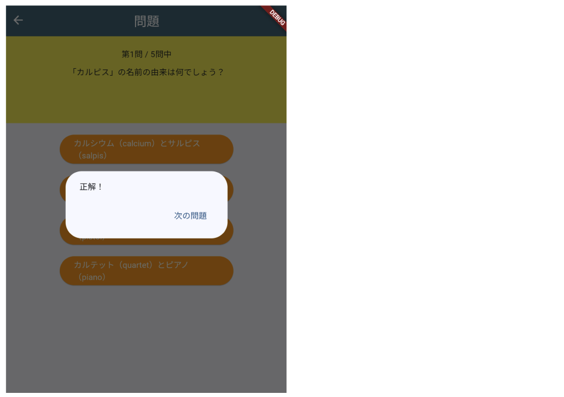
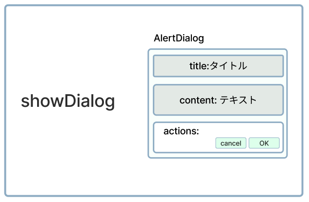
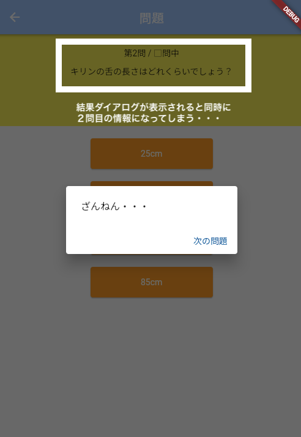
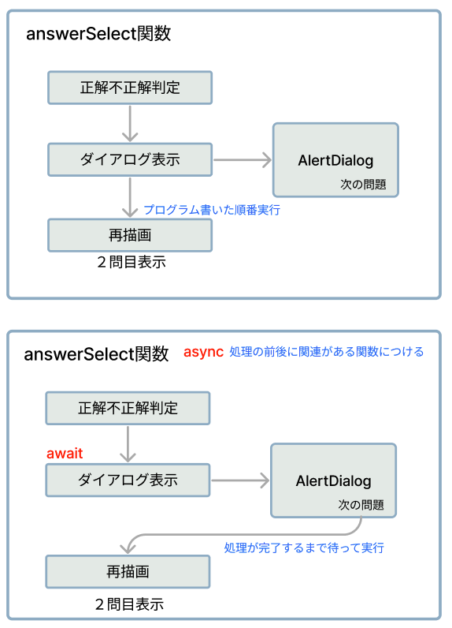

# **クイズアプリを作ろう 09**

## **結果をダイアログに表示しよう QuizListPage.class**

<br>

## **実行結果**

<br>



## **演習**



① showDialogメソッドを使おう  
② 結果のテキストを表示  
③ テキストボタンを作る  
④ 次の問題を表示する  

```dart

void answerSelect() {

    if (quizlist[listIndex]["correct"] == selectedBtn) {
      resultText = "正解！";
      correctCnt++;
    } else {
      resultText = "ざんねん・・・";
    }

    //①showDialogを使う
    showDialog(
      barrierDismissible: false,  //背景タップできないようにする
      context: context,
      builder: (context) => AlertDialog(
        //②結果のテキスト表示
        content: Text(resultText),
        actions: [
          //③テキストボタンを作る
          TextButton(
            onPressed: () {
              Navigator.pop(context); //ダイアログを閉じる
            },
            child: Text("次の問題"),
          ),
        ],
      ),
    );

    //④再描画
    setState(() {
      listIndex++; // 次の問題へ
      selectedBtn = 0; // 選ばれたボタンの情報をリセット
    });
  }

```

<br>



「次の問題」ボタンが押されるまでは情報を更新しないようにする  

⑤ 処理を待って次の処理を実行

```dart

//⑤ asyncをつける
//⑤ asyncをつける
  void answerSelect() async{
    if (quizlist[listIndex]["correct"] == selectedBtn) {
      resultText = "正解！";
      correctCnt++;
    } else {
      resultText = "ざんねん・・・";
    }

    //⑤awaitをつける
    await showDialog(
      barrierDismissible: false,
      context: context,
      builder: (context) => AlertDialog(
        content: Text(resultText),
        actions: [
          TextButton(
            onPressed: () {
              Navigator.pop(context);
            },
            child: Text("次の問題"),
          ),
        ],
      ),
    );

    
    setState(() {
      listIndex++; 
      selectedBtn = 0; 
    });
  }

```

 

<br>

#### **【ソースコード】**

```dart

import 'package:flutter/material.dart';
import 'quizlist.dart';

int listIndex = 0;
int quizlistCnt = quizlist.length;
int selectedBtn = 0;
//③ 正解 or 不正解
String resultText = "";
//④ 正解数
int correctCnt = 0;

class QuestionPage extends StatefulWidget {
  const QuestionPage({super.key});

  @override
  _QuestionPageState createState() => _QuestionPageState();
}

class _QuestionPageState extends State<QuestionPage> {


  //⑤ asyncをつける
  void answerSelect() async{
    if (quizlist[listIndex]["correct"] == selectedBtn) {
      resultText = "正解！";
      correctCnt++;
    } else {
      resultText = "ざんねん・・・";
    }

    //⑤awaitをつける
    await showDialog(
      barrierDismissible: false,
      context: context,
      builder: (context) => AlertDialog(
        content: Text(resultText),
        actions: [
          TextButton(
            onPressed: () {
              Navigator.pop(context);
            },
            child: Text("次の問題"),
          ),
        ],
      ),
    );

    
    setState(() {
      listIndex++; 
      selectedBtn = 0; 
    });
  }

  @override
  Widget build(BuildContext context) {
    return Scaffold(
      appBar: AppBar(
        centerTitle: true,
        foregroundColor: Colors.white,
        backgroundColor: Color.fromARGB(255, 65, 105, 121),
        title: Text("問題"),
      ),
      body: Center(
        child: Column(
          children: [
            Container(
              padding: const EdgeInsets.all(20),
              width: double.infinity,
              height: 150,
              color: Colors.yellow,
              child: Column(
                children: [
                  Text("第${listIndex + 1}問 / ${quizlistCnt}問中"),
                  SizedBox(height: 10),
                  Text(quizlist[listIndex]["question"]),
                ],
              ),
            ),
            SizedBox(height: 20),
            for (int i = 1; i <= 4; i++) ...{
              ElevatedButton(
                onPressed: () {
                  selectedBtn = i;
                  //②答えが選択された時の処理を呼び出す
                  answerSelect();
                },
                child: Text(quizlist[listIndex]["answer$i"]),
                style: ElevatedButton.styleFrom(
                  backgroundColor: Colors.orange,
                  foregroundColor: Colors.white,
                  fixedSize: Size(300, 50),
                ),
              ),
              SizedBox(height: 20),
            }, //①追加
          ],
        ),
      ),
    );
  }
}


```
