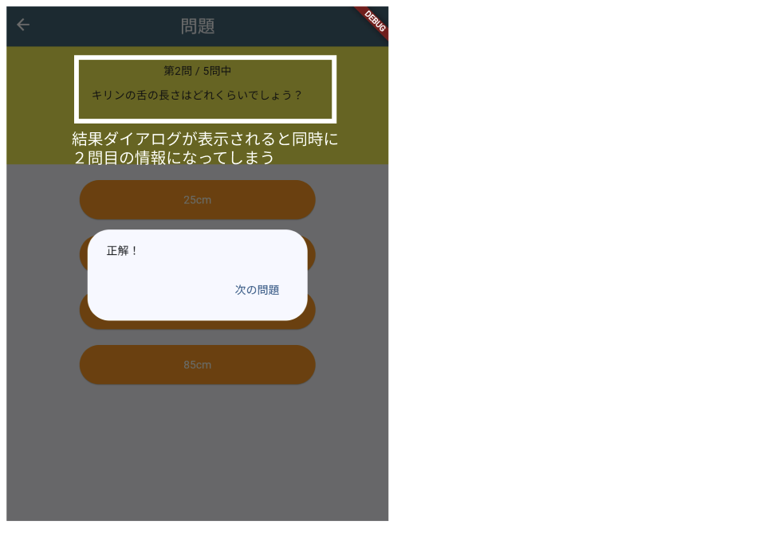

# **クイズアプリを作ろう 09**

## **結果をダイアログに表示しよう QuizListPage.class**

<br>

## **実行結果**

<br>


## **演習**


① showDialogメソッドを使おう  
② 結果のテキストを表示  
③ テキストボタンを作る  
④ 次の問題を表示する  

```dart

void answerSelect() {

    if (quizlist[_listIndex]["correct"] == _selectedBtn) {
      _resultText = "正解！";
      _correctCnt++;
    } else {
      _resultText = "ざんねん・・・";
    }

    //①showDialogを使う
    showDialog(
      barrierDismissible: false,  //背景タップできないようにする
      context: context,
      builder: (context) => AlertDialog(
        //②結果のテキスト表示
        content: Text(_resultText),
        actions: [
          //③テキストボタンを作る
          TextButton(
            onPressed: () {
              Navigator.pop(context); //ダイアログを閉じる
            },
            child: Text("次の問題"),
          ),
        ],
      ),
    );

    //④再描画
    setState(() {
      _listIndex++; // 次の問題へ
      _selectedBtn = 0; // 選ばれたボタンの情報をリセット
    });
  }

```

<br>



「次の問題」ボタンが押されるまでは情報を更新しないようにする  

⑤ 処理を待って次の処理を実行

```dart

//⑤ asyncをつける
void answerSelect() async{
    if (quizlist[_listIndex]["correct"] == _selectedBtn) {
      _resultText = "正解！";
      _correctCnt++;
    } else {
      _resultText = "ざんねん・・・";
    }

    //⑤awaitをつける
    await showDialog(
      barrierDismissible: false,
      context: context,
      builder: (context) => AlertDialog(
        content: Text(_resultText),
        actions: [
          TextButton(
            onPressed: () {
              Navigator.pop(context); //ダイアログを閉じる
            },
            child: Text("次の問題"),
          ),
        ],
      ),
    );

    setState(() {
      _listIndex++;
      _selectedBtn = 0;
    });
  }

```

 

<br>

#### **【ソースコード】**

```dart

// 省略

  void answerSelect() async {
    if (quizlist[_listIndex]["correct"] == _selectedBtn) {
      _resultText = "正解！";
      _correctCnt++;
    } else {
      _resultText = "ざんねん・・・";
    }

    //⑤ダイアログ表示　ボタンが押されるまで次の処理が動かないようにする
    await showDialog(
      barrierDismissible: false,
      context: context,
      builder: (context) => AlertDialog(
        content: Text(_resultText),
        actions: [
          TextButton(
            onPressed: () {
              Navigator.pop(context); //ダイアログを閉じる
            },
            child: Text("次の問題"),
          ),
        ],
      ),
    );

    //再描画
    setState(() {
      _listIndex++; // 次の問題へ
      _selectedBtn = 0; // 選ばれたボタンの情報をリセット
    });
  }

// 省略

```
