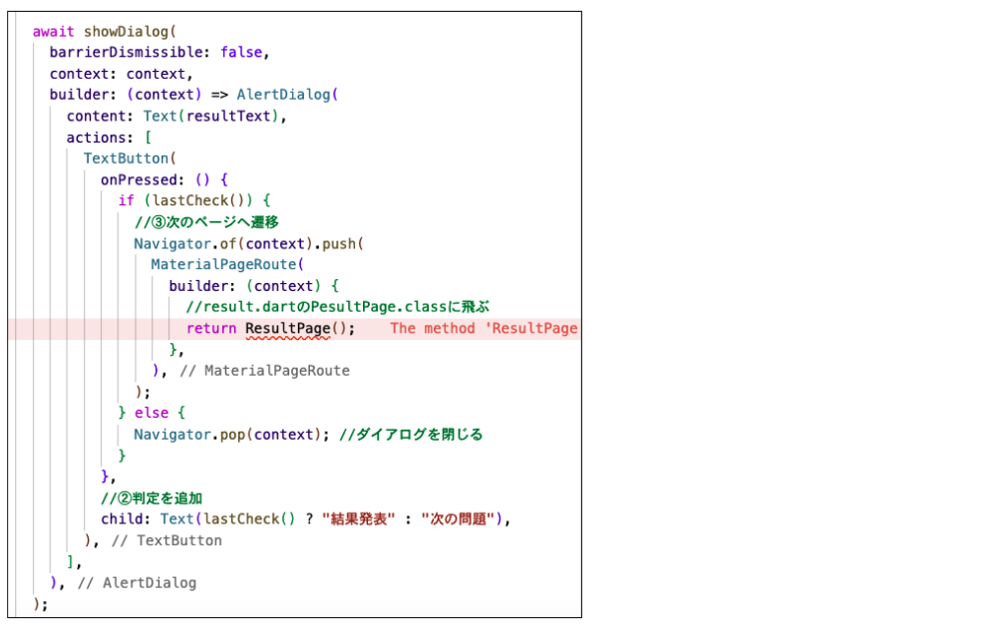

# **クイズアプリを作ろう 10**

## **最終問題のときの処理 QuizListPage.class**

<br><br>

## **実行結果**

次の課題（11_quizlist_09_dialog_final）完了後の結果  
この課題はプログラムエラーのまま終了します
<br>


## **演習**

① 最終問題の判定関数を作る


```dart

//省略

class _QuestionPageState extends State<QuestionPage> {
  int _listIndex = 0;
  int _quizlistCnt = quizlist.length;
  int _selectedBtn = 0;
  String _resultText = "";
  int _correctCnt = 0;

  //①最終問題判定関数
  bool lastCheck() {
    if (_listIndex == _quizlistCnt - 1) {
      return true;
    }
    return false;
  }

  void answerSelect() async {
    if (quizlist[_listIndex]["correct"] == _selectedBtn) {
      _resultText = "正解！";
      _correctCnt++;
    } else {
      _resultText = "ざんねん・・・";
    }

//省略

```

② if文の条件に関数呼び出し

```dart

await showDialog(
  barrierDismissible: false,
  context: context,
  builder: (context) => AlertDialog(
    content: Text(_resultText),
    actions: [
      TextButton(
        onPressed: () {
          //②判定を追加
          if (lastCheck()) {


          } else {
            Navigator.pop(context); //ダイアログを閉じる
          }
        },
        //②判定を追加
        child: Text(lastCheck() ? "結果発表" : "次の問題"),
      ),
    ],
  ),
);

```
<br>


<br><br>

### **Widgeをif文で制御することはできない**

最終問題のとき　→　Text("結果発表")  
最終問ではないとき　→　Text("次の問題")  
とするとき

```dart
if(lastCheck()){
  Text("結果発表"), //← Widgetなのでif文が使えれない 
}else{
  Text("次の問題"), //← Widgetなのでif文が使えれない
}
```

この書き方はNG

<br>

### **三項演算子を使って制御する**


<br><br>


③ 最終問題だったら飛び先とボタンのテキストを変更  
ResultPageに引数を渡す、受け取りの処理を書かないとエラーになる

```dart

await showDialog(
  barrierDismissible: false,
  context: context,
  builder: (context) => AlertDialog(
    content: Text(_resultText),
    actions: [
      TextButton(
        onPressed: () {
          if (lastCheck()) {
            //③次のページへ遷移
            Navigator.of(context).push(
              MaterialPageRoute(
                builder: (context) {
                  //result.dartのPesultPage.classに飛ぶ
                  //引数に_quizlistCnt,_correctCnt
                  return ResultPage(_quizlistCnt, _correctCnt);
                },
              ),
            );
          } else {
            Navigator.pop(context); //ダイアログを閉じる
          }
        },
        child: Text(lastCheck() ? "結果発表" : "次の問題"),
      ),
    ],
  ),
);

```

<br>



<br>

④ result.dartをインポート

```dart

import 'package:flutter/material.dart';
import 'quizlist.dart';
import 'result.dart'; //ここ追加

```

<br>


#### **【ソースコード】**

```dart

import 'package:flutter/material.dart';
import 'quizlist.dart';
import 'result.dart';

class QuestionPage extends StatefulWidget {
  const QuestionPage({super.key});

  @override
  _QuestionPageState createState() => _QuestionPageState();
}

class _QuestionPageState extends State<QuestionPage> {
  int _listIndex = 0;
  int _quizlistCnt = quizlist.length;
  int _selectedBtn = 0;
  String _resultText = "";
  int _correctCnt = 0;


  //①最終問題判定関数
  bool lastCheck() {
    if (_listIndex == _quizlistCnt - 1) {
      return true;
    }
    return false;
  }

  void answerSelect() async {
    if (quizlist[_listIndex]["correct"] == _selectedBtn) {
      _resultText = "正解！";
      _correctCnt++;
    } else {
      _resultText = "ざんねん・・・";
    }

    await showDialog(
      barrierDismissible: false,
      context: context,
      builder: (context) => AlertDialog(
        content: Text(_resultText),
        actions: [
          TextButton(
            onPressed: () {
              if (lastCheck()) {
                Navigator.of(context).push(
                  MaterialPageRoute(
                    builder: (context) {
                      return ResultPage(_quizlistCnt, _correctCnt);
                    },
                  ),
                );
              } else {
                Navigator.pop(context); //ダイアログを閉じる
              }
            },
            child: Text(lastCheck() ? "結果発表" : "次の問題"),
          ),
        ],
      ),
    );

    //再描画
    setState(() {
      _listIndex++; // 次の問題へ
      _selectedBtn = 0; // 選ばれたボタンの情報をリセット
    });
  }

  @override
  Widget build(BuildContext context) {
    return Scaffold(
      appBar: AppBar(
        centerTitle: true,
        backgroundColor: Theme.of(context).colorScheme.surfaceTint,
        title: Text("問題"),
      ),
      body: Center(
        child: Column(
          children: [
            Container(
              padding: const EdgeInsets.all(20),
              width: double.infinity,
              height: 150,
              color: Colors.yellow,
              child: Column(
                children: [
                  Text("第${_listIndex + 1}問 / ${_quizlistCnt}問中"),
                  SizedBox(height: 10),
                  Text(quizlist[_listIndex]["question"]),
                ],
              ),
            ),
            SizedBox(height: 20),
            for (int i = 1; i <= 4; i++) ...{
              ElevatedButton(
                onPressed: () {
                  _selectedBtn = i;
                  answerSelect();
                },
                child: Text(quizlist[_listIndex]["answer$i"]),
                style: ElevatedButton.styleFrom(
                  backgroundColor: Colors.orange,
                  foregroundColor: Colors.white,
                  fixedSize: Size(200, 50),
                ),
              ),
              SizedBox(height: 20),
            },
          ],
        ),
      ),
    );
  }
}


```
