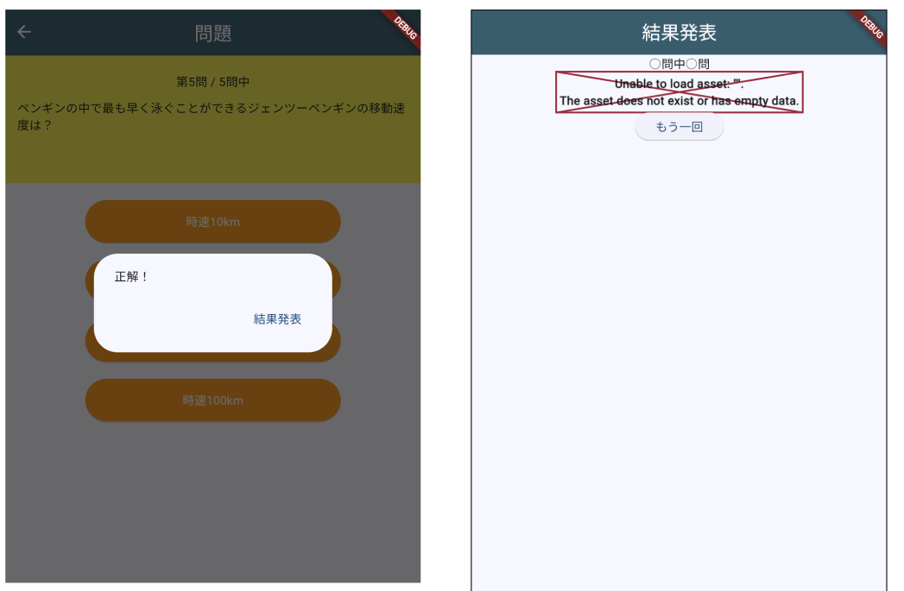

# **クイズアプリを作ろう 11**

## **結果発表ページに飛ばそう QuizListPage.class**

<br><br>

## **実行結果**

<br>



## **演習**

① ResultPageで、総問題数と正解数を受け取る  
② ResultPageで、総問題数と正解数を使えるようにする  

<br>

```dart

class ResultPage extends StatefulWidget {
  //①コメントアウト const ResultPage({super.key});
  //①総問題数と正解数を受け取る
  ResultPage(this._quizlistCnt, this._correctCnt);
  //②型を宣言し、総問題数と正解数を使えるようにする
  int _quizlistCnt;
  int _correctCnt;

  @override
  _ResultPageState createState() => _ResultPageState();
}

```
 
#### **【ソースコード】ResultPage**

```dart

mport 'package:flutter/material.dart';

class ResultPage extends StatefulWidget {
  ResultPage(this._quizlistCnt, this._correctCnt);
  int _quizlistCnt;
  int _correctCnt;

  @override
  _ResultPageState createState() => _ResultPageState();
}

class _ResultPageState extends State<ResultPage> {
  @override
  Widget build(BuildContext context) {
    return Scaffold(
      appBar: AppBar(
        centerTitle: true,
        backgroundColor: Theme.of(context).colorScheme.surfaceTint,
        title: Text("結果発表"),
      ),
      body: Center(),
    );
  }
}


```
