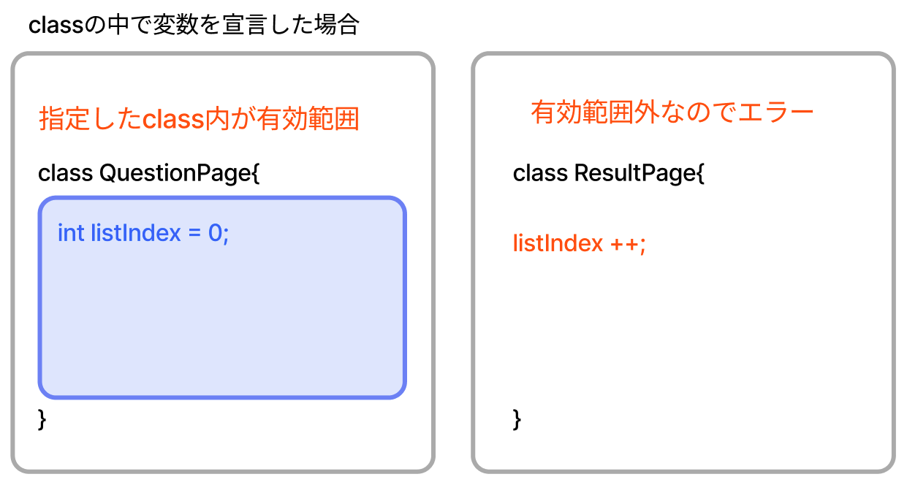
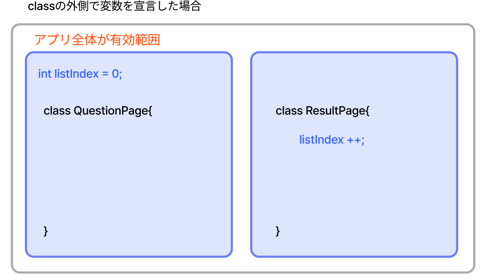
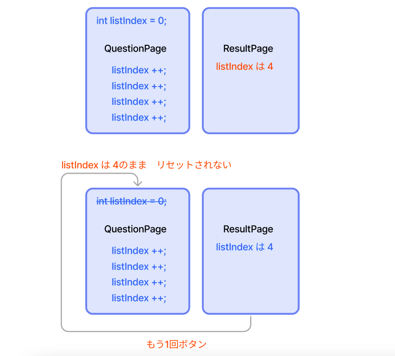

# **クイズアプリを作ろう 12**

## **結果発表ページを表示しよう ResultPage.class**

<br><br>

## **実行結果**

<br>


## **演習**

①question.dartをimport  
②結果表示  
③トップ画面に戻る処理  

<br>

```dart
import 'package:flutter/material.dart';
//①question.dartをimport
import 'question.dart';

body: Center(
  child: Column(
    children: [
      // ②問題数と正解数を変数で表示
      Text("${quizlistCnt}問中 ${correctCnt}問正解"),
      ElevatedButton(
        onPressed: () {
          //③トップページに戻る
          Navigator.of(context).popUntil((route) => route.isFirst);
        },
        child: Text("もう一回"), // ボタンのテキスト
      )
    ],
  ),
),

```


<br>

### **Top画面に直接戻る（popUntil)**

画面遷移の復習をしましょう  
PUSHとPOPを使って「画面スタック」領域に画面情報を入れたり、取り除いたりしてページの切り替えをしていきました。  


<br><br>

④widgetの装飾

```dart

body: Center(
  child: Column(
    mainAxisAlignment: MainAxisAlignment.center,  //④ 中央寄せ
    children: [
      Text(
        "${quizlistCnt}問中 ${correctCnt}問正解",
        style: TextStyle(                         //④ 文字の大きさを30pxに
          fontSize: 30,                           
        ),
      ),
      SizedBox(height: 20),                       //④ 余白
      Image.asset(""),
      SizedBox(height: 20),                       //④ 余白
      ElevatedButton(
        // ボタン
        onPressed: () {
          // ボタンを押したら
          Navigator.of(context)
              .popUntil((route) => route.isFirst); 
        },
        child: Text("もう一回"), 
        style: ElevatedButton.styleFrom(          //④ ボタンのスタイル
          // ボタンの見た目
          backgroundColor: Colors.orange,         //④ 背景はオレンジ
          foregroundColor: Colors.white,          //④ 文字の色は白
          fixedSize: Size(200, 50),               //④ 幅200px 高さ50px
        ),
      )
    ],
  ),

```

### **変数の有効範囲について**

戻った後、スタートボタンをクリックするとエラーになってしまう


**ローカル変数**  

class内、関数内で変数宣言した場合、変数が使える有効範囲は指定したclass,関数になる  



**グローバル変数（`このアプリはこちらを使っています`）**

class、関数の外側で変数宣言　（dartのimportの次に書く）の場合、変数が使える有効範囲はアプリ全体になる
question.dartの先頭で宣言した変数はresult.dartに引き継がれ使えています



**グローバル変数はリセット処理をしないかぎり、データを保持する**  
listIndexの変化をみてみよう



**リセット処理（initState）**

⑤classの最初に呼び出される関数を追加

```dart

class _QuestionPageState extends State<QuestionPage> {
  
  //　初期化する
  @override
  void initState() {
    super.initState();

    listIndex = 0;
    quizlistCnt = quizlist.length;
    selectedBtn = 0;
    resultText = "";
    correctCnt = 0;
  }

  bool lastCheck() {
    if (listIndex == quizlistCnt - 1) {
      return true;
    }
    return false;
  }


```

#### **【ソースコード】result.dart**

```dart

import 'package:flutter/material.dart';
import 'question.dart';

class ResultPage extends StatefulWidget {
  const ResultPage({super.key});

  @override
  _ResultPageState createState() => _ResultPageState();
}

class _ResultPageState extends State<ResultPage> {
  @override
  Widget build(BuildContext context) {
    return Scaffold(
      appBar: AppBar(
        centerTitle: true,
        foregroundColor: Colors.white,
        backgroundColor: Color.fromARGB(255, 65, 105, 121),
        title: Text("結果発表"),
        automaticallyImplyLeading: false,
      ),
      body: Center(
        child: Column(
          mainAxisAlignment: MainAxisAlignment.center, //⑥ 中央寄せ
          children: [
            Text(
              "${quizlistCnt}問中 ${correctCnt}問正解",
              style: TextStyle(
                fontSize: 30,
              ),
            ),
            SizedBox(height: 20),
            Image.asset(""),
            SizedBox(height: 20),
            ElevatedButton(
              onPressed: () {
                Navigator.of(context).popUntil((route) => route.isFirst);
              },
              child: Text("もう一回"),
              style: ElevatedButton.styleFrom(
                backgroundColor: Colors.orange,
                foregroundColor: Colors.white,
                fixedSize: Size(200, 50),
              ),
            )
          ],
        ),
      ),
    );
  }
}

```


#### **【ソースコード】question.dart**

```dart

import 'package:flutter/material.dart';
import 'quizlist.dart';
import 'result.dart';

int listIndex = 0;
int quizlistCnt = quizlist.length;
int selectedBtn = 0;
String resultText = "";
int correctCnt = 0;

class QuestionPage extends StatefulWidget {
  const QuestionPage({super.key});

  @override
  _QuestionPageState createState() => _QuestionPageState();
}

class _QuestionPageState extends State<QuestionPage> {
  @override
  void initState() {
    super.initState();

    listIndex = 0;
    quizlistCnt = quizlist.length;
    selectedBtn = 0;
    resultText = "";
    correctCnt = 0;
  }

  bool lastCheck() {
    if (listIndex == quizlistCnt - 1) {
      return true;
    }
    return false;
  }

  void answerSelect() async {
    if (quizlist[listIndex]["correct"] == selectedBtn) {
      resultText = "正解！";
      correctCnt++;
    } else {
      resultText = "ざんねん・・・";
    }

    await showDialog(
      barrierDismissible: false,
      context: context,
      builder: (context) => AlertDialog(
        content: Text(resultText),
        actions: [
          TextButton(
            onPressed: () {
              if (lastCheck()) {
                Navigator.of(context).push(
                  MaterialPageRoute(
                    builder: (context) {
                      //result.dartのPesultPage.classに飛ぶ
                      return ResultPage();
                    },
                  ),
                );
              } else {
                Navigator.pop(context);
              }
            },
            child: Text(lastCheck() ? "結果発表" : "次の問題"),
          ),
        ],
      ),
    );

    setState(() {
      listIndex++;
      selectedBtn = 0;
    });
  }

  @override
  Widget build(BuildContext context) {
    return Scaffold(
      appBar: AppBar(
        centerTitle: true,
        foregroundColor: Colors.white,
        backgroundColor: Color.fromARGB(255, 65, 105, 121),
        title: Text("問題"),
      ),
      body: Center(
        child: Column(
          children: [
            Container(
              padding: const EdgeInsets.all(20),
              width: double.infinity,
              height: 150,
              color: Colors.yellow,
              child: Column(
                children: [
                  Text("第${listIndex + 1}問 / ${quizlistCnt}問中"),
                  SizedBox(height: 10),
                  Text(quizlist[listIndex]["question"]),
                ],
              ),
            ),
            SizedBox(height: 20),
            for (int i = 1; i <= 4; i++) ...{
              ElevatedButton(
                onPressed: () {
                  selectedBtn = i;
                  answerSelect();
                },
                child: Text(quizlist[listIndex]["answer$i"]),
                style: ElevatedButton.styleFrom(
                  backgroundColor: Colors.orange,
                  foregroundColor: Colors.white,
                  fixedSize: Size(300, 50),
                ),
              ),
              SizedBox(height: 20),
            },
          ],
        ),
      ),
    );
  }
}


```
