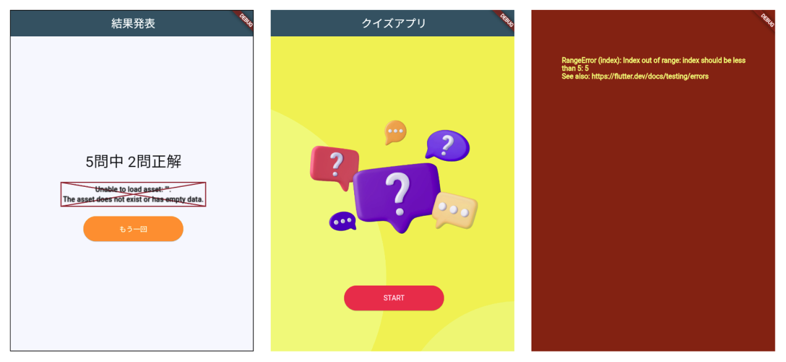

# **クイズアプリを作ろう 12**

## **結果発表ページを表示しよう ResultPage.class**

<br><br>

## **実行結果**

<br>


## **演習**
 
① 表示の枠を作る  
② 結果表示の文字を作る  
③ 最初のページに戻るボタンを作る  

実行結果を見て、自分で考えて書いてみよう  
「縦に３つのwidgetを配置」

<br><br>

```dart

body: Center(
  child: Column(
    children: [
      Text("○問中○問"),
      Image.asset(""),
      ElevatedButton(
        onPressed: () {},
        child: Text("もう一回"), // ボタンのテキスト
      )
    ],
  ),
),

```


④ 結果表示  
⑤トップ画面に戻る処理  

<br>

```dart

body: Center(
  child: Column(
    children: [
      // ④問題数と正解数を変数で表示
      Text("${widget._quizlistCnt}問中 ${widget._correctCnt}問正解"),
      ElevatedButton(
        onPressed: () {
          // ⑤トップページに戻る
          Navigator.of(context).popUntil((route) => route.isFirst);
        },
        child: Text("もう一回"), // ボタンのテキスト
      )
    ],
  ),
),

```


<br>

### **Top画面に直接戻る（popUntil)**

画面遷移の復習をしましょう  
PUSHとPOPを使って「画面スタック」領域に画面情報を入れたり、取り除いたりしてページの切り替えをしていきました。  


<br><br>

⑥widgetの装飾

```dart

body: Center(
  child: Column(
    mainAxisAlignment: MainAxisAlignment.center,  //⑥ 中央寄せ
    children: [
      Text(
        "${widget._quizlistCnt}問中 ${widget._correctCnt}問正解",
        style: TextStyle(                         //⑥ 文字の大きさを30pxに
          fontSize: 30,                           
        ),
      ),
      SizedBox(height: 20),                       //⑥ 余白
      Image.asset(""),
      SizedBox(height: 20),                       //⑥ 余白
      ElevatedButton(
        // ボタン
        onPressed: () {
          // ボタンを押したら
          Navigator.of(context)
              .popUntil((route) => route.isFirst); 
        },
        child: Text("もう一回"), 
        style: ElevatedButton.styleFrom(          //⑥ ボタンのスタイル
          // ボタンの見た目
          backgroundColor: Colors.orange,         //⑥ 背景はオレンジ
          foregroundColor: Colors.white,          //⑥ 文字の色は白
          fixedSize: Size(200, 50),               //⑥ 幅200px 高さ50px
        ),
      )
    ],
  ),

```



#### **【ソースコード】**

```dart

import 'package:flutter/material.dart';

class ResultPage extends StatefulWidget {
  //①コメントアウト const ResultPage({super.key});
  //①総問題数と正解数を受け取る
  ResultPage(this._quizlistCnt, this._correctCnt);
  //②型を宣言し、総問題数と正解数を使えるようにする
  int _quizlistCnt;
  int _correctCnt;

  @override
  _ResultPageState createState() => _ResultPageState();
}

class _ResultPageState extends State<ResultPage> {
  @override
  Widget build(BuildContext context) {
    return Scaffold(
      appBar: AppBar(
        centerTitle: true,
        backgroundColor: Theme.of(context).colorScheme.surfaceTint,
        title: Text("結果発表"),
      ),
      body: Center(
        child: Column(
          mainAxisAlignment: MainAxisAlignment.center, // 中央寄せ
          children: [
            Text(
              "${widget._quizlistCnt}問中 ${widget._correctCnt}問正解",
              style: TextStyle(
                fontSize: 30, // 文字の大きさを30pxに
              ),
            ),
            SizedBox(height: 20),
            Image.asset(""),
            SizedBox(height: 20),
            ElevatedButton(
              // ボタン
              onPressed: () {
                // ボタンを押したら
                Navigator.of(context)
                    .popUntil((route) => route.isFirst); // 最初のページへ
              },
              child: Text("もう一回"), // ボタンのテキスト
              style: ElevatedButton.styleFrom(
                // ボタンの見た目
                backgroundColor: Colors.orange, // 背景はオレンジ
                foregroundColor: Colors.white, // 文字の色は白
                fixedSize: Size(200, 50), // 幅200px 高さ50px
              ),
            )
          ],
        ),
      ),
    );
  }
}

```