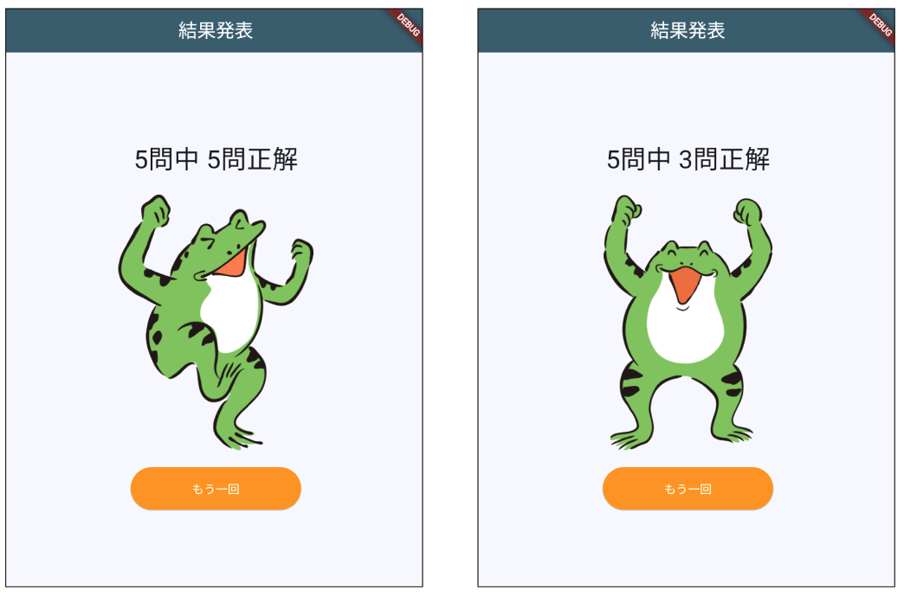
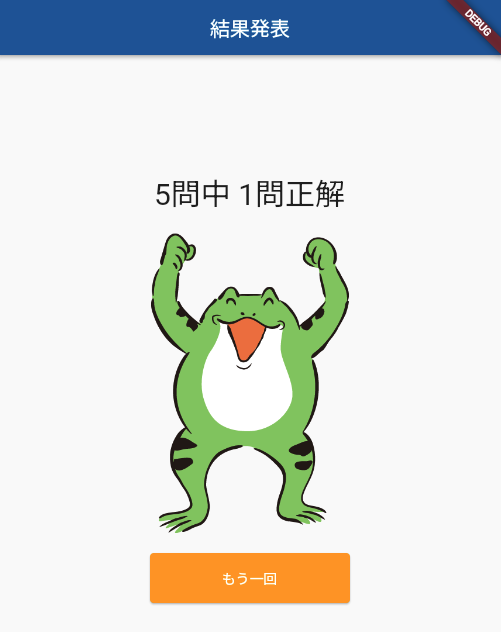

# **クイズアプリを作ろう 13**

## **正解数によって画像を切り替える関数 ResultPage.class**

<br><br>

## **実行結果**

<br>



## **演習**

① 画像切り替え関数を作る（関数呼び出し）

  「10_quizlist_08_dialog_onpress」のTextWidgetの切り替えと同じで  
  ImageWidgetもif文で切り替えることができないため「三項演算子」を使って切り替えました  
  今回はWidget関数を作って画像を切り替えてみよう

```dart
  //① Image widgetをコメントアウト　関数呼び出し
  // Image.asset(""),
  resultImage(),
```

<br><br>

② 関数の作成全問正解の時のみ、画像を切り替える処理を設定

```dart

//省略

class _ResultPageState extends State<ResultPage> {

  //Widget関数を作成
  Widget resultImage() {
    var imagePath;

    if (widget._correctCnt == widget._quizlistCnt) {
      imagePath = "images/yeah.png";
    } else {
      imagePath = "images/yeah2.png";
    }

    //returnでWidgetのごと返す
    return Image.asset(
      imagePath,
      width: 300,
      height: 300,
    );
  }

  @override
  Widget build(BuildContext context) {

//省略


```

三項演算子でWidgetを切り替える場合  
`resultImage(),`の部分を置き換える

```dart

Image.asset(
  (widget._correctCnt == widget._quizlistCnt)
      ? "images/yeah.png"
      : "images/yeah2.png",
  width: 300,
  height: 300,
),

```

<br>

③ appBerの戻るボタンを削除

```dart

appBar: AppBar(
  centerTitle: true,
  backgroundColor: Theme.of(context).colorScheme.surfaceTint,
  title: Text("結果発表"),
  automaticallyImplyLeading: false,//ここ追加
),

```


<br>

#### **【ソースコード】**

```dart

import 'package:flutter/material.dart';

class ResultPage extends StatefulWidget {
  ResultPage(this._quizlistCnt, this._correctCnt);
  int _quizlistCnt;
  int _correctCnt;

  @override
  _ResultPageState createState() => _ResultPageState();
}

class _ResultPageState extends State<ResultPage> {
  Widget resultImage() {
    var imagePath;

    if (widget._correctCnt == widget._quizlistCnt) {
      imagePath = "images/yeah.png";
    } else {
      imagePath = "images/yeah2.png";
    }

    return Image.asset(
      imagePath,
      width: 300,
      height: 300,
    );
  }

  @override
  Widget build(BuildContext context) {
    return Scaffold(
      appBar: AppBar(
        centerTitle: true,
        backgroundColor: Theme.of(context).colorScheme.surfaceTint,
        title: Text("結果発表"),
        automaticallyImplyLeading: false,
      ),
      body: Center(
        child: Column(
          mainAxisAlignment: MainAxisAlignment.center, // 中央寄せ
          children: [
            Text(
              "${widget._quizlistCnt}問中 ${widget._correctCnt}問正解",
              style: TextStyle(
                fontSize: 30, // 文字の大きさを30pxに
              ),
            ),
            SizedBox(height: 20),
            //三項演算子の場合
            // Image.asset(
            //   (widget._correctCnt == widget._quizlistCnt)
            //       ? "images/yeah.png"
            //       : "images/yeah2.png",
            //   width: 300,
            //   height: 300,
            // ),
            resultImage(),
            SizedBox(height: 20),
            ElevatedButton(
              // ボタン
              onPressed: () {
                // ボタンを押したら
                Navigator.of(context)
                    .popUntil((route) => route.isFirst); // 最初のページへ
              },
              child: Text("もう一回"), // ボタンのテキスト
              style: ElevatedButton.styleFrom(
                // ボタンの見た目
                backgroundColor: Colors.orange, // 背景はオレンジ
                foregroundColor: Colors.white, // 文字の色は白
                fixedSize: Size(200, 50), // 幅200px 高さ50px
              ),
            )
          ],
        ),
      ),
    );
  }
}


```
