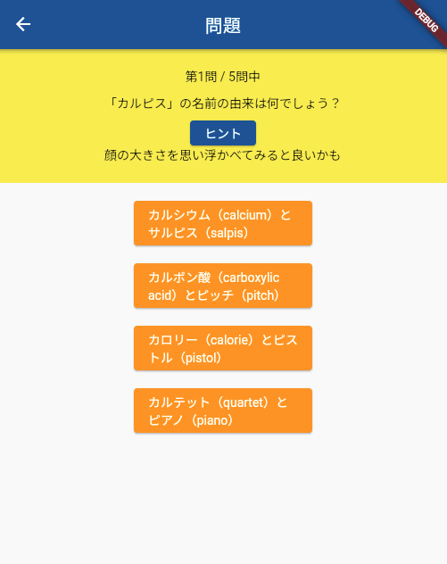
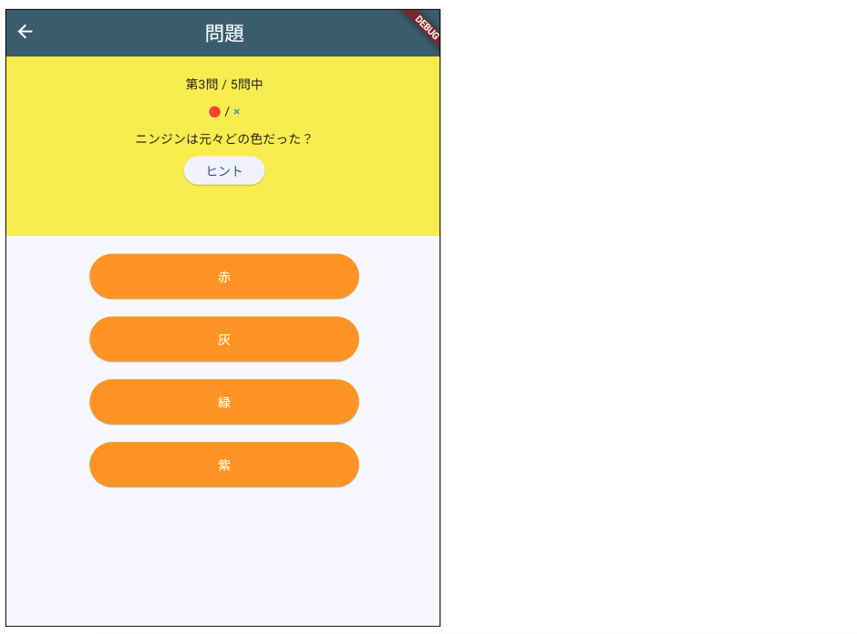
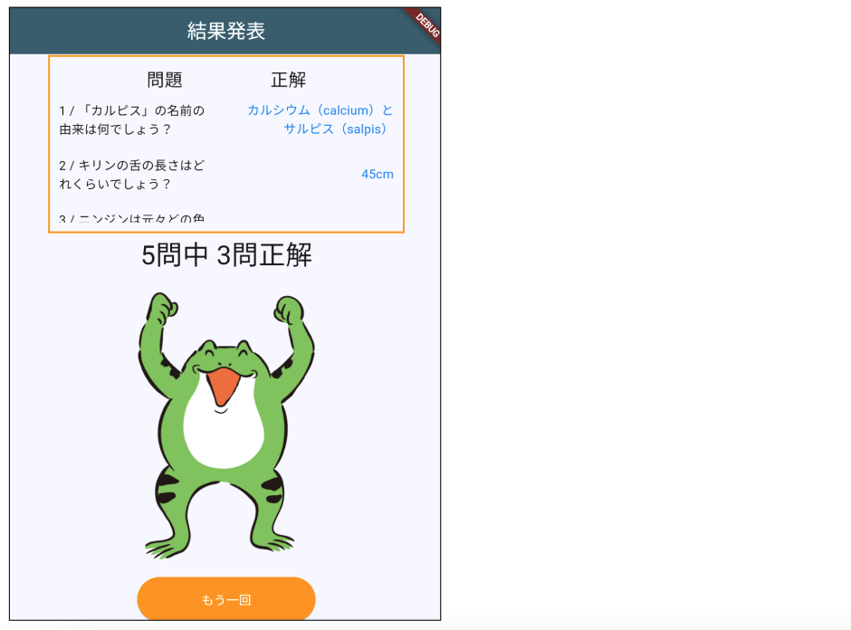

# **クイズアプリを作ろう 14**

## **出来上がったクイズアプリをアレンジしよう**

https://webgakushu.com/flutter/quiz_new14/

<br>

### **課題①ヒントボタンを作る**


<br>



<br>

**ヒント**
- quizlist.dartに「hint」を追加
- hint という変数を作る
- 問題文表示領域の高さを200にする
- ヒントボタンと、表示するTextウィジェット作る
- ヒントボタンが押されたらhint にヒントを代入
- hintを初期化

<br>

**quizlist.dart**

```dart
{
    "question": "キリンの舌の長さはどれくらいでしょう？",
    "answer1": "25cm",
    "answer2": "45cm",
    "answer3": "65cm",
    "answer4": "85cm",
    "correct": 2,
    "hint": "原材料を考えてみるとよいかも", // ★ヒントを追加
},

```

**question.dart _QuestionPageState**

```dart

  int listIndex = 0;
  int quizlistCnt = quizlist.length;
  int selectedBtn = 0;
  String resultText = "";
  int correctCnt = 0;
  String hint = ""; // ★ヒント用の変数追加

  //省略

  @override
  void initState() {
    super.initState();

    listIndex = 0;
    quizlistCnt = quizlist.length;
    selectedBtn = 0;
    resultText = "";
    correctCnt = 0;
    String hint = "";
  }

  //省略

```

**question.dart _QuestionPageState body**

```dart

  Container(
    padding: const EdgeInsets.all(20),
    width: double.infinity,
    height: 200,  //高さを変える
    color: Colors.yellow,
    child: Column(
      children: [
        Text("第${listIndex + 1}問 / ${quizlistCnt}問中"),
        SizedBox(height: 10),
        Text(quizlist[listIndex]["question"]),
        // ★ヒントここから
        SizedBox(height: 10),
        ElevatedButton(
          onPressed: () {
            setState(() {
              hint = quizlist[listIndex]["hint"];
            });
          },
          child: Text("ヒント"),
        ),
        SizedBox(height: 10),
        Text(hint),
        // ★ヒントここまで
      ],
    ),
  ),

```

**question.dart answerSelect関数**
```dart
  //再描画
  setState(() {
    listIndex++;
    selectedBtn = 0;
    hint = ""; //ヒント初期化
  });
```

<br><br>

### **課題②現在までの正解数を表示させる**



<br>

**ヒント**
- Rowを作る
- ひとつめに● * 正解数
- ふたつめに× * 今何問目か - 正解数
- 色などをよしなに

<br>

```dart

Container(
  padding: const EdgeInsets.all(20),
  width: double.infinity,
  height: 200,
  color: Colors.yellow,
  child: Column(
    children: [
      Text("第${listIndex + 1}問 / ${quizlistCnt}問中"),
      SizedBox(height: 10),
      //ここから
      Row(
        mainAxisAlignment: MainAxisAlignment.center,
        children: [
          Text(
            "●" * correctCnt,
            style: TextStyle(color: Colors.red),
          ),
          Text(" / "),
          Text(
            "×" * (listIndex - correctCnt),
            style: TextStyle(color: Colors.blue),
          ),
        ],
      ),
      SizedBox(height: 10),
      //ここまで
      Text(quizlist[listIndex]["question"]),
      // ★ヒントここから
      SizedBox(height: 10),
      ElevatedButton(
        onPressed: () {
          setState(() {
            hint = quizlist[listIndex]["hint"];
          });
        },
        child: Text("ヒント"),
      ),
      SizedBox(height: 10),
      Text(hint),
      // ★ヒントここまで
    ],
  ),
),

```

<br>

### **課題③正解や結果が最後にまとめて表示されるようにする**

<br>



<br>

**ヒント**

- 'quizlist.dart'をインポート
- Containerを作る
- 幅、高さなどを設定
- 子要素にListViewを入れる
- Rowを作り「問題」「正解」のテキストを表示
- for文を使って、クイズの問題と正解をRowの中に表示
- 色などをよしなに


<br>

#### **【ソースコード】 ③正解や結果が最後にまとめて表示されるようにする**

**result.dart _ResultPageState body**

```dart
  import 'quizlist.dart';

  //省略

  body: Center(
        child: Column(
          mainAxisAlignment: MainAxisAlignment.center, // 中央寄せ
          children: [
            //ここから
            Container(
              width: 400,
              height: 200,
              padding: EdgeInsets.all(10),
              decoration: BoxDecoration(
                border: Border.all(color: Colors.orange, width: 2),
              ),
              child: ListView(
                children: [
                  Row(
                    mainAxisAlignment: MainAxisAlignment.spaceEvenly,
                    children: [
                      Text(
                        "問題",
                        style: TextStyle(fontSize: 20),
                      ),
                      Text(
                        "正解",
                        style: TextStyle(fontSize: 20),
                      )
                    ],
                  ),
                  SizedBox(height: 10),
                  for (int i = 0; i <= 4; i++) ...{
                    Row(
                      mainAxisAlignment: MainAxisAlignment.spaceBetween,
                      children: [
                        Flexible(
                            child:
                                Text("${i + 1} / ${quizlist[i]["question"]}")),
                        SizedBox(width: 30),
                        Flexible(
                            child: Text(
                          quizlist[i]["answer${quizlist[i]["correct"]}"],
                          style: TextStyle(color: Colors.blue),
                          textAlign: TextAlign.right,
                        )),
                      ],
                    ),
                    SizedBox(height: 20),
                  },
                ],
              ),
            ),
            //ここまで
            Text(
              "${widget._quizlistCnt}問中 ${widget._correctCnt}問正解",
              style: TextStyle(
                fontSize: 30, // 文字の大きさを30pxに
              ),
            ),
            SizedBox(height: 20),
            // Image.asset(
            //   (widget._correctCnt == widget._quizlistCnt)
            //       ? "images/yeah.png"
            //       : "images/yeah2.png",
            //   width: 300,
            //   height: 300,
            // ),
            resultImage(),
            SizedBox(height: 20),
            ElevatedButton(
              // ボタン
              onPressed: () {
                // ボタンを押したら
                Navigator.of(context)
                    .popUntil((route) => route.isFirst); // 最初のページへ
              },
              child: Text("もう一回"), // ボタンのテキスト
              style: ElevatedButton.styleFrom(
                // ボタンの見た目
                backgroundColor: Colors.orange, // 背景はオレンジ
                foregroundColor: Colors.white, // 文字の色は白
                fixedSize: Size(200, 50), // 幅200px 高さ50px
              ),
            )
          ],
        ),
      ),

```