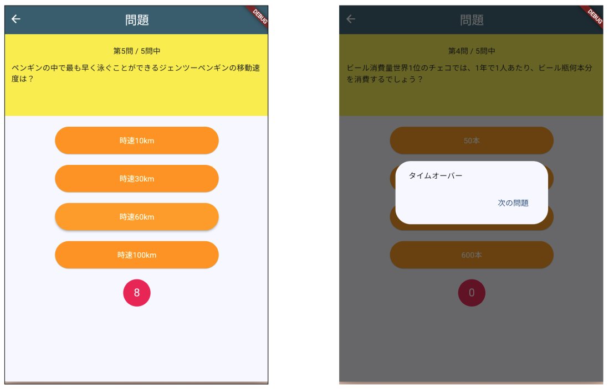

# **クイズアプリを作ろう タイマー追加**

## **カウントダウンタイマーを作る**



<br>

- [ ] ① カウントダウン表示用Containerを作る  

```dart

Container(
  width: 50,
  height: 50,
  decoration: BoxDecoration(
    borderRadius: BorderRadius.circular(50),
    color: Colors.pink,
  ),
  child: Center(
    child: Text(
      "10",
      style: TextStyle(
        fontSize: 20,
        color: Colors.white,
      ),
    ),
  ),
)

```

- [ ] ②一番上に「import 'dart:async';」を追加

```dart

import 'dart:async';

import 'package:flutter/material.dart';
import 'quizlist.dart';
import 'result.dart';

```

- [ ] ③変数「_currentSec」を作り、10を代入（10秒のタイマー）
- [ ] ④タイマー用の関数作成
- [ ] ⑤タイムオーバー処理
- [ ] ⑥タイマーリセット

```dart

class _QuestionPageState extends State<QuestionPage> {
  int _listIndex = 0;
  int _quizlistCnt = quizlist.length;
  int _selectedBtn = 0;
  String _resultText = "";
  int _correctCnt = 0;

  int _currentSec = 10; //③タイマー
  bool _timeOver = false; //③タイムオーバー判定

  bool lastCheck() {
    if (_listIndex == _quizlistCnt - 1) {
      return true;
    }
    return false;
  }

  @override

  //④タイマースタート（一番最初に動き出す）
  void initState() {
    super.initState();
    countTimer();
  }

  //④タイマー制御（1秒毎に実行される）
  Timer countTimer() {
    return Timer.periodic(const Duration(seconds: 1), (Timer timer) {
      //⑤回答有無
      if (_selectedBtn == 0) {
        //⑤タイムオーバー判定
        if (_currentSec == 0) {
          timer.cancel();
          _timeOver = true;
          answerSelect();
        } else {
          if (this.mounted) {
            setState(() {
              _currentSec--;
            });
          }
        }
      } else {
        timer.cancel();
        answerSelect();
      }
    });
  }

  void answerSelect() async {
    //⑤タイムオーバー判定追加
    if (_timeOver) {
      _resultText = "タイムオーバー";
    } else {
      if (quizlist[_listIndex]["correct"] == _selectedBtn) {
        _resultText = "正解！";
        _correctCnt++;
      } else {
        _resultText = "ざんねん・・・";
      }
    }

    await showDialog(
      context: context,
      builder: (context) => AlertDialog(
        content: Text(_resultText),
        actions: [
          TextButton(
            onPressed: () {
              if (lastCheck()) {
                Navigator.of(context).push(
                  MaterialPageRoute(
                    builder: (context) {
                      return ResultPage(_quizlistCnt, _correctCnt);
                    },
                  ),
                );
              } else {
                Navigator.pop(context); //ダイアログを閉じる
              }
            },
            child: Text(lastCheck() ? "結果発表" : "次の問題"),
          ),
        ],
      ),
    );

    //再描画
    if (this.mounted) {
      setState(() {
        _listIndex++; // 次の問題へ
        _selectedBtn = 0; // 選ばれたボタンの情報をリセット
        _currentSec = 10; //⑥タイマーリセット
        _timeOver = false;//⑥ゲームオーバー判定リセット
        countTimer(); //⑥タイマー再起動
      });
    }
  }

  @override
  Widget build(BuildContext context) {

  //省略

```

- [ ] ⑦ボタンが押された時の処理　answerSelectをコメントアウト


```dart

//省略

for (int i = 1; i <= 4; i++) ...{
  ElevatedButton(
    onPressed: () {
      //answerSelect();
      _selectedBtn = i;
    },
    child: Text(quizlist[_listIndex]["answer$i"]),
    style: ElevatedButton.styleFrom(
      backgroundColor: Colors.orange,
      foregroundColor: Colors.white,
      fixedSize: Size(200, 50),
    ),
  ),
  SizedBox(height: 20),
},

//省略

```
