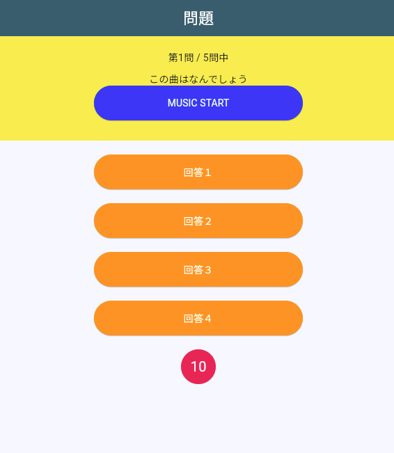

# **イントロクイズを作ってみよう**



## **MUSIC STARTボタンを追加**

**【question.dart】**

```dart

child: Column(
  children: [
    Text("第${listIndex + 1}問 / ${quizlistCnt}問中"),
    SizedBox(height: 10),
    //①
    Text("この曲はなんでしょう"),
    ElevatedButton(
      onPressed: () {},
      child: Text("MUSIC START"),
      style: ElevatedButton.styleFrom(
        backgroundColor: const Color.fromARGB(255, 0, 81, 255),
        foregroundColor: Colors.white,
        fixedSize: Size(300, 50),
      ),
    ),
  ],
),

```

## **audioplayersを使う**

- [ ] ① pubspec.yaml

```dart

dependencies:
  flutter_test:
    sdk: flutter
  audioplayers: ^6.0.0 //ここに追加

```

assets/audioフォルダを作成し、pubspec.yamlの設定

```dart

assets:
    - images/
    - assets/audio/Onoma-Sparkle.mp3

```

- [ ] ②コマンド
  
```dart

flutter pub get

```

- [ ] ③パッケージをインポート

```dart

import 'package:audioplayers/audioplayers.dart';

```

- [ ] ④音源ファイルの情報を追加

**【quizlist.dart】**

```dart

{
    "question": "", //問題文
    "answer1": "回答１", //選択肢１
    "answer2": "回答２", //選択肢２
    "answer3": "回答３", //選択肢３
    "answer4": "回答４", //選択肢４
    "correct": 1, //回答番号
    "music": "audio/Onoma-Sparkle.mp3" //音楽ファイル
  },

```

- [ ] ⑤AudioPlayerインスタンスを追加
- [ ] ⑥停止関数
- [ ] ⑦再生関数
- [ ] ⑧回答したら音を止める


```dart

class _QuestionPageState extends State<QuestionPage> {
  //ローカル変数
  int _currentSec = 10; //タイマー
  bool _timeOver = false; //タイムオーバー判定
  final AudioPlayer _audioPlayer = AudioPlayer(); // ⑤AudioPlayerインスタンス

  //省略

  @override
  void initState() {
    super.initState();

    listIndex = 0;
    quizlistCnt = quizlist.length;
    selectedBtn = 0;
    resultText = "";
    correctCnt = 0;

    //タイマースタート
    countTimer();
  }

  // ⑥画面終了時に音声を停止
  @override
  void dispose() {
    _audioPlayer.dispose(); // 画面終了時に音声を停止
    super.dispose();
  }

  // ⑦音声再生関数
  void playAudio() async {
    String audioPath = quizlist[listIndex]["music"];
    await _audioPlayer.play(AssetSource(audioPath)); // アセットから音声再生
  }

  //省略

   void answerSelect() async {
    // ⑧音声停止
    await _audioPlayer.stop();

    //タイムオーバー判定追加
    if (_timeOver) {
      resultText = "タイムオーバー";
    } else {
      if (quizlist[listIndex]["correct"] == selectedBtn) {
        resultText = "正解！";
        correctCnt++;
      } else {
        resultText = "ざんねん・・・";
      }
    }

  //省略

```

- [ ] ⑨関数呼び出し
- [ ] ⑩ボタンが押されたらタイマーを動かす

```dart

child: Column(
  children: [
    Text("第${listIndex + 1}問 / ${quizlistCnt}問中"),
    SizedBox(height: 10),
    Text("この曲はなんでしょう"),
    ElevatedButton(
      onPressed: () {
        //⑨再生
        playAudio();
        //⑩タイマー動かす
        countTimer();
      },
      child: Text("MUSIC START"),
      style: ElevatedButton.styleFrom(
        backgroundColor: const Color.fromARGB(255, 0, 81, 255),
        foregroundColor: Colors.white,
        fixedSize: Size(300, 50),
      ),
    ),
  ],
),

```


```dart

@override
  void initState() {
    super.initState();

    listIndex = 0;
    quizlistCnt = quizlist.length;
    selectedBtn = 0;
    resultText = "";
    correctCnt = 0;

    //タイマースタート
    // ⑩countTimer();
  }

```

```dart

await showDialog(
      barrierDismissible: false,
      context: context,
      builder: (context) => AlertDialog(
        content: Text(resultText),
        actions: [
          TextButton(
            onPressed: () {
              if (lastCheck()) {
                Navigator.of(context).push(
                  MaterialPageRoute(
                    builder: (context) {
                      return ResultPage();
                    },
                  ),
                );
              } else {
                Navigator.pop(context);
              }
            },
            child: Text(lastCheck() ? "結果発表" : "次の問題"),
          ),
        ],
      ),
    );

    setState(() {
      listIndex++;
      selectedBtn = 0;
      _currentSec = 10; //タイマーリセット
      _timeOver = false; //ゲームオーバー判定リセット
      // ⑩countTimer(); //タイマー再起動
    });
  }

```
