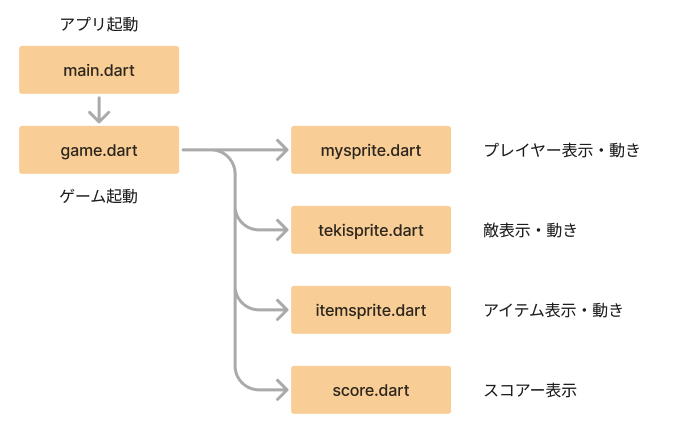

# **ゲームプログラミング**

## **flutter flame**

### **flame インストール**

コマンド実行

```dart

flutter pub add flame
flutter pub upgrade flame

```

### **サイトマップ**



<br>

### **ベースを作る**

**①Flameインポート**
  
```dart

import 'package:flame/game.dart';

```

**②GameWidget追加**

```dart

body: GameWidget(game: MainGame()));

```

**③game.dartを追加**

```dart

import 'game.dart';

```

```dart

// ①flutter_flameを使う
import 'package:flame/game.dart';
import 'package:flutter/material.dart';
// ③ゲーム起動
import 'game.dart';

void main() => runApp(MyApp());

// アプリ起動
class MyApp extends StatelessWidget {
  @override
  Widget build(BuildContext context) {
    return MaterialApp(
      title: 'Generated App',
      theme: ThemeData(
        primarySwatch: Colors.blue,
        primaryColor: const Color(0xff2196f3),
        canvasColor: const Color(0xfffafafa),
      ),
      home: MyHomePage(),
    );
  }
}

class MyHomePage extends StatefulWidget {
  MyHomePage({Key? key}) : super(key: key);
  @override
  _MyHomePageState createState() => _MyHomePageState();
}

class _MyHomePageState extends State<MyHomePage> {
  @override
  Widget build(BuildContext context) {
    return Scaffold(
        appBar: AppBar(
          title: Text('GAME'),
        ),
        //② GameWidget
        body: GameWidget(game: MainGame()));
  }
}


```

