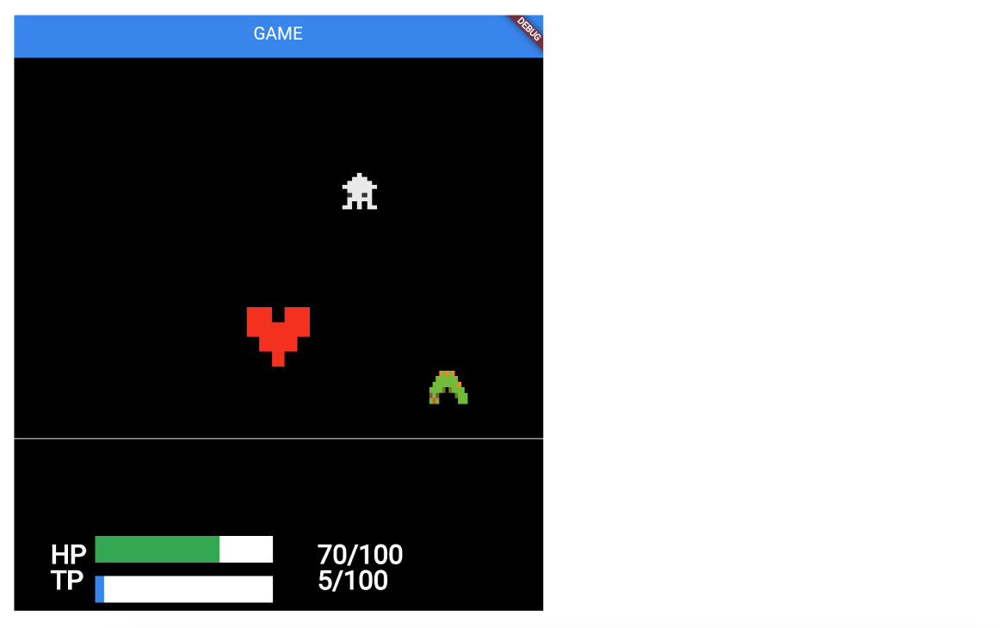

# **スコアバーの表示**



## **変数作成・クラス作成**

**game.dart**

①HPバー表示  
②TPバー表示  

```dart
//HPテキスト描画
Future<void> HpTextRemove() async {
  await add(Hptext());

  children.whereType<Hpscore>().forEach((text) {
    text.removeFromParent();
  });
  await add(Hpscore());

  //①HPバー表示
  children.whereType<HpBar>().forEach((text) {
    text.removeFromParent();
  });
  await add(HpBar());
}

```

```dart
//TPテキスト描画
Future<void> TpTextRemove() async {
  children.whereType<Tptext>().forEach((text) {
    text.removeFromParent();
  });
  await add(Tptext());

  children.whereType<Tpscore>().forEach((text) {
    text.removeFromParent();
  });
  await add(Tpscore());

  //②TPバー表示
  children.whereType<TpBar>().forEach((text) {
    text.removeFromParent();
  });
  await add(TpBar());
}

```

**score.dart**

①HPバー表示  
②TPバー表示

```dart

// ①HPバー表示
class HpBar extends RectangleComponent with HasGameRef<MainGame> {
  final barsize = 200.0;
  @override
  Future<void> onLoad() async {
    position = Vector2(100, gameRef.size.y - 60 * 1.5);

    //HPの割合で横幅指定
    size = Vector2((gameRef.HP * barsize / 100).toDouble(), 30);
    paint = Paint()..color = Colors.green;
  }

  //オブジェクトを重ねる
  void renderHpBarButton(Canvas canvas) {
    final rect = Rect.fromLTWH(
      0,
      0,
      barsize,
      30,
    );
    final bgPaint = Paint()..color = Colors.white;
    canvas.drawRect(rect, bgPaint);
  }

  @override
  Future<void> render(Canvas canvas) async {
    renderHpBarButton(canvas);
    super.render(canvas);
  }
}

// TPバー表示
class TpBar extends RectangleComponent with HasGameRef<MainGame> {
  final barsize = 200.0;
  @override
  Future<void> onLoad() async {
    position = Vector2(100, gameRef.size.y - 30 * 1.5);
    //TPの割合で横幅指定
    size = Vector2((gameRef.TP * barsize / 100).toDouble(), 30);
    paint = Paint()..color = Colors.blue;
  }

  void renderHpBarButton(Canvas canvas) {
    final rect = Rect.fromLTWH(
      0,
      0,
      barsize,
      30,
    );
    final bgPaint = Paint()..color = Colors.white;
    canvas.drawRect(rect, bgPaint);
  }

  @override
  Future<void> render(Canvas canvas) async {
    renderHpBarButton(canvas);
    super.render(canvas);
  }
}


```
