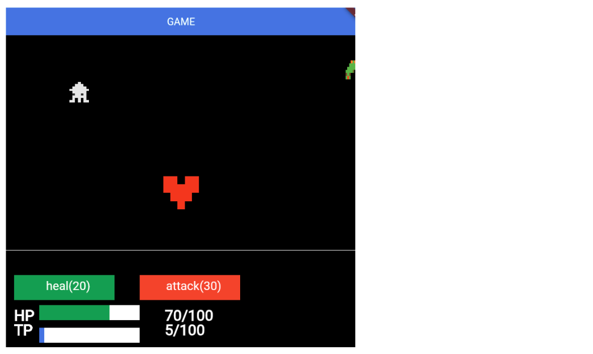

# **ボタンの表示**



## **変数作成・クラス作成**

**game.dart**

①ボタン表示  

```dart

Future<void> onLoad() async {
    await super.onLoad();

    // 省略

    //① ボタン表示
    ButtonRemove();
  }

```

```dart

// ボタン追加
Future<void> ButtonRemove() async {
  
    await add(Healbutton());
  
    await add(Attackbutton());
  
}

```

**score.dart**

①healボタン表示  
②attackボタン表示

```dart

//①healボタン描画
class Healbutton extends TextBoxComponent with HasGameRef<MainGame> {
  @override
  Future<void> onLoad() async {
    position = Vector2(50, gameRef.size.y - 150);
    text = "heal(20)";
    size = Vector2(200, 50);
    align = Anchor.center;

    super.onLoad();
  }

  @override
  Future<void> render(Canvas canvas) async {
    renderHealButton(canvas);
    super.render(canvas);
  }

  void renderHealButton(Canvas canvas) {
    final rect = Rect.fromLTWH(
      0,
      0,
      200,
      50,
    );
    final bgPaint = Paint()..color = Colors.green;
    canvas.drawRect(rect, bgPaint);
  }
}

//②attackボタン表示
class Attackbutton extends TextBoxComponent with HasGameRef<MainGame> {
  @override
  Future<void> onLoad() async {
    position = Vector2(300, gameRef.size.y - 150);
    text = "attack(30)";
    size = Vector2(200, 50);
    align = Anchor.center;

    super.onLoad();
  }

  @override
  Future<void> render(Canvas canvas) async {
    renderAttackButton(canvas);
    super.render(canvas);
  }

  void renderAttackButton(Canvas canvas) {
    final rect = Rect.fromLTWH(
      0,
      0,
      200,
      50,
    );
    final bgPaint = Paint()..color = Colors.red;
    canvas.drawRect(rect, bgPaint);
  }
}


```

## **表示・非表示判定**

**game.dart**

①TPが20以上で表示
②TPが30以上で表示

```dart
Future<void> ButtonRemove() async {
    if (TP >= 20) {
      await add(Healbutton());
    } else {
      children.whereType<Healbutton>().forEach((text) {
        text.removeFromParent();
      });
    }
    if (TP >= 30) {
      await add(Attackbutton());
    } else {
      children.whereType<Attackbutton>().forEach((text) {
        text.removeFromParent();
      });
    }
  }

```

**itemsprite.dart**

③アイテムとプレーヤーが衝突したら、ボタンの状態も再読み込みする

```dart

@override
  Future<void> onRemove() async {
    if (gameRef.HP > 0) {
      await gameRef.ItemSpriteRemove();
      await gameRef.TpTextRemove();
      //①再読み込み
      await gameRef.ButtonRemove();
    }
    super.onRemove();
  }

```

**tekisprite.dart**

④とプレーヤーが衝突したら、ボタンの状態も再読み込みする

```dart

@override
Future<void> onRemove() async {
  await gameRef.TekiSpriteRemove();
  await gameRef.HpTextRemove();
  await gameRef.ButtonRemove();
    
  super.onRemove();
}

```

## **ボタンタップ**

**score.dart**

①パッケージ追加

```dart

import 'package:flame/events.dart';

```

②`TapCallbacks`ミックスイン

```dart

class Healbutton extends TextBoxComponent
    with HasGameRef<MainGame>,TapCallbacks {

```

```dart

class Attackbutton extends TextBoxComponent
    with HasGameRef<MainGame>,TapCallbacks {

```

③healボタンをタップした時

```dart

class Healbutton extends TextBoxComponent
    with HasGameRef<MainGame>, TapCallbacks {
  
  //省略

  @override
  Future<void> onTapDown(TapDownEvent event) async {

    //healボタンを消す
    children.whereType<Healbutton>().forEach((button) {
      button.removeFromParent();
    });
    gameRef.HP = 100;
    gameRef.TP -= 20;

    await gameRef.HpTextRemove(); //HP再描画
    await gameRef.TpTextRemove(); //TP再描画
    await gameRef.ButtonRemove(); //ボタン再描画
    super.onTapDown(event);
  }

  //省略

```

④attackボタンをタップした時

敵を消す処理を追加

```dart

@override
Future<void> onTapDown(TapDownEvent event) async {
  children.whereType<Attackbutton>().forEach((button) {
    button.removeFromParent();
  });

  gameRef.TP -= 30;
  await gameRef.TpTextRemove();
  await gameRef.ButtonRemove();
  await gameRef.TekiRemoveOnly();//敵を消す

  super.onTapDown(event);
}

```

**game.dart**

敵を消す

```dart

// 敵を消す
  Future<void> TekiRemoveOnly() async {
    children.whereType<TekiSprite>().forEach((text) {
      text.removeFromParent();
    });
  }

```

## **キーボードから操作**

**score.dart**

①コンポーネント追加

```dart

import 'package:flutter/services.dart';

```

②`KeyboardHandler`ミックスイン

```dart

// healボタン
class Healbutton extends TextBoxComponent
    with HasGameRef<MainGame>, TapCallbacks, KeyboardHandler {

```

③キーイベント追加(Healbutton)

```dart

@override
  bool onKeyEvent(
    RawKeyEvent event,
    Set<LogicalKeyboardKey> keysPressed,
  ) {
    if (event.character == 'q') {
      children.whereType<Healbutton>().forEach((button) {
        button.removeFromParent();
      });
      gameRef.HP = 100;
      gameRef.TP -= 20;
      gameRef.HpTextRemove();
      gameRef.TpTextRemove();
      gameRef.ButtonRemove();
    }
    return true;
  }

```

④キーイベント追加(Attackbutton)

```dart

@override
  bool onKeyEvent(
    RawKeyEvent event,
    Set<LogicalKeyboardKey> keysPressed,
  ) {
    if (event.character == 'e') {
      children.whereType<Attackbutton>().forEach((button) {
        button.removeFromParent();
      });

      gameRef.TP -= 30;
      gameRef.TpTextRemove();
      gameRef.ButtonRemove();
      gameRef.TekiRemoveOnly();
    }
    return true;
  }

```
