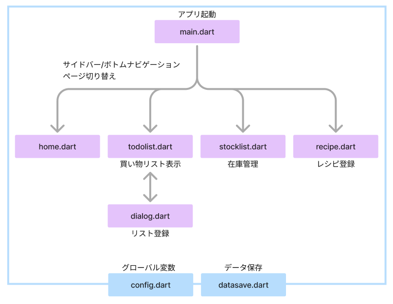
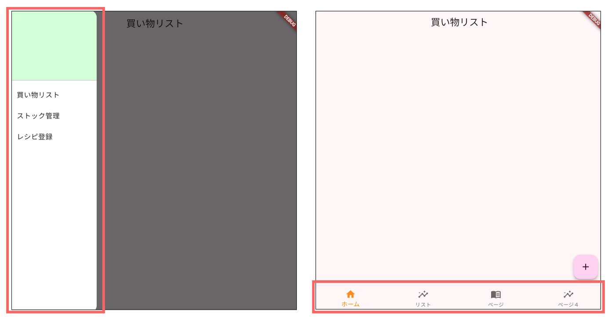
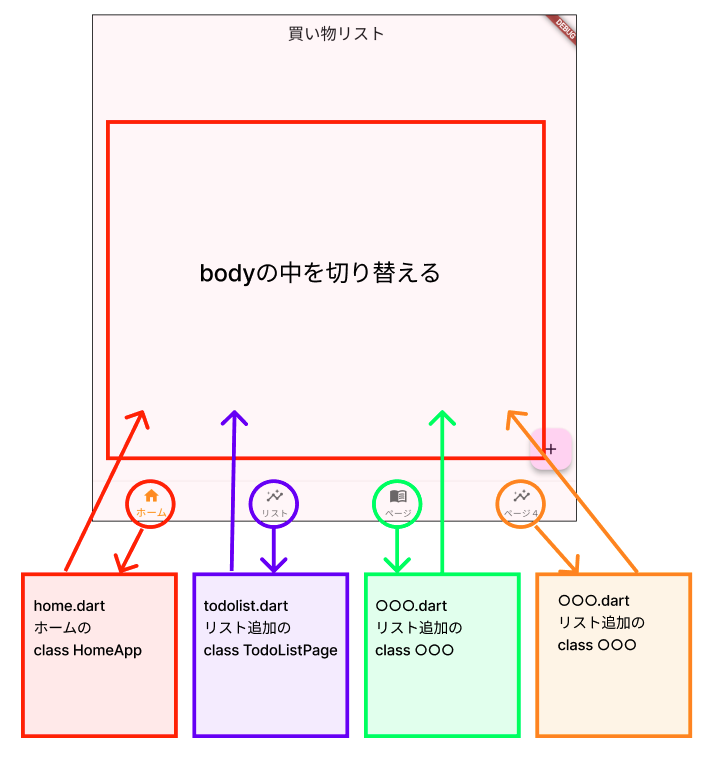
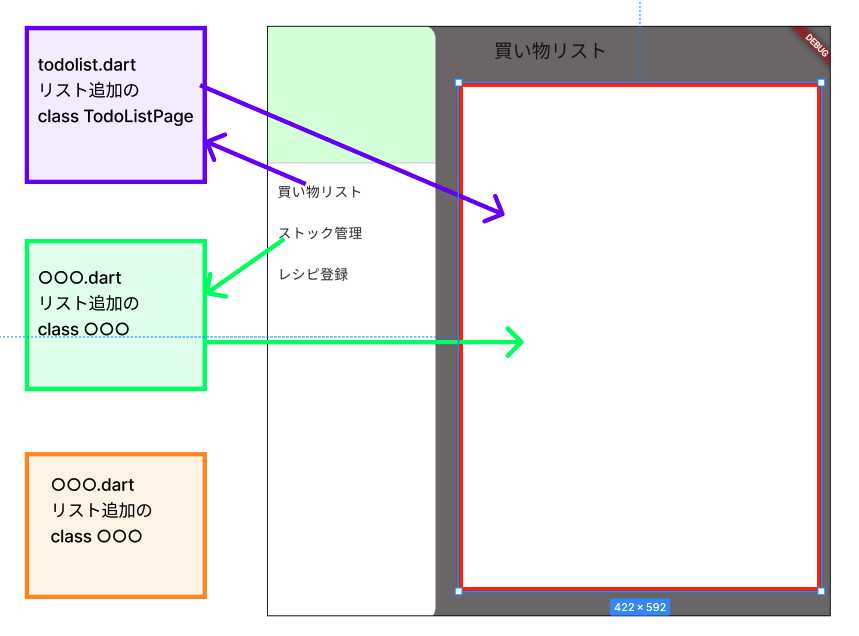

# Todoアプリを作ろう 01

https://webgakushu.com/flutter/todoapp_new/

## サイトマップ




## 実行結果



### アプリのベースを作る

```Dart

import 'package:flutter/material.dart';

void main() {
  runApp(const MyApp());
}

class MyApp extends StatelessWidget {
  const MyApp({super.key});

  @override
  Widget build(BuildContext context) {
    return MaterialApp(
      title: "TODOアプリ",
      theme: ThemeData(
        colorScheme:
            ColorScheme.fromSeed(seedColor: Color.fromARGB(255, 255, 45, 251)),
      ),
      home: NaviApp(),
    );
  }
}

```

### ボトムナビゲーションの作り方

#### **【切り替えの仕組み】**




**①ボトムナビゲーションのベース**

**【main.dart】**

```dart

class NaviApp extends StatefulWidget {
  @override
  _NaviAppState createState() => _NaviAppState();
}

class _NaviAppState extends State<NaviApp> {

  @override
  Widget build(BuildContext context) {
    return Scaffold(
      body: Text("bodyを切り替える"),
      // ----- ボトムナビゲーション -----
      bottomNavigationBar: BottomNavigationBar(
        items: const <BottomNavigationBarItem>[
          BottomNavigationBarItem(icon: Icon(Icons.home), label: 'ホーム'),
          BottomNavigationBarItem(
              icon: Icon(
                Icons.insights_outlined,
              ),
              label: 'リスト'),
          BottomNavigationBarItem(
              icon: Icon(
                Icons.menu_book_outlined,
              ),
              label: 'ページ'),
          BottomNavigationBarItem(
              icon: Icon(
                Icons.insights_outlined,
              ),
              label: 'ページ４'),
        ],
        selectedItemColor: Colors.amber[800],
        type: BottomNavigationBarType.fixed,
      ),
    );
  }
}

```

**②切り替えるdartとclassを作る**

アプリ設計に合わせて、dartファイル名、class名をつける

例として「home.dart」「todolist.dart」「stocklist.dart」「recipe.dart」を追加して  
ベースのclassを作る

**【home.dart】**

```dart

import 'package:flutter/material.dart';

class HomeApp extends StatefulWidget {
  @override
  _HomeAppState createState() => _HomeAppState();
}

class _HomeAppState extends State<HomeApp> {
  @override
  Widget build(BuildContext context) {
    return Scaffold(
      appBar: AppBar(
        title: Text("topページタイトル"),
      ),
      body: Center(
        child: Text("topページ"),
      ),
    );
  }
}

```

**【todolist.dart】**

```dart

import 'package:flutter/material.dart';

class TodoListPage extends StatefulWidget {
  const TodoListPage({super.key});

  @override
  _TodoListPageState createState() => _TodoListPageState();
}

class _TodoListPageState extends State<TodoListPage> {
  @override
  Widget build(BuildContext context) {
    return Scaffold(
      appBar: AppBar(
        title: Text("買い物リストタイトル"),
      ),
      body: Center(
        child: Text("買い物リスト"),
      ),
    );
  }
}

```

**【stocklist.dart】**

```dart

import 'package:flutter/material.dart';

class StockListPage extends StatefulWidget {
  const StockListPage({super.key});

  @override
  _StockListPageState createState() => _StockListPageState();
}

class _StockListPageState extends State<StockListPage> {
  @override
  Widget build(BuildContext context) {
    return Scaffold(
      appBar: AppBar(
        title: Text("在庫管理タイトル"),
      ),
      body: Center(
        child: Text("在庫管理"),
      ),
    );
  }
}

```

**【recipe.dart】**

```dart

import 'package:flutter/material.dart';

class RecipePage extends StatefulWidget {
  const RecipePage({super.key});

  @override
  _RecipePageState createState() => _RecipePageState();
}

class _RecipePageState extends State<RecipePage> {
  @override
  Widget build(BuildContext context) {
    return Scaffold(
       appBar: AppBar(
        title: Text("レシピ登録タイトル"),
      ),
      body: Center(
        child: Text("レシピ登録"),
      ),
    );
  }
}

```

**③切り替えのための変数を作る**

**【main.dart】**

```dart

import 'package:flutter/material.dart';
import 'home.dart'; //③追加
import 'todolist.dart'; //③追加
import 'stocklist.dart'; //③追加
import 'recipe.dart'; //③追加

//省略

class NaviApp extends StatefulWidget {
  @override
  _NaviAppState createState() => _NaviAppState();
}

class _NaviAppState extends State<NaviApp> {
  // ③ナビゲーションの切り替えインデックス
  int _selectedIndex = 0;

  // ③タップされた時、インデックスを切り替える
  void _onItemTapped(int index) {
    setState(() {
      _selectedIndex = index;
    });
  }

  @override
  Widget build(BuildContext context) {
    // ③飛び先のclassをリストで管理
    List<Widget> _pages = <Widget>[
      HomeApp(),
      TodoListPage(),
      StockListPage(),
      RecipePage()
    ];
    return Scaffold(
      // ③飛び先のクラスを呼び出す
      body: _pages[_selectedIndex],
      // ----- ボトムナビゲーション -----
      bottomNavigationBar: BottomNavigationBar(
        items: const <BottomNavigationBarItem>[
          BottomNavigationBarItem(icon: Icon(Icons.home), label: 'ホーム'),
          BottomNavigationBarItem(
              icon: Icon(
                Icons.insights_outlined,
              ),
              label: 'リスト'),
          BottomNavigationBarItem(
              icon: Icon(
                Icons.menu_book_outlined,
              ),
              label: 'ページ'),
          BottomNavigationBarItem(
              icon: Icon(
                Icons.insights_outlined,
              ),
              label: 'ページ４'),
        ],
        // ③　currentIndexとonTapを追加
        currentIndex: _selectedIndex,
        onTap: _onItemTapped,
        selectedItemColor: Colors.amber[800],
        type: BottomNavigationBarType.fixed,
      ),
    );
  }
}


```

### サイドバーの作り方

#### **【切り替えの仕組み】**



**①サイドバーのベース**

```dart

class NaviApp extends StatefulWidget {
  @override
  _NaviAppState createState() => _NaviAppState();
}

class _NaviAppState extends State<NaviApp> {

  @override
  Widget build(BuildContext context) {
    
    return Scaffold(
      appBar: AppBar(
        title: Text('タイトルを切り替える'),
      ),
      // ------ サイドバー ------
      drawer: SizedBox(
        width: 200,
        child: Drawer(
          backgroundColor: Colors.white,
          child: ListView(
            children: <Widget>[
              DrawerHeader(
                child: Text(''),
                decoration: BoxDecoration(
                  color: Color.fromARGB(255, 221, 255, 219),
                ),
              ),
              ListTile(
                title: Text('サイドバータイトル'),
                onTap: () {
                  setState(() {
                  });
                  Navigator.pop(context);
                },
              ),
            ],
          ),
        ),
      ),
      body: Text("bodyを切り替える"),
    );
  }
}

```

**②切り替えるdartとclassを作る（ボトムナビゲーションと同じ）**

アプリ設計に合わせて、dartファイル名、class名をつける

例として「home.dart」「todolist.dart」「stocklist.dart」「recipe.dart」を追加して  
ベースのclassを作る

**【home.dart】**

```dart

import 'package:flutter/material.dart';

class HomeApp extends StatefulWidget {
  @override
  _HomeAppState createState() => _HomeAppState();
}

class _HomeAppState extends State<HomeApp> {
  @override
  Widget build(BuildContext context) {
    return Scaffold(
      body: Center(
        child: Text("topページ"),
      ),
    );
  }
}

```

**【todolist.dart】**

```dart

import 'package:flutter/material.dart';

class TodoListPage extends StatefulWidget {
  const TodoListPage({super.key});

  @override
  _TodoListPageState createState() => _TodoListPageState();
}

class _TodoListPageState extends State<TodoListPage> {
  @override
  Widget build(BuildContext context) {
    return Scaffold(
      body: Center(
        child: Text("買い物リスト"),
      ),
    );
  }
}

```

**【stocklist.dart】**

```dart

import 'package:flutter/material.dart';

class StockListPage extends StatefulWidget {
  const StockListPage({super.key});

  @override
  _StockListPageState createState() => _StockListPageState();
}

class _StockListPageState extends State<StockListPage> {
  @override
  Widget build(BuildContext context) {
    return Scaffold(
      body: Center(
        child: Text("在庫管理"),
      ),
    );
  }
}

```

**【recipe.dart】**

```dart

import 'package:flutter/material.dart';

class RecipePage extends StatefulWidget {
  const RecipePage({super.key});

  @override
  _RecipePageState createState() => _RecipePageState();
}

class _RecipePageState extends State<RecipePage> {
  @override
  Widget build(BuildContext context) {
    return Scaffold(
      body: Center(
        child: Text("レシピ登録"),
      ),
    );
  }
}

```

**③切り替えのための変数を作る**

**【config.dart】**

```dart

//③サイドバーメニューの設定
List<String> titlelist = ["ホーム","買い物リスト", "ページ２", "ページ３"];

```

**【main.dart】**

```dart
import 'package:flutter/material.dart';
import 'config.dart'; //③追加
import 'home.dart'; //③追加
import 'todolist.dart'; //③追加
import 'stocklist.dart'; //③追加
import 'recipe.dart'; //③追加

//省略

class NaviApp extends StatefulWidget {
  @override
  _NaviAppState createState() => _NaviAppState();
}

class _NaviAppState extends State<NaviApp> {
  // ③ナビゲーションの切り替えインデックス
  int _selectedIndex = 0;

  // ③タップされた時、インデックスを切り替える
  void _onItemTapped(int index) {
    setState(() {
      _selectedIndex = index;
    });
  }

  @override
  Widget build(BuildContext context) {
    // ③飛び先のclassをリストで管理
    List<Widget> _pages = <Widget>[
      HomeApp(),
      TodoListPage(),
      StockListPage(),
      RecipePage()
    ];
    return Scaffold(
      appBar: AppBar(
        // ③リストから取得
        title: Text('${titlelist[_selectedIndex]}'),
      ),
      // ------ サイドバー ------
      drawer: SizedBox(
        width: 200,
        child: Drawer(
          backgroundColor: Colors.white,
          child: ListView(
            children: <Widget>[
              DrawerHeader(
                child: Text(''),
                decoration: BoxDecoration(
                  color: Color.fromARGB(255, 221, 255, 219),
                ),
              ),
              // ③リストから取得
              for (var i = 0; i < titlelist.length; i++) ...{
                ListTile(
                  title: Text('${titlelist[i]}'),
                  onTap: () {
                    setState(() {
                      _selectedIndex = i;
                    });
                    Navigator.pop(context);
                  },
                ),
              }
            ],
          ),
        ),
      ),
      // ③リストから取得
      body: _pages[_selectedIndex],
    );
  }
}

```
