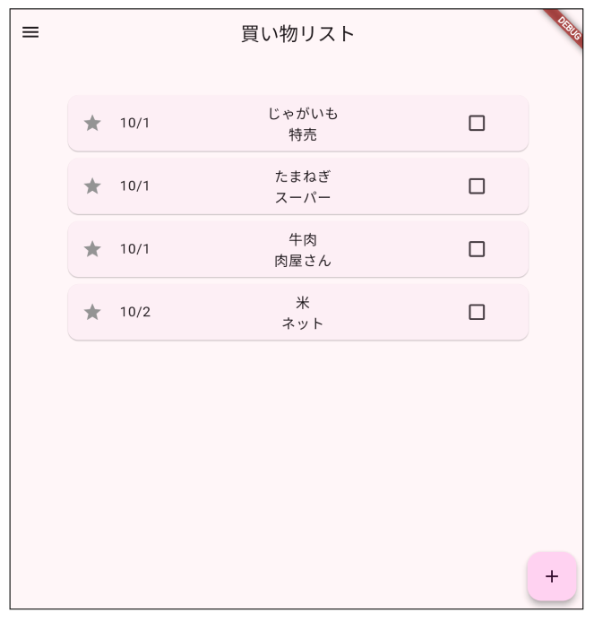
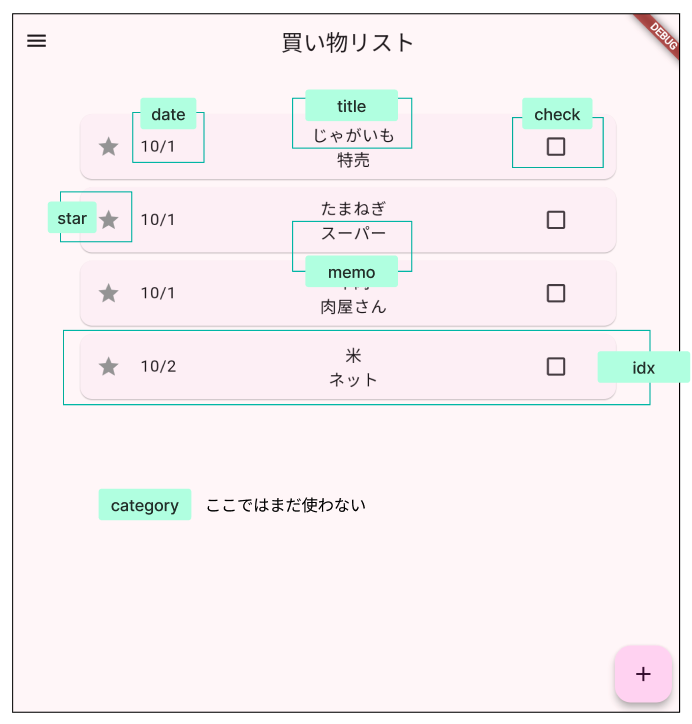
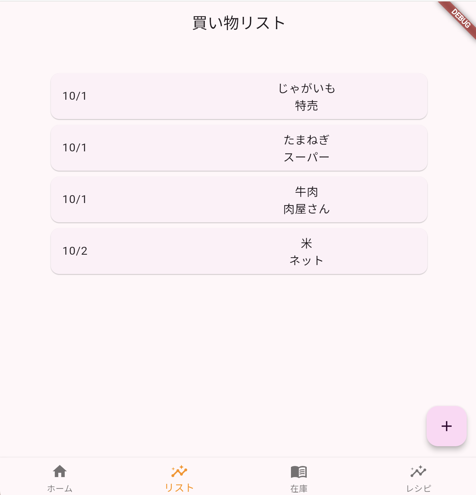
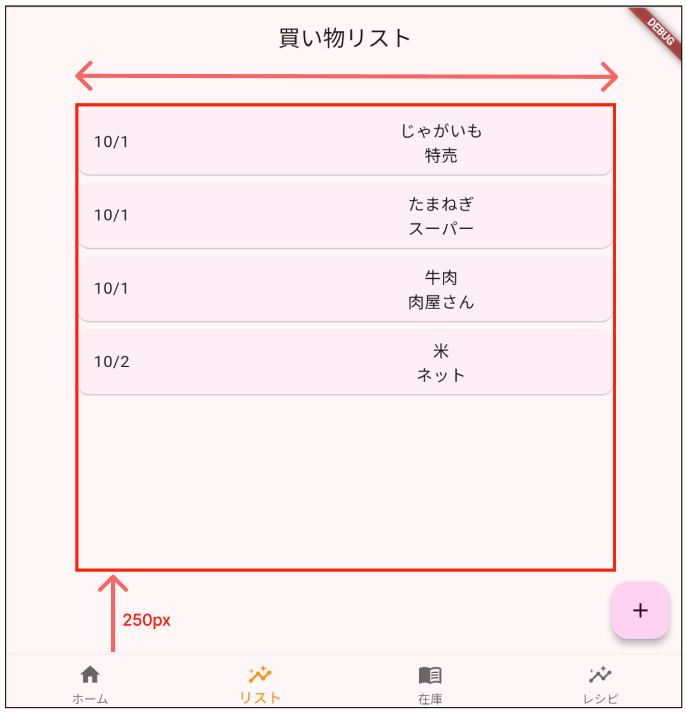

# Todoアプリを作ろう 02


## 実行結果



#### **変数設計**



### ①グループとフローティングボタンを追加

```Dart

class _TodoListPageState extends State<TodoListPage> {
  @override
  Widget build(BuildContext context) {
    return Scaffold(
      appBar: AppBar(
        title: Text("買い物リスト"),
      ),
      body: Center(
        //①グループを作る
        child: Column(children: [
          SizedBox(height: 20),
          Container(),
        ]),
      ),
      //①ボタンを作る
      floatingActionButton: FloatingActionButton(
        onPressed: () {},
        child: Icon(Icons.add),
      ),
    );
  }
}

```

### ②リストを表示

#### **日付・タイトル・メモ・ボタン**



#### **ダミーデータを使ってリスト表示**

**【config.dart】**

```dart

// 登録リスト(ダミーデータ)
// 一意の番号
// 日付
// タイトル
// メモ
// 種類
// 星
// 済み
List<Map<String, dynamic>> todoList = [
  {
    'idx': 0,
    'date': DateTime(2024, 10, 01, 0, 0, 0),
    'title': 'じゃがいも',
    'memo': '特売',
    'category': 2,
    'star': false,
    'check': false,
  },
  {
    'idx': 1,
    'date': DateTime(2024, 10, 01, 0, 0, 0),
    'title': 'たまねぎ',
    'memo': 'スーパー',
    'category': 2,
    'star': false,
    'check': false,
  },
  {
    'idx': 2,
    'date': DateTime(2024, 10, 01, 0, 0, 0),
    'title': '牛肉',
    'memo': '肉屋さん',
    'category': 1,
    'star': false,
    'check': false,
  },
  {
    'idx': 3,
    'date': DateTime(2024, 10, 02, 0, 0, 0),
    'title': '米',
    'memo': 'ネット',
    'category': 3,
    'star': false,
    'check': false,
  }
];

```

**【todo.dart】**

```dart

import 'config.dart';

```

### **③ブラウザの大きさを取得**



```dart

class _TodoListPageState extends State<TodoListPage> {
  double? _deviceWidth, _deviceHeight; //①ブラウザの横幅と高さ

  @override
  Widget build(BuildContext context) {
    // ③ブラウザの横幅、高さから　表示範囲を指定
    //横幅の80%
    _deviceWidth = MediaQuery.of(context).size.width * 0.8;
    //ブラウザの下から250上の位置まで
    _deviceHeight = MediaQuery.of(context).size.height - 250;


    return Scaffold(
      appBar: AppBar(
        title: Text("買い物リスト"),
      ),
      body: Center(
        child: Column(children: [
          SizedBox(height: 20),
          Container(
              // ③ブラウザの幅に合わせてサイズ設定
              width: _deviceWidth,
              height: _deviceHeight,
          ),
        ]),
      ),
      floatingActionButton: FloatingActionButton(
        onPressed: () {},
        child: Icon(Icons.add),
      ),
    );
  }
}


```

### **④日付、タイトル、メモ追加**

`container`の中に`ListView.builder`でリスト表示

```dart

class _TodoListPageState extends State<TodoListPage> {
  double? _deviceWidth, _deviceHeight; //①ブラウザの横幅と高さ

  @override
  Widget build(BuildContext context) {
    //ブラウザの横幅、高さから　表示範囲を指定
    //横幅の80%
    _deviceWidth = MediaQuery.of(context).size.width * 0.8;
    //ブラウザの下から250上の位置まで
    _deviceHeight = MediaQuery.of(context).size.height - 250;


    return Scaffold(
      appBar: AppBar(
        title: Text("買い物リスト"),
      ),
      body: Center(
        child: Column(children: [
          SizedBox(height: 20),
          Container(
              //ブラウザの幅に合わせてサイズ設定
              width: _deviceWidth,
              height: _deviceHeight,
              // ④リスト表示
              child: ListView.builder(
                  itemCount: todoList.length,
                  itemBuilder: (context, index) {
                    //カードWidgetで表示
                    return Card(
                      child: ListTile(
                        title: Row(
                          mainAxisAlignment: MainAxisAlignment.spaceBetween,
                          children: [
                            //日付
                            Container(
                                child: Text(
                                    '${todoList[index]["date"].month}/${todoList[index]["date"].day}')),
                            //タイトルとメモ
                            Container(
                              width: 300,
                              child: Column(
                                children: [
                                  Container(
                                      padding: EdgeInsets.only(left: 10),
                                      child: Text(todoList[index]["title"])),
                                  Container(
                                      padding: EdgeInsets.only(left: 10),
                                      child: Text(todoList[index]["memo"])),
                                ],
                              ),
                            ),
                          ],
                        ),
                      ),
                    );
                  })
                  ),
        ]),
      ),
      floatingActionButton: FloatingActionButton(
        onPressed: () {},
        child: Icon(Icons.add),
      ),
    );
  }
}


```

#### **⑤星、チェックボックス**

```dart

//省略

Container(
  // ブラウザの幅に合わせてサイズ設定
  width: _deviceWidth,
  height: _deviceHeight,
  // リスト表示
  child: ListView.builder(
    itemCount: todoList.length,
    itemBuilder: (context, index) {
      return Card(
        child: ListTile(
          title: Row(
            mainAxisAlignment: MainAxisAlignment.spaceBetween,
            children: [
              //⑤★のアイコン
              Container(
                child: Icon(Icons.star_outlined,
                    color: todoList[index]["star"]
                        ? Colors.red
                        : Colors.grey),
              ),
              //日付
              Container(
                  child: Text(
                      '${todoList[index]["date"].month}/${todoList[index]["date"].day}')),
              //タイトルとメモ
              Container(
                width: 300,
                child: Column(
                  children: [
                    Container(
                        padding: EdgeInsets.only(left: 10),
                        child: Text(todoList[index]["title"])),
                    Container(
                        padding: EdgeInsets.only(left: 10),
                        child: Text(todoList[index]["memo"])),
                  ],
                ),
              ),
              // ⑤チェックボックス
              Container(
                  width: 70,
                  child: Checkbox(
                      value: todoList[index]["check"],
                      onChanged: (value) {})),
            ],
          ),
        ),
      );
    }
  )
),

//省略

```

