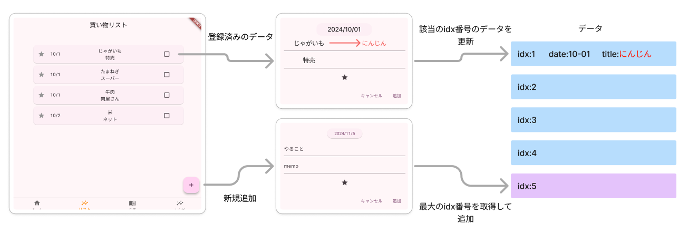
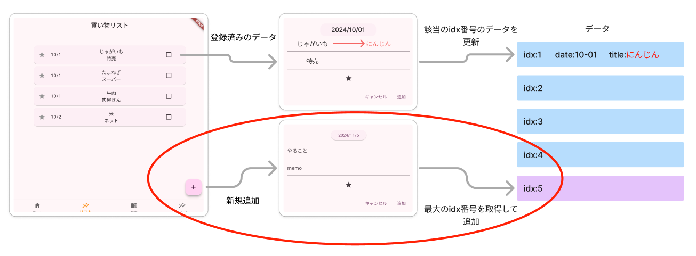
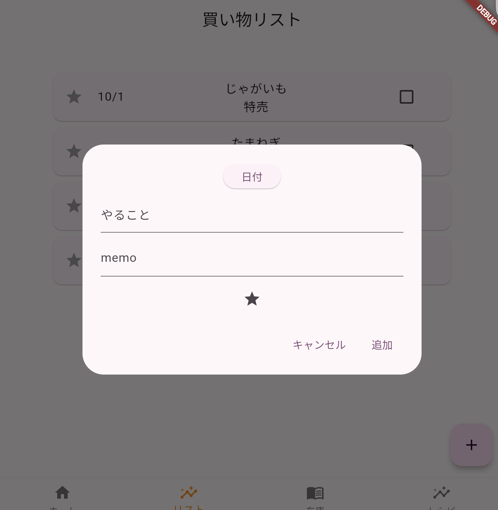
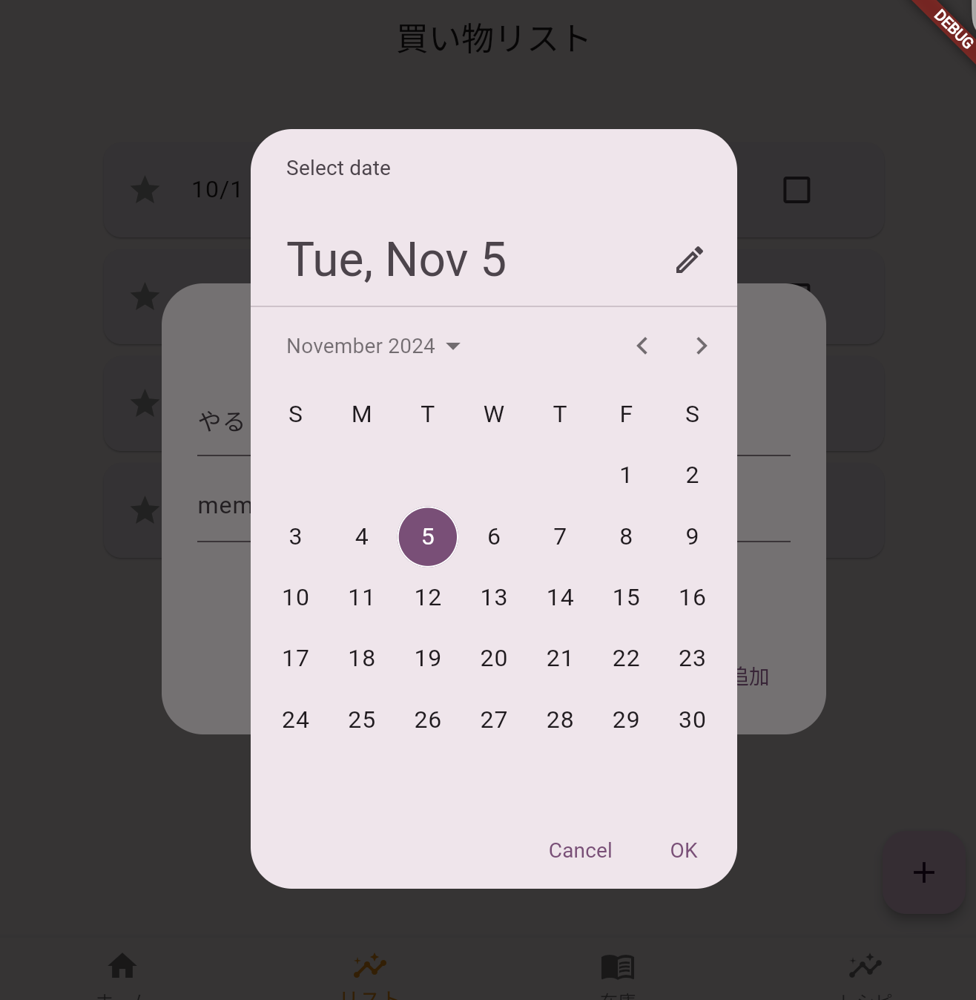
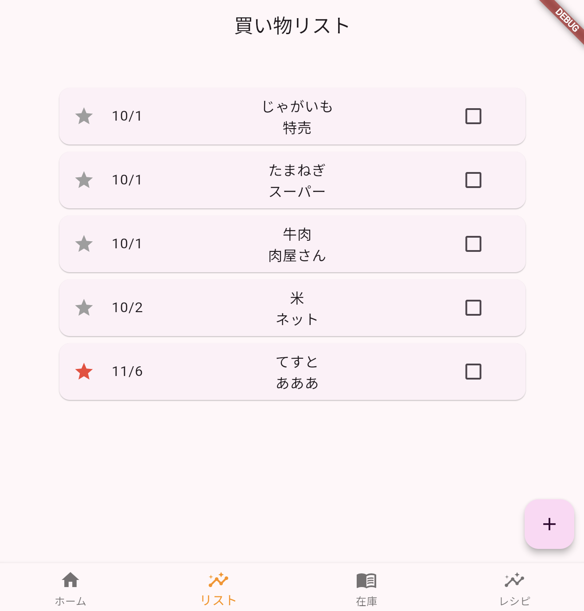

# Todoアプリを作ろう 03

## データフロー



新しくデータを追加する部分をつくろう



## 実行結果



### ①ダイアログ呼び出し（フローティングボタンから）

**【todolist.dart】**

```Dart

floatingActionButton: FloatingActionButton(
  onPressed: () {
    // ①追加
    showDialog(
        context: context,
        builder: (BuildContext context) {
          return DialogPage();
        });
  },
  child: Icon(Icons.add),
),

```

### ②ダイアログ表示

ダイアログ用のファイル【dialog.dart】を作成

**【todolist.dart】**

```dart
import 'package:flutter/material.dart';
import 'config.dart';
import 'dialog.dart'; //追加

```

**【dialog.dart】**

```dart

import 'package:flutter/material.dart';

class DialogPage extends StatefulWidget {
  const DialogPage({super.key});

  @override
  _DialogPageState createState() => _DialogPageState();
}

class _DialogPageState extends State<DialogPage> {
  @override
  Widget build(BuildContext context) {
    return AlertDialog(
      content: SingleChildScrollView(
        child: Column(
          children: [
            SizedBox(height: 10),
            Container(
              child: ElevatedButton(
                onPressed: () {},
                child: Text('日付'),
              ),
            ),
            SizedBox(height: 10),
            Container(
              width: 400,
              child: TextField(
                maxLines: 2,
                minLines: 1,
                decoration: InputDecoration(
                  labelText: 'やること',
                ),
                onChanged: (String value) {
                  setState(() {});
                },
              ),
            ),
            SizedBox(height: 10),
            Container(
              width: 400,
              child: TextField(
                maxLines: 2,
                minLines: 1,
                decoration: InputDecoration(
                  labelText: 'memo',
                ),
                onChanged: (String value) {
                  setState(() {});
                },
              ),
            ),
            SizedBox(height: 10),
            Container(
              child: IconButton(
                icon: Icon(Icons.star_outlined),
                onPressed: () {
                  setState(
                    () {},
                  );
                },
              ),
            ),
          ],
        ),
      ),
      actions: [
        TextButton(
          onPressed: () async {
            Navigator.of(context).pop();
          },
          child: Text('キャンセル'),
        ),
        TextButton(
          onPressed: () async {
            Navigator.of(context).pop("RTN");
          },
          child: Text('追加'),
        )
      ],
    );
  }
}

```

### ③日付表示



**【dialog.dart】**

```dart

class _DialogPageState extends State<DialogPage> {
  // ③今日の日付を設定
  DateTime _selectedDate = DateTime.now();

  // ③日付の取得
  Future<void> _selectDate(BuildContext context) async {
    // showDatePickerでカレンダーを表示
    final DateTime? picked = await showDatePicker(
      context: context,
      initialDate: _selectedDate, // 初期日付
      firstDate: DateTime(2020), // 選択可能な最初の日付
      lastDate: DateTime(2100), // 選択可能な最後の日付
    );

    // 日付を選んだら代入
    if (picked != null && picked != _selectedDate) {
      setState(() {
        _selectedDate = picked;
      });
    }
  }

  @override
  Widget build(BuildContext context) {
    return AlertDialog(
      content: SingleChildScrollView(
        child: Column(
          children: [
            SizedBox(height: 10),
            Container(
              child: ElevatedButton(
                onPressed: () {
                  //③関数呼び出し
                  _selectDate(context);
                },
                //③選択した日付を表示
                child: Text(
                    '${_selectedDate.year}/${_selectedDate.month}/${_selectedDate.day}'),
              ),
            ),
            SizedBox(height: 10),

//省略

```

### ④タイトル、メモ、星

データを変数に代入

**【dialog.dart】**

```dart

return AlertDialog(
      content: SingleChildScrollView(
        child: Column(
          children: [
            SizedBox(height: 10),
            Container(
              child: ElevatedButton(
                onPressed: () {
                  _selectDate(context);
                },
                child: Text(
                    '${_selectedDate.year}/${_selectedDate.month}/${_selectedDate.day}'),
              ),
            ),
            SizedBox(height: 10),
            Container(
              width: 400,
              child: TextField(
                maxLines: 2,
                minLines: 1,
                decoration: InputDecoration(
                  labelText: 'やること',
                ),
                onChanged: (String value) {
                  setState(() {
                    // ④データ書き換え
                    _title = value;
                  });
                },
              ),
            ),
            SizedBox(height: 10),
            Container(
              width: 400,
              child: TextField(
                maxLines: 2,
                minLines: 1,
                decoration: InputDecoration(
                  labelText: 'memo',
                ),
                onChanged: (String value) {
                  setState(() {
                    // ④データ書き換え
                    _memo = value;
                  });
                },
              ),
            ),
            SizedBox(height: 10),
            Container(
              child: IconButton(
                // ④追加
                icon: Icon(Icons.star_outlined,
                    color: _starchecked
                        ? Colors.red
                        : const Color.fromARGB(255, 182, 182, 182)),
                onPressed: () {
                  setState(
                    () {
                      // ④データ書き換え（!は「ではない」の意味 true→falseにfalse→trueに）
                      _starchecked = !_starchecked;
                    },
                  );
                },
              ),
            ),
          ],
        ),
      ),

```

### ⑤追加ボタン

データ登録関数を呼び出す

**【dialog.dart】**

```dart
actions: [
  TextButton(
    onPressed: () async {
      Navigator.of(context).pop();
    },
    child: Text('キャンセル'),
  ),
  TextButton(
    onPressed: () async {
      // ⑤登録関数
      await Entry();
      Navigator.of(context).pop("RTN");
    },
    child: Text('追加'),
  )
],
```

### ⑥データ登録

_selectDate関数の下にEntry関数を追加



**【dialog.dart】**

```dart

//パッケージをインポート
import 'dart:math';
import 'config.dart';

//省略

// 登録
  Future<void> Entry() async {
    int maxIdx = 0;

    // idx の最大値を取得（todoListにすでにデータがある場合）
    if (todoList.isNotEmpty) {
      maxIdx = todoList.map((element) => element['idx'] as int).reduce(max);
    }
    
    todoList.add({
      'idx': maxIdx + 1, //最大値+1
      'date': _selectedDate,
      'title': _title,
      'memo': _memo,
      'category': _category,
      'star': _starchecked,
      'check': _checked
    });

  }

```

### ⑦追加後画面再描画

**【todolist.dart】**

```dart

//⑦戻ってきたとき再描画
floatingActionButton: FloatingActionButton(
  onPressed: () async {
    var RtnText = await showDialog(
        context: context,
        builder: (BuildContext context) {
          return DialogPage();
        });
    if (RtnText != null) {
      setState(() {});
    }
  },
  child: Icon(Icons.add),
),

```
