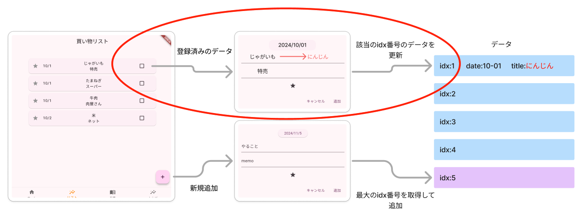
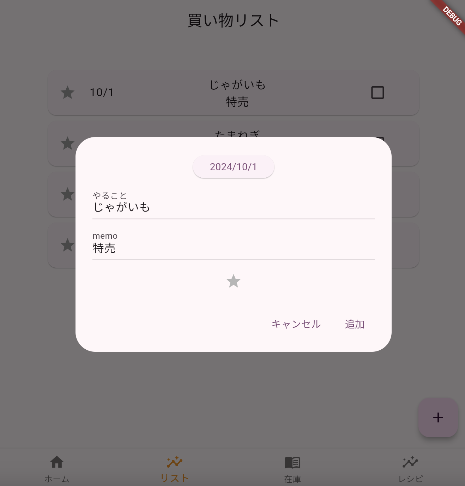
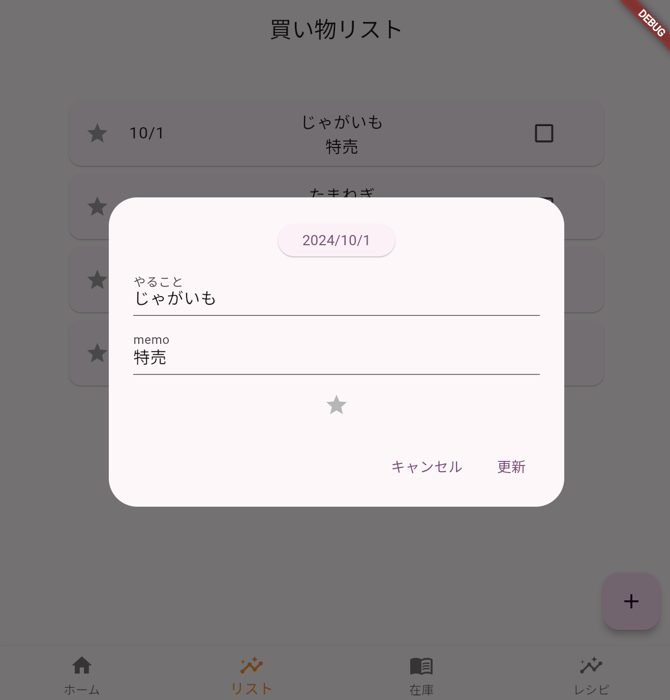
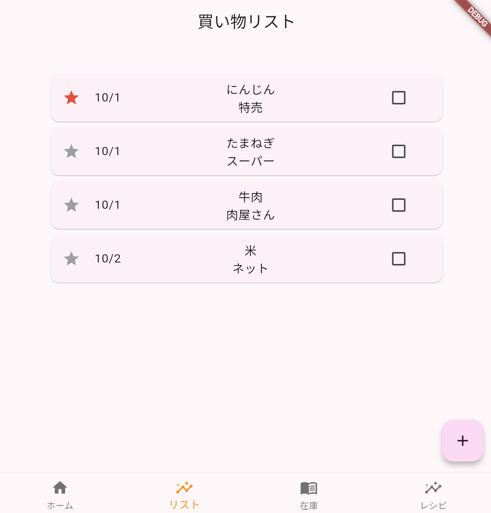

# Todoアプリを作ろう 04


登録されているリストを更新しよう



## 実行結果



### ①元々あるデータからダイアログ表示

**【todolist.dart】**

```Dart

child: ListView.builder(
    itemCount: todoList.length,
    itemBuilder: (context, index) {
      // ①GestureDetectorで要素をタップできるように
      // Cardを「child:Card・・・」にreturnの後に「GestureDetector」
      return GestureDetector(
        onTap: () async {
          var RtnText = await showDialog(
              context: context,
              builder: (BuildContext context) {
                return DialogPage();
              });
          if (RtnText != null) {
            setState(() {});
          }
        },
      child:Card(
        child: ListTile(
          //---省略
        ),
      ),
      );
    }
  )
),

```

登録済みのデータがダイアログに反映されない

### ②表示の切り替え

追加か更新かを判断する

更新の場合、選択したリストのidxの値をダイアログに渡す  
追加の場合はidx番号がないのでダミーのデータをダイアログに渡す

**【todolist.dart】**

**更新の時**
```dart

return GestureDetector(
  onTap: () async {
    var RtnText = await showDialog(
        context: context,
        builder: (BuildContext context) {
          //②idx番号を引数で渡す
          return DialogPage(todoList[index]["idx"]);
        });
    if (RtnText != null) {
      setState(() {});
    }
  },
  child: Card(
    child: ListTile(

```

**追加の時**

```dart

floatingActionButton: FloatingActionButton(
  onPressed: () async {
    var RtnText = await showDialog(
        context: context,
        builder: (BuildContext context) {
          // ②ダミーで-1を渡す
          return DialogPage(-1);
        });
    if (RtnText != null) {
      setState(() {});
    }
  },
  child: Icon(Icons.add),
),

```

**渡されたデータを受け取る**

**【dialog.dart】**

```dart

class DialogPage extends StatefulWidget {
  // ②コメントアウト
  // const DialogPage({super.key});
  // ②データを受け取る
  DialogPage(this._argidx);
  // ②型を指定
  int _argidx;

  @override
  _DialogPageState createState() => _DialogPageState();
}

```

### ③データ初期表示

**変数追加**

**【dialog.dart】**

```dart

class _DialogPageState extends State<DialogPage> {
  DateTime _selectedDate = DateTime.now();
  int _idx = 0;   // ③追加
  String _title = "";
  String _memo = "";
  int _category = 0;
  bool _starchecked = false;
  bool _checked = false;
  String _mode = ""; //③追加　  更新、追加を区別

  // ③コントローラーを使って初期値設定
  late TextEditingController _titleController;
  late TextEditingController _memoController;

```

**初期値設定**

```dart

//③初期表示データ
void initState() {
    // 受け取ったデータを初期値として代入
    _idx = widget._argidx;

    //更新か登録か名前をつけて区別する(_idxが-1のとき「新規」それ以外「更新)
    if (_idx == -1) {
      _mode = "NEW";
    } else {
      _mode = "UPD";

      // todoListから_idxの番号のデータを抽出(データがなかった場合は空のmapを返す)
      Map<String, dynamic>? result_todoData = todoList.firstWhere(
        (element) => element['idx'] == _idx,
        orElse: () => {},
      );

      // 抽出したデータを各項目に入れる(データがあるかどうか調べる、ある場合はデータ代入)
      if (result_todoData != null && result_todoData.isNotEmpty) {
        _selectedDate = result_todoData['date'];
        _title = result_todoData['title'];
        _memo = result_todoData['memo'];
        _category = result_todoData['category'];
        _starchecked = result_todoData['star'];
        _checked = result_todoData['check'];
      }
    }

    // 初期値設定
    _titleController = TextEditingController(text: _title);
    _memoController = TextEditingController(text: _memo);

    super.initState();
  }

```

**コントローラーで初期表示**

**titleのTextField**

```dart

Container(
  width: 400,
  child: TextField(
    controller: _titleController, //③追加
    maxLines: 2,
    minLines: 1,
    decoration: InputDecoration(
      labelText: 'やること',
    ),
    onChanged: (String value) {
      setState(() {
        _title = value;
      });
    },
  ),
),

```

**memoのTextField**

```dart

Container(
  width: 400,
  child: TextField(
    controller: _memoController, //③追加
    maxLines: 2,
    minLines: 1,
    decoration: InputDecoration(
      labelText: 'memo',
    ),
    onChanged: (String value) {
      setState(() {
        _memo = value;
      });
    },
  ),
),

```

### ④ボタンの切り替え

「追加」「更新」ボタンを`_mode`の値で切り替える



```dart

actions: [
  TextButton(
    onPressed: () async {
      Navigator.of(context).pop();
    },
    child: Text('キャンセル'),
  ),
  // ④ボタンの種類を変える
  _mode == "NEW"
      ? TextButton(
          onPressed: () async {
            await Entry();
            Navigator.of(context).pop("RTN");
          },
          child: Text('追加'),
        )
      : TextButton(
          onPressed: () async {
            Navigator.of(context).pop("RTN");
          },
          child: Text('更新'),
        )
],
```

### ⑤データを更新する

「更新」ボタンがおされたら`Update`関数を呼び出す

```dart

actions: [
  TextButton(
    onPressed: () async {
      Navigator.of(context).pop();
    },
    child: Text('キャンセル'),
  ),

  _mode == "NEW"
      ? TextButton(
          onPressed: () async {
            await Entry();
            Navigator.of(context).pop("RTN");
          },
          child: Text('追加'),
        )
      : TextButton(
          onPressed: () async {
            // ⑤更新関数
            await Update();
            Navigator.of(context).pop("RTN");
          },
          child: Text('更新'),
        )
],

```

**Update関数追加**

Entry関数の下に追加

```dart

// 更新
  Future<void> Update() async {
    // 該当データのインデックス番号を取得
    int index = todoList.indexWhere((todo) => todo['idx'] == _idx);

    if (index != -1) {
      todoList[index]['date'] = _selectedDate;
      todoList[index]['title'] = _title;
      todoList[index]['memo'] = _memo;
      todoList[index]['category'] = _category;
      todoList[index]['star'] = _starchecked;
      todoList[index]['check'] = _checked;
    }
  }

```



### ⑥todoListのダミーデータを削除する

空の状態から登録、更新ができることを確認しよう

```dart

List<Map<String, dynamic>> todoList = [
  // {
  //   'idx': 0,
  //   'date': DateTime(2024, 10, 01, 0, 0, 0),
  //   'title': 'じゃがいも',
  //   'memo': '特売',
  //   'category': 2,
  //   'star': false,
  //   'check': false,
  // },
  // {
  //   'idx': 1,
  //   'date': DateTime(2024, 10, 01, 0, 0, 0),
  //   'title': 'たまねぎ',
  //   'memo': 'スーパー',
  //   'category': 2,
  //   'star': false,
  //   'check': false,
  // },
  // {
  //   'idx': 2,
  //   'date': DateTime(2024, 10, 01, 0, 0, 0),
  //   'title': '牛肉',
  //   'memo': '肉屋さん',
  //   'category': 1,
  //   'star': false,
  //   'check': false,
  // },
  // {
  //   'idx': 3,
  //   'date': DateTime(2024, 10, 02, 0, 0, 0),
  //   'title': '米',
  //   'memo': 'ネット',
  //   'category': 3,
  //   'star': false,
  //   'check': false,
  // }
];

```
