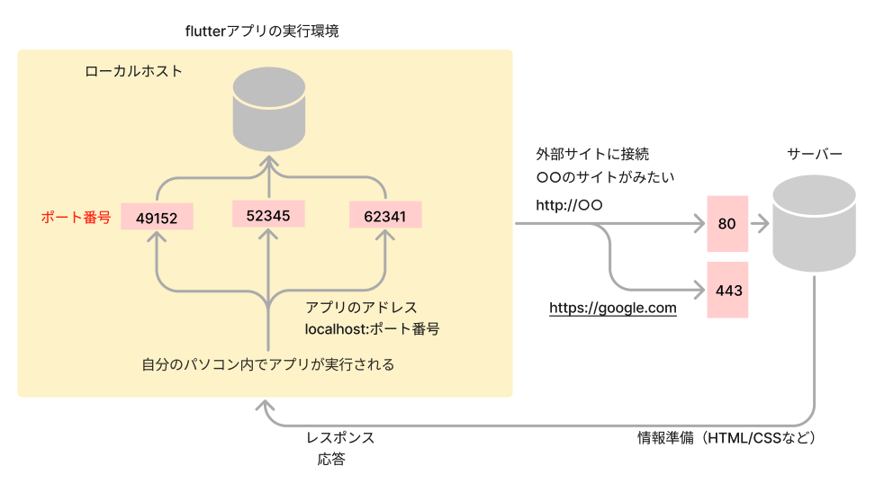
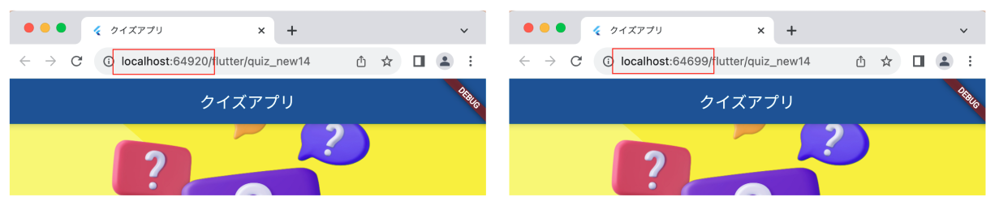
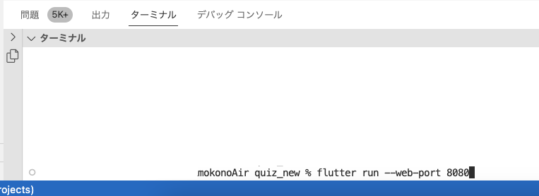
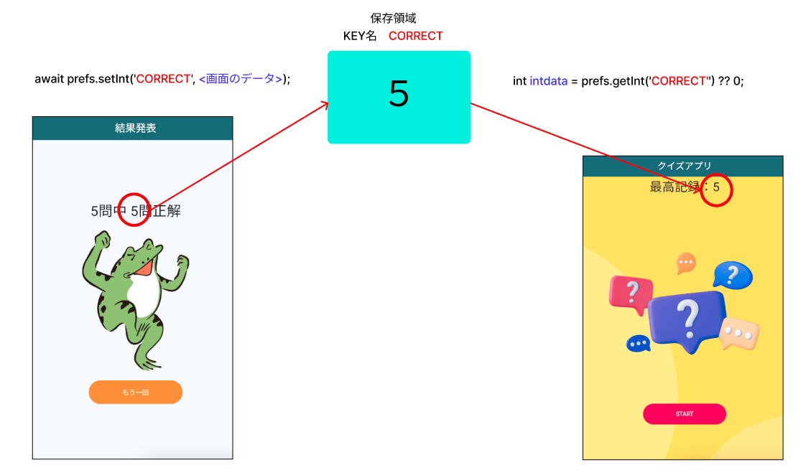
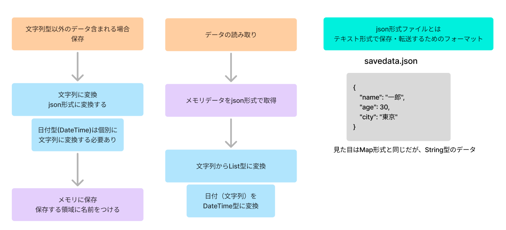

# Todoアプリを作ろう 05


**データを保存しよう**

## **shared_preferencesプラグインの使い方**

- [ ] アプリの実行環境について



自分のパソコン上でアプリが実行される（ローカルホスト接続）  
この時のURLは「localhost:ポート番号」となっていて、実行するたびにポート番号が変わります    
ポート番号・・・通信する時の出入口（処理を実行している部屋のようなイメージ）



<br>

shared_preferencesプラグインは、このポート番号で割り当てられたメモリ領域にデータを読み書きする機能です


### **アプリの実行方法**

実行する際はターミナルからポート番号を指定して実行します

- `VSCode＞ターミナル`　アプリのディレクトリを指定
- `flutter run --web-port 8080` として実行  
  


**launch.json**

- ポート番号の情報を追加することで、「実行とデバック」から実行可能です。

```dart

{
    "version": "0.2.0",
    "configurations": [
        {
            "name": "Flutter",
            "request": "launch",
            "type": "dart",
            "program": "lib/main.dart", // エントリーポイント
            "args": [
              "--web-port",
              "8080" // 指定したいポート番号
            ]
        }
    ]
}

```

<br>

### **shared_preferencesの仕組み** 



### **プラグインのインストール**  

pubspec.yaml
```dart

dependencies:
  flutter:
    sdk: flutter
  shared_preferences: ^2.2.2

```

自動でインストールされない場合  

```dart
flutter pub get
```

### **インポート**  
「import 'package:shared_preferences/shared_preferences.dart';」を追加

```dart

import 'package:shared_preferences/shared_preferences.dart';

```

### **データを保存する**

- [ ] Shared preferencesのインスタンスを取得する

```dart
final SharedPreferences prefs = await SharedPreferences.getInstance();
```

- [ ] int型のデータを保存する


```dart
await prefs.setInt('KEY_INT', 9999);
```

- [ ] String型のデータを保存する


```dart
await prefs.setString('KEY_STRING', 'HELLO');
```

- [ ] BOOL型のデータを保存する


```dart
await prefs.setBool('KEY_BOOL', true);
```

- [ ] double型のデータを保存する


```dart
await prefs.setDouble('KEY_DOUBLE', 1.2345);
```

- [ ] List型のデータを保存する  
  Listの型は必ず文字列型でなくてはならない  
  `List<String> `で宣言する

```dart
List<String> listdata = ['a','b'];
await prefs.getStringList('KEY_List', listdata);
```

### **データを読み取る（取り出す）**

- [ ] Shared preferencesのインスタンスを取得する

```dart
final SharedPreferences prefs = await SharedPreferences.getInstance();
```

- [ ] int型のデータを読み取る


```dart
 int intdata = prefs.getInt('KEY_INT') ?? 0;
```

- [ ] String型のデータを読み取る


```dart
 String stringdata = prefs.getString('KEY_STRING') ?? "";
```

- [ ] bool型のデータを読み取る


```dart
 bool booldata = prefs.getBool('KEY_BOOL') ?? true;
```

- [ ] double型のデータを読み取る


```dart
 double doubledata = prefs.getDouble('KEY_DOUBLE') ?? 0.0;
```

- [ ] List型のデータを読み取る


```dart
 double listdata = prefs.getStringList('KEY_List') ?? [];
```

### **List（文字列以外が含まれる）場合**

**Map型のListは文字列形式ではないので保存ができない**

全てのデータを文字列に変換して保存する




**①データSave関数**

```dart

Future<void> saveData_todoList() async {
  //日付型をString型に変換
  await DateToString(todoList);
  //SharedPreferences宣言
  SharedPreferences prefs = await SharedPreferences.getInstance();
  // JSON文字列に変換
  String jsonString = jsonEncode(todoList); 
  //キー「todoList」にデータ保存
  await prefs.setString('todoList', jsonString);
  await prefs.setString('maxindex', maxindex.toString());
  //日付を文字列から日付型に戻す
  await StringToDate(todoList);
}

```

**②日付型をString型に変換関数**

```dart

Future<void> DateToString(arglist) async {
  for (var item in arglist) {
    try {
      //キー「date」が存在し日付型だった場合
      if (item['date'] is DateTime) {
        // DateTimeをStringに変換
        item['date'] =
            (item['date'] as DateTime).toIso8601String(); 
      }
    } catch (e) {
      print('Error converting date: $e');
    }
  }
}

```

**③String型を日付型に戻す関数**

```dart

Future<void> StringToDate(arglist) async {
  for (var item in arglist) {
    try {
      //キー「date」が存在し文字列だった場合
      if (item['date'] is String) {
        // StringをDateTimeに変換
        item['date'] = DateTime.parse(item['date']); 
      }
    } catch (e) {
      print('Error converting date: $e');
    }
  }
}

```

**④日付型を含むデータの読み込み**

```dart

Future<void> load_todoList() async {
  SharedPreferences prefs = await SharedPreferences.getInstance();
  String? jsonString = prefs.getString('todoList'); // 保存されたJSON文字列を取得
  try {
    if (jsonString != null) {
      print(jsonString);
      List<dynamic> jsonResponse = jsonDecode(jsonString);
      todoList = jsonResponse.map((item) {
        // `item`をそのままコピーして特定のキーだけ変更
        return {
          ...item as Map<String, dynamic>, // `item`の全てのキーと値を展開
          'date': DateTime.parse(item['date']), // `date`キーだけDateTimeに変換
        };
      }).toList();
    } else {
      todoList = [];
    }
  } catch (e) {
    print('Error converting date: $e');
  }
}

```