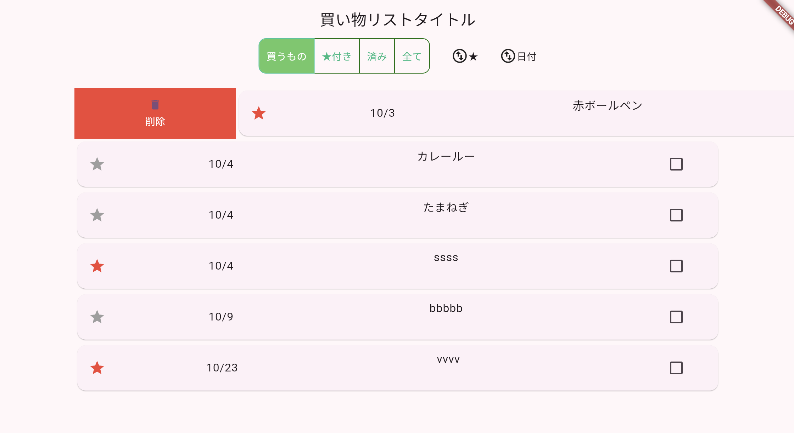

# Todoアプリを作ろう 07


**データ削除**



**①Slidable　widgetを追加**

**【pubspec.yaml】**

flutter_slidableパッケージを追加

```dart

flutter_slidable: ^3.1.2

```

**【todo.dart】**


```dart

import 'package:flutter_slidable/flutter_slidable.dart'; //⭐️追加


//省略

Container(
  width: _deviceWidth,
  height: _deviceHeight,
  child: ListView.builder(
      itemCount: displaylist.length,
      itemBuilder: (context, index) {
        //⭐️追加↓↓↓↓
        return Slidable(
          key: Key(displaylist[index]["idx"].toString()),
          // 左から右にスワイプして削除ボタンを表示
        startActionPane: ActionPane(
          extentRatio: 0.25,
          motion: ScrollMotion(),
          children: [
            SlidableAction(
              onPressed: (context) {
                setState(() {
                });
                ScaffoldMessenger.of(context).showSnackBar(
                  SnackBar(content: Text('削除しました')),
                );
              },
              backgroundColor: Colors.red,
              foregroundColor: Colors.white,
              icon: Icons.delete,
              label: '削除',
            ),
          ],
        ),
        //⭐️追加↑↑↑↑
        child: GestureDetector(//⭐️childにする
            onTap: () async {
              var RtnText = await showDialog(
                  context: context,
                  builder: (BuildContext context) {
                    return DialogPage(displaylist[index]['idx']);
                  });
              if (RtnText != null) {
                setState(() {});
              }
            },
            child: Card(
              child: ListTile(
                  title: Row(
                mainAxisAlignment: MainAxisAlignment.spaceBetween,
                children: [
                  Container(
                    child: Icon(Icons.star_outlined,
                        color: displaylist[index]['star']
                            ? Colors.red
                            : Colors.grey),
                  ),
                  Container(
                    child: Text(
                        '${displaylist[index]['date'].month}/${displaylist[index]['date'].day}'),
                  ),
                  Container(
                    width: 300,
                    child: Column(
                      children: [
                        Container(
                          padding: EdgeInsets.only(left: 10),
                          child:
                              Text(displaylist[index]['title']),
                        ),
                        Container(
                          padding: EdgeInsets.only(left: 10),
                          child: Text(displaylist[index]['memo']),
                        )
                      ],
                    ),
                  ),
                  Container(
                    width: 70,
                    child: Checkbox(
                        value: displaylist[index]['check'],
                        onChanged: (value) {}),
                  ),
                ],
              )),
            )
          )
        );//⭐️ )追加
      }
  ),
)
```

**②削除ボタン押下**

**【todo.dart】**

元データの削除と表示用データの削除

```dart

SlidableAction(
  onPressed: (context) {
    setState(() {
      Delete(displaylist[index]["idx"]); //⭐️追加
      displaylist.removeAt(index); //⭐️追加
    });
    ScaffoldMessenger.of(context).showSnackBar(
      SnackBar(content: Text('削除しました')),
    );
  },
  backgroundColor: Colors.red,
  foregroundColor: Colors.white,
  icon: Icons.delete,
  label: '削除',
),

```

**【datasave.dart】**

```dart

Future<void> Delete(idx) async {
  // 該当データのインデックス番号を取得
  int index = todoList.indexWhere((todo) => todo['idx'] == idx);

  todoList.removeAt(index);

  await saveData_todoList(todoList);
}

```