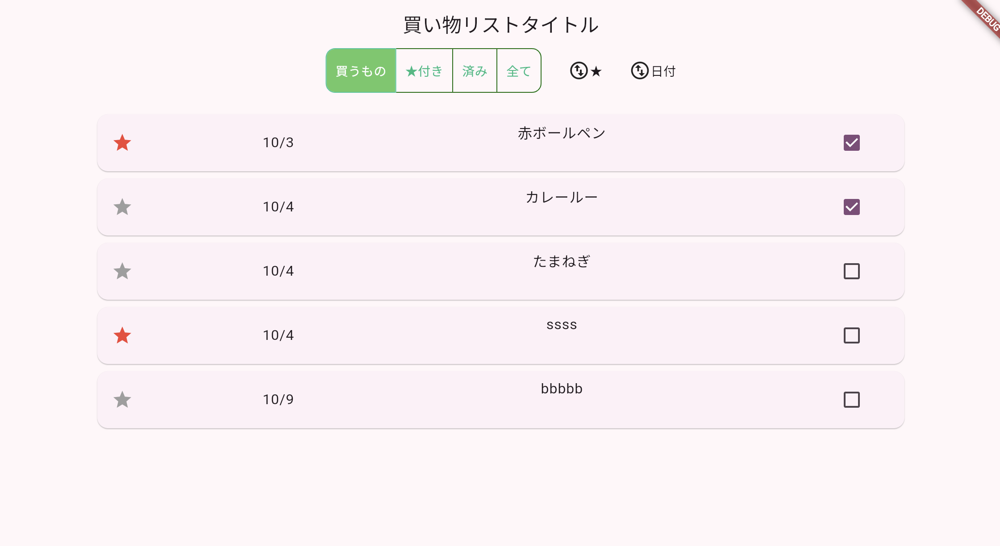
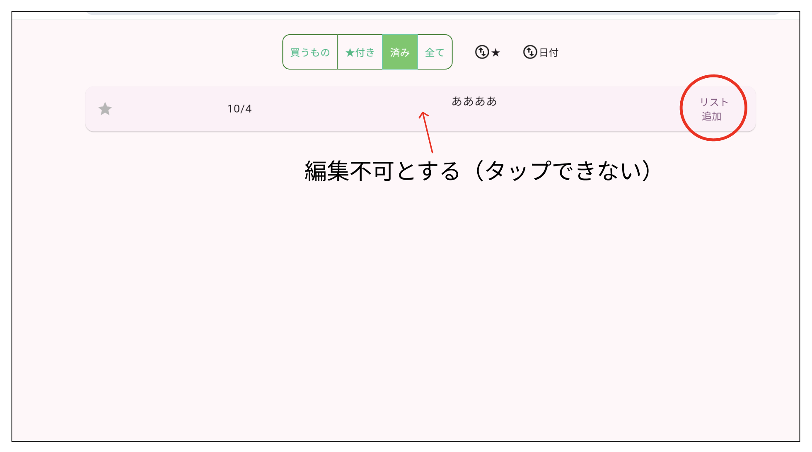

# Todoアプリを作ろう 08


**完了チェック**



**①チェック時の処理**

**【todo.dart】**


```dart

Container(
  width: 70,
  child: Checkbox(
      value: displaylist[index]['check'],
      onChanged: (value) async {
        displaylist[index]["check"] = value;
        await saveData_todoList(todoList);
        setState(() {
          _selectbutton = 0;
          _isState = List.generate(stateList.length, (index) => index == 0);
        });
      }),
),

```

**②完了データをストックデータに移す**

**【config.dart】**

```dart

// ストック管理用リスト
List<Map<String, dynamic>> stockList = [];

```

**【todo.dart】**

```dart

Container(
  width: 70,
  child: Checkbox(
      value: displaylist[index]['check'],
      onChanged: (value) async {
        displaylist[index]["check"] = value;
        await saveData_todoList(todoList);
        await stockupdate(displaylist[index]["idx"]);//⭐️追加
        setState(() {
          _selectbutton = 0;
          _isState = List.generate(stateList.length, (index) => index == 0);
        });
      }),
),

```

**【todo.dart】**

```dart

// チェックされたら該当のデータをストック用のリストに追加
Future<void> stockupdate(idx) async {
  print("stockupdate");
  //チェックされたデータを抽出
  var todo = todoList.firstWhere((todo) => todo['idx'] == idx, orElse: () => {});

  if (todo != null) {
    // ストック用のリストに追加
    stockList.add(todo);
    // 表示を最新にする
    displaylist = todoList.where((todo) => todo['check'] == false).toList();
  }

  await saveData_stockList();

  print("todoList===${todoList}");
  print("stockList===${stockList}");
}

```

**【datasave.dart】**

```dart

Future<void> saveData_stockList() async {
  await DateToString(stockList);
  SharedPreferences prefs = await SharedPreferences.getInstance();
  String jsonString = jsonEncode(stockList); // JSON文字列に変換
  await prefs.setString('stockList', jsonString);
  await StringToDate(stockList);
}


```

**③済データを元に戻す**



チェックデータは編集不可とする

**【todo.dart】**

```dart

//３項演算子で切り替える
//!displaylist[index]["check"]?【既存showDialog】:null

child: GestureDetector(
  onTap: !displaylist[index]["check"] //⭐️
      ? () async {
          var RtnText = await showDialog(
              context: context,
              builder: (BuildContext context) {
                return DialogPage(displaylist[index]['idx']);
              });
          if (RtnText != null) {
            setState(() {
              _selectbutton = 0;
              _isState = List.generate(stateList.length,(index) => index == 0);
            });
          }
        }
      : null,//⭐️
  child: Card(
    //省略
  ),
),

```

チェックとリスト追加の切り替え

**【todo.dart】**

```dart

Container(
  width: 70,
  child: !displaylist[index]["check"]//⭐️
      ? Checkbox(
          value: displaylist[index]["check"],
          onChanged: (value) async {
            displaylist[index]["check"] = value;
            await saveData_todoList(todoList);
            await stockupdate(
                displaylist[index]["idx"]);
            setState(() {
              _selectbutton = 0;
              _isState = List.generate(stateList.length,(index) => index == 0);
            });
          })
          //⭐️追加↓↓↓↓↓
      : TextButton(
          onPressed: () async {
            await readd(displaylist[index]["idx"]);
            setState(() {
              // 表示を最新にする
              displaylist = todoList
                  .where((todo) =>
                      todo['check'] == false)
                  .toList();
              _selectbutton = 0;
              _isState = List.generate(stateList.length,(index) => index == 0);
            });
          },
          child: Text("リスト\n 追加")),
),


```


**④チェックデータを元に戻す**

```dart

Container(
  width: 70,
  child: !displaylist[index]["check"]
      ? Checkbox(
          value: displaylist[index]['check'],
          onChanged: (value) async {
            displaylist[index]["check"] = value;
            await saveData_todoList(todoList);
            await stockupdate(
                displaylist[index]["idx"]);
            setState(() {
              _selectbutton = 0;
              _isState = List.generate(
                  stateList.length,
                  (index) => index == 0);
            });
          })
      : TextButton(
          onPressed: () async {
            await readd(displaylist[index]["idx"]); //⭐️追加
            setState(() {
              // 表示を最新にする
              displaylist = todoList
                  .where((todo) =>
                      todo['check'] == false)
                  .toList();
              _selectbutton = 0;
              _isState = [
                true,
                false,
                false,
                false
              ];
            });
          },
          child: Text("リスト\n 追加")),
),

```

**【datesave.dart】**

```dart

Future<void> readd(idx) async {
  int index = todoList.indexWhere((todo) => todo['idx'] == idx);
  if (index != -1) {
    Map<String, dynamic> newTodo = {
      'idx': index,
      'date': todoList[index]['date'],
      'title': todoList[index]['title'],
      'memo': todoList[index]['memo'],
      'star': false,
      'check': false, // checkをfalseにリセット
    };

    todoList[index] = newTodo;

    await saveData_todoList(todoList);
  }

  print("★todoList===${todoList}");
  print("★stockList===${stockList}");
}


```
