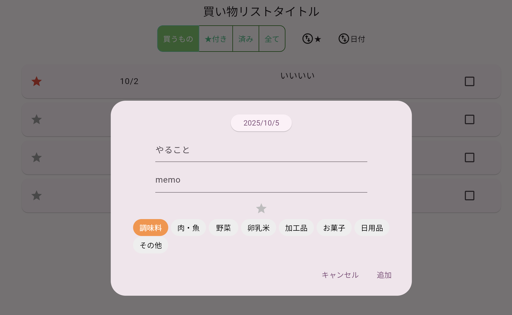

# Todoアプリを作ろう 09


**カテゴリを追加する**



**①カテゴリーデータ作成**

**【config.dart】**


```dart

import 'package:flutter/material.dart'; //⭐️追加

// カテゴリリスト
List<String> categorylist = [
  "調味料",
  "肉・魚",
  "野菜",
  "卵乳米",
  "加工品",
  "お菓子",
  "日用品",
  "その他",
  "全て"
];

const List<Color> categoryColor = [
  Color.fromARGB(255, 81, 81, 81),
  Color.fromARGB(255, 206, 141, 1),
  Color.fromARGB(255, 0, 172, 106),
  Color.fromARGB(255, 255, 153, 0),
  Color.fromARGB(255, 251, 252, 194),
  Color.fromARGB(255, 255, 86, 252),
  Color.fromARGB(255, 86, 120, 255),
  Color.fromARGB(255, 171, 71, 247),
  Color.fromARGB(255, 255, 235, 86),
];


```

**②ダイアログに選択肢追加**

**【dialog.dart】**

```dart

late TextEditingController _titleController;
late TextEditingController _memiContoroller;
List<bool> isSelected = List<bool>.filled(categorylist.length, false); //⭐️

void initState() {
    _idx = widget._argidx;

    if (_idx == -1) {
      _mode = 'NEW';
    } else {
      _mode = 'UPD';

      Map<String, dynamic>? result_todoDate = todoList.firstWhere(
        (element) => element['idx'] == _idx,
        orElse: () => {},
      );

      if (result_todoDate != null && result_todoDate.isNotEmpty) {
        _selectedDate = result_todoDate['date'];
        _title = result_todoDate['title'];
        _memo = result_todoDate['memo'];
        _category = result_todoDate['category'];
        _starchecked = result_todoDate['star'];
        _checked = result_todoDate['check'];
      }
    }

    _titleController = TextEditingController(text: _title);
    _memiContoroller = TextEditingController(text: _memo);

    //⭐️追加↓↓↓
    isSelected = List<bool>.filled(categorylist.length, false);
    if (_category != 99) {
      isSelected[_category] = true;
    }
    //⭐️↑↑↑

    super.initState();
  }

  //⭐️追加↓↓↓
  @override
  void dispose() {
    // コントローラを解放
    _listController.dispose();
    _memoController.dispose();
    super.dispose();
  }
  //⭐️↑↑↑


```

**【dialog.dart】**

```dart

Container(
    child: Wrap(
  spacing: 5,
  runSpacing: 1,
  children: List.generate(
    categorylist.length - 1,
    (index) => TextButton(
      style: ButtonStyle(
        backgroundColor: WidgetStateProperty.all(
          isSelected[index]
              ? Color.fromARGB(255, 254, 145, 61)
              : Colors.grey[200], // 選択状態に応じた背景色
        ),
      ),
      onPressed: () {
        setState(() {
          for (var i = 0; i < categorylist.length - 1; i++) {
            if (i == index) {
              isSelected[i] = true;
              _category = i;
            } else {
              isSelected[i] = false;
            }
          }
        });
      },
      child: Text(
        categorylist[index],
        style: TextStyle(
          color: isSelected[index]
              ? Colors.white
              : Colors.black, // 選択状態に応じた文字色
        ),
      ),
    ),
  ),
))

```
