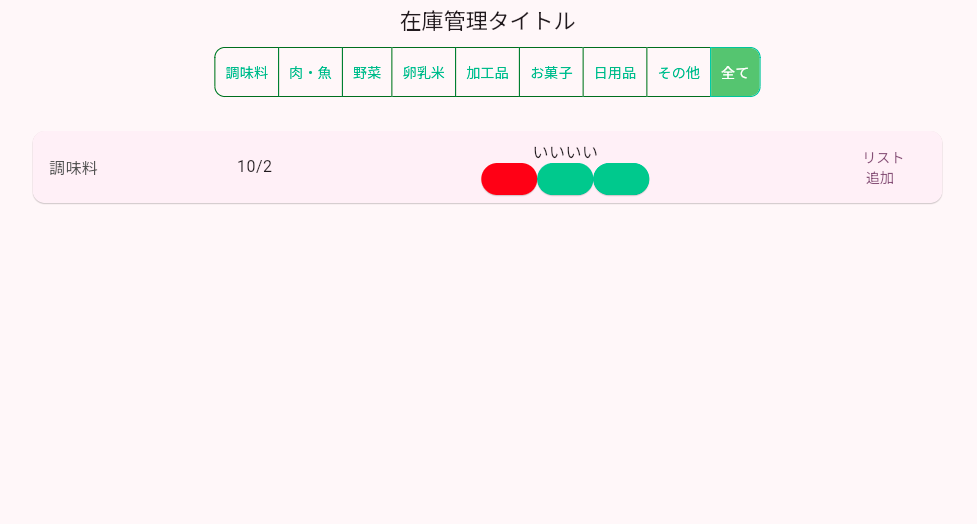

# Todoアプリを作ろう 10


**ストック画面を作る**



**①カテゴリーデータ作成**

**【stocklist.dart】**


```dart

import 'package:flutter/material.dart';
import 'package:flutter_slidable/flutter_slidable.dart';
import 'config.dart';
import 'dialog.dart';
import 'datesave.dart';

class StockListPage extends StatefulWidget {
  const StockListPage({super.key});
  @override
  _StockListPageState createState() => _StockListPageState();
}

class _StockListPageState extends State<StockListPage> {
  double? _deviceWidth, _deviceHeight; //ブラウザの横幅と高さ
  var _isCategory = List<bool>.filled(categorylist.length, false);
  var _selectbutton = 0;
  var _stocklist1 = [true, true, true];

  @override
  void initState() {
    super.initState();

    // 最初全てにチェック
    _isCategory[_isCategory.length - 1] = true;
    loadData();
  }

  Future<void> loadData() async {
    await load_stockList();

    setState(() {
      displaylist = stockList;
      print(displaylist);
    });
  }

  void DataSelect() {
    sort(stockList, "check");
    if (_selectbutton == categorylist.length - 1) {
      displaylist = stockList;
    } else {
      displaylist =
          stockList.where((todo) => todo['category'] == _selectbutton).toList();
    }
  }

  @override
  Widget build(BuildContext context) {
    _deviceWidth = MediaQuery.of(context).size.width * 0.8;
    _deviceHeight = MediaQuery.of(context).size.height - 250;

    return Scaffold(
      appBar: AppBar(
        title: Text('在庫管理タイトル'),
      ),
      body: Center(
        child: Column(
          children: [
            Row(
              mainAxisAlignment: MainAxisAlignment.center,
              children: [
                Container(
                  child: ToggleButtons(
                    color: Color.fromARGB(255, 30, 186, 128),
                    fillColor: Color.fromARGB(255, 104, 200, 101),
                    borderColor: Color.fromARGB(255, 0, 113, 4),
                    splashColor: Color.fromARGB(255, 171, 205, 159),
                    selectedBorderColor:
                        const Color.fromARGB(255, 40, 198, 151),
                    selectedColor: Colors.white,
                    borderRadius: const BorderRadius.all(Radius.circular(10)),
                    isSelected: _isCategory,
                    onPressed: (index) {
                      setState(() {
                        for (var i = 0; i < _isCategory.length; i++) {
                          if (i == index) {
                            _isCategory[i] = true; //選択の状態を更新
                            _selectbutton = index; //選択されたボタン
                          } else {
                            _isCategory[i] = false;
                          }
                        }
                        DataSelect();
                      });
                    },
                    children: [
                      for (var i = 0; i < categorylist.length; i++) ...{
                        Padding(
                          padding: EdgeInsets.all(10.0),
                          child: Text('${categorylist[i]}'),
                        ),
                      }
                    ],
                  ),
                ),
              ],
            ),
            SizedBox(height: 30),
            Container(
              width: _deviceWidth,
              height: _deviceHeight,
              child: ListView.builder(
                itemCount: displaylist.length,
                itemBuilder: (context, index) {
                  return Slidable(
                      key: Key(displaylist[index]["idx"].toString()),
                      // 左から右にスワイプして削除ボタンを表示
                      startActionPane: ActionPane(
                        extentRatio: 0.25,
                        motion: ScrollMotion(),
                        children: [
                          SlidableAction(
                            onPressed: (context) {
                              setState(() {
                                Delete(displaylist[index]["idx"]);
                                displaylist.removeAt(index);
                              });
                              ScaffoldMessenger.of(context).showSnackBar(
                                SnackBar(content: Text('削除しました')),
                              );
                            },
                            backgroundColor: Colors.red,
                            foregroundColor: Colors.white,
                            icon: Icons.delete,
                            label: '削除',
                          ),
                        ],
                      ),
                      child: GestureDetector(
                        onTap: !displaylist[index]
                                ["check"] // タップ可能な場合のみ onTap を設定
                            ? () async {
                                var RtnText = await showDialog(
                                    context: context,
                                    builder: (BuildContext context) {
                                      return DialogPage(
                                        displaylist[index]["idx"],
                                      );
                                    });
                                if (RtnText != null) {
                                  setState(() {});
                                }
                              }
                            : null,
                        child: Card(
                          child: ListTile(
                            title: Row(
                              mainAxisAlignment: MainAxisAlignment.spaceBetween,
                              children: [
                                Container(
                                  width: 50,
                                  child: Text(
                                    "${categorylist[displaylist[index]["category"]]}",
                                    style: TextStyle(
                                      color: categoryColor[displaylist[index]
                                          ["category"]],
                                    ),
                                  ),
                                ),
                                Container(
                                    child: Text(
                                        '${displaylist[index]["date"].month}/${displaylist[index]["date"].day}')),
                                Container(
                                  width: 300,
                                  child: Column(
                                    children: [
                                      Container(
                                          padding: EdgeInsets.only(left: 10),
                                          child: Text(
                                              displaylist[index]["title"])),
                                      Container(
                                        padding: EdgeInsets.only(left: 10),
                                        child: Row(
                                          mainAxisAlignment:
                                              MainAxisAlignment.center,
                                          children: [
                                            for (var i = 0; i < 3; i++) ...{
                                              ElevatedButton(
                                                  style: ButtonStyle(
                                                    backgroundColor:
                                                        WidgetStateProperty.all(
                                                            i == 0
                                                                ? Color
                                                                    .fromARGB(
                                                                        255,
                                                                        255,
                                                                        23,
                                                                        23)
                                                                : Color.fromARGB(
                                                                    255,
                                                                    15,
                                                                    203,
                                                                    134) // 選択状態に応じた背景色
                                                            ),
                                                  ),
                                                  onPressed: () {},
                                                  child: Text("")),
                                            }
                                          ],
                                        ),
                                      ),
                                    ],
                                  ),
                                ),
                                Container(
                                  width: 70,
                                  child: TextButton(
                                      onPressed: () async {
                                        await readd(displaylist[index]["idx"]);
                                        setState(() {});
                                      },
                                      child: Text("リスト\n 追加")),
                                ),
                              ],
                            ),
                          ),
                        ),
                      ));
                },
              ),
            ),
          ],
        ),
      ),
    );
  }
}


```
