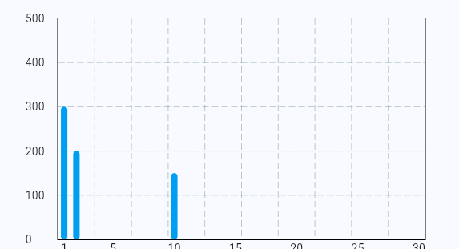

# **グラフを作る**



### **fl_chart インストール**


### **①設定**

**【pubspec.yaml】**

```dart

fl_chart: ^0.69.0

```

### **②コンポーネントをインポート**

**【XXX.dart】使いたいページのdart**

```dart

import 'package:fl_chart/fl_chart.dart';

```

### **③ダミーデータを作る**

**棒グラフのデータをリストの形式で作成**
  
```dart
class _GraphPageState extends State<GraphPage> {
  List<dynamic> data = [];

  @override
  void initState() {
    data = [300, 200, 0, 0, 0, 0, 0, 0, 0, 150, 0, 0, 0, 0, 0, 0, 0, 0, 0, 0, 0, 0, 0, 0, 0, 0, 0, 0, 0, 0];
    super.initState();
  }

  //省略
}

```

### **④グラフのベースを作る**  

**表示したい部分に追加**

```dart

Container(
  height: 300,
  width: 500,
  child: BarChart(
    BarChartData(
      titlesData: FlTitlesData(
        // グラフの下の単位
        bottomTitles: AxisTitles(
          sideTitles: SideTitles(
            showTitles: true,
            getTitlesWidget: (double value, TitleMeta meta) {
              // 1日〜30日をX軸のラベルに表示
              int day = value.toInt() + 1;
              if (day % 5 == 0 || day == 1 || day == 30) {
                // 5日ごとにラベル表示
                return Text(day.toString());
              }
              return const SizedBox(); // ラベルを間引く
            },
          ),
        ),
        // グラフの左の単位
        leftTitles: AxisTitles(
          sideTitles: SideTitles(
            showTitles: true,
            reservedSize: 40,
            getTitlesWidget: (double value, TitleMeta meta) {
              return Text(value.toInt().toString()); // Y軸ラベル
            },
          ),
        ),
        // グラフの上の単位（非表示）
        topTitles: AxisTitles(
          sideTitles: SideTitles(showTitles: false),
        ),
        // グラフの右の単位（非表示）
        rightTitles: AxisTitles(
          sideTitles: SideTitles(showTitles: false),
        ),
      ),
      // グラフの部分
      barGroups: List.generate(data.length, (index) {
        return BarChartGroupData(
          x: index, // X軸のインデックス
          barRods: [
            BarChartRodData(
              toY: data[index].toDouble(), // リストの値を棒の高さに適用
              color: Colors.blue, // 棒の色
            ),
          ],
        );
      }),
      maxY: 1000, // Y軸の最大値
      gridData: FlGridData(show: true), // グリッド線を表示
      borderData: FlBorderData(show: true),
      alignment: BarChartAlignment.spaceAround, // 棒グラフの配置
    ),
  ),
),
  

```
