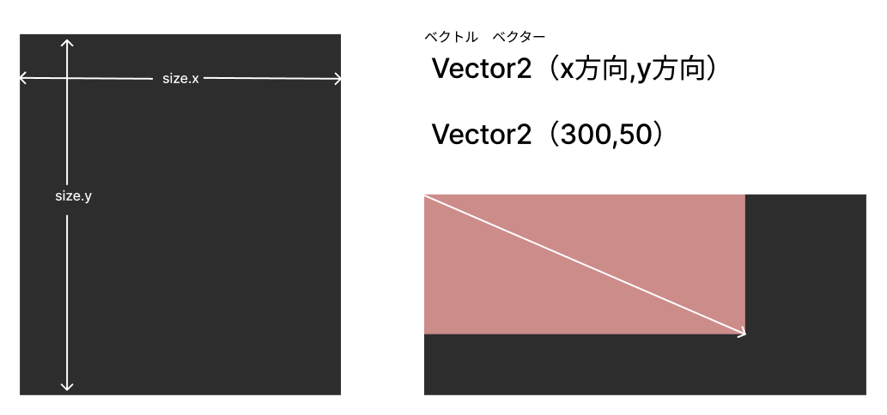
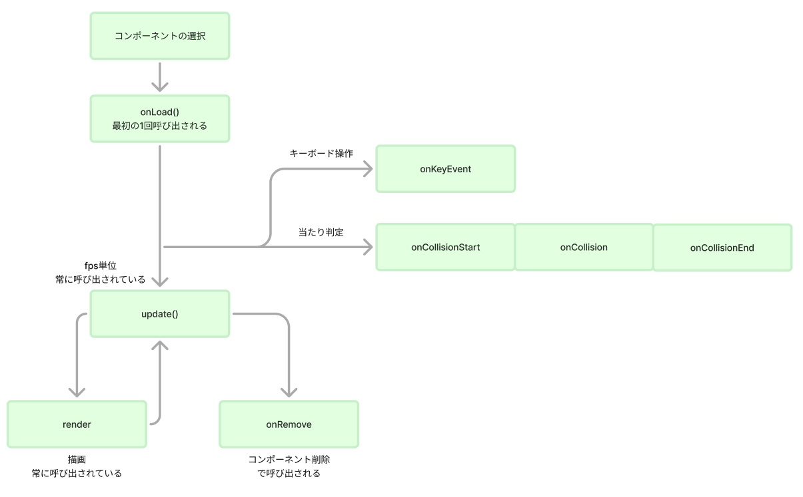
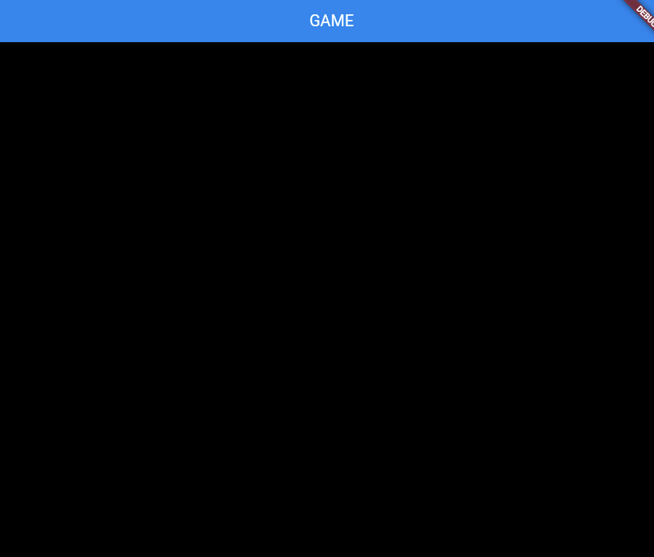
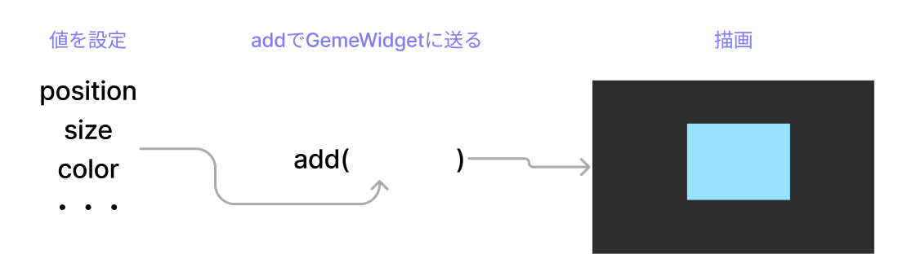

# **全ての機能をまとめる（背景の設置）**

## **game.dart**

### **最初に知っておくこと**

Flutter Flameにはゲーム制作のために必要な描画や動作を制御するコンポーネントが用意されています

（参考）https://flame.tnantoka.com/examples/hello/#hello

<br>

**画面の読み込み**

常に画面が読み込まれる  
PCのフレームレート(fps)の単位

（見てみよう！）https://flame.tnantoka.com/examples/lifecycle/#lifecycle

<br>

**画面サイズの取得と方向**



<br>

### **全体の流れを整理**


<br>

## **ベースを作る**

**①FlameGameコンポーネントを使う**

`onLoad()`関数は一番最初に呼び出される関数

<br><br>

【game.dart】
```dart

import 'package:flame/game.dart';
import 'package:flutter/material.dart';

class MainGame extends FlameGame {
  final BuildContext context;
  MainGame(this.context);

  @override
  Future<void> onLoad() async {
    await super.onLoad();
  }
}


```



<br><br>

## **背景を作る**

**②スクリーンのサイズ**

**【game.dart】**

game.dartの中でいろいろなパーツをつくるclassを呼び出す

```dart
import 'package:flame/game.dart';
import 'package:flutter/material.dart';
import 'screen.dart'; // ①

// ①スクリーンサイズを保持する変数
late Vector2 screenSize;

class MainGame extends FlameGame {
  final BuildContext context;
  MainGame(this.context);

  // ①スクリーンのサイズ変更（ブラウザの大きさ保存）
  @override
  void onGameResize(Vector2 size) {
    super.onGameResize(size);
    screenSize = size;
  }

  // 初期表示の設定
  @override
  Future<void> onLoad() async {
    await super.onLoad();

    // ②背景の設定
    await ScreenRemove();
  }

  // ②背景の描画
  Future<void> ScreenRemove() async {
    await add(BackScreen());
    await add(ground());
  }
}

```

### 【解説】  

**addでオブジェクトが作られる**




**【setting.dart】**

変数を設定、すべてのdartで使用する変数をまとめて設定します


```dart

import 'game.dart';

var Y_GROUND_POSITION = screenSize.y * 3 / 4;


```

**【screen.dart】**

背景を描画する

```dart

import 'package:flutter/material.dart';
import 'package:flame/components.dart'; //図形描画のためのコンポーネント
import 'game.dart'; //ゲームを制御するdart
import 'setting.dart'; //変数制御するdart

class BackScreen extends RectangleComponent with HasGameRef<MainGame> {
  @override
  Future<void> onLoad() async {
    position = Vector2(0, 0);
    size = Vector2(screenSize.x, screenSize.y);
    paint = Paint()..color = Color.fromARGB(255, 68, 185, 183);
  }

  @override
  Future<void> render(Canvas canvas) async {
    super.render(canvas);
  }
}

class ground extends RectangleComponent with HasGameRef<MainGame> {
  @override
  Future<void> onLoad() async {
    position = Vector2(0, Y_GROUND_POSITION);
    size = Vector2(screenSize.x, screenSize.y * 3 / 4);
    paint = Paint()..color = Color.fromARGB(255, 150, 83, 56);
  }

  @override
  Future<void> render(Canvas canvas) async {
    super.render(canvas);
  }
}


```

### 【解説】  

**RectangleComponent**  
四角形をつくるコンポーネント

https://flame.tnantoka.com/examples/rect/

<br>

**game.dartのMainGameクラスの情報を扱えるようにする**


classの定義の後ろにwithをつけて、別のコンポーネントを追加することができる（ミックスイン）


```dart

with HasGameRef<MainGame>

```

<br>

**使い方：gameRefをつける**

game.dartのMainGameクラスの情報を使う場合は`gameRef.`をつける
フィールドの横幅、高さは`FlameGame`widgetに含まれる

```dart

gameRef.size.x
gameRef.size.y

```

