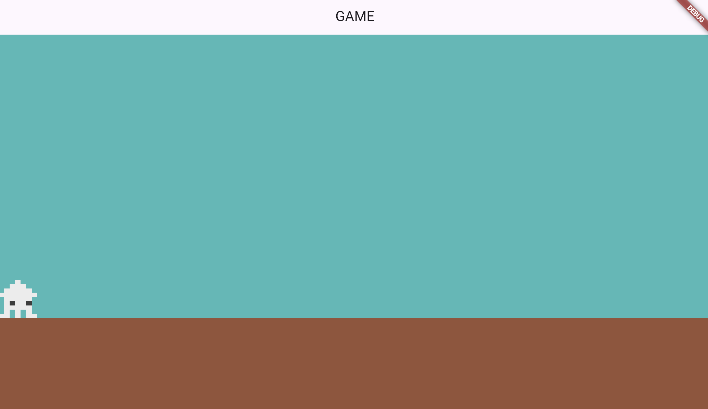
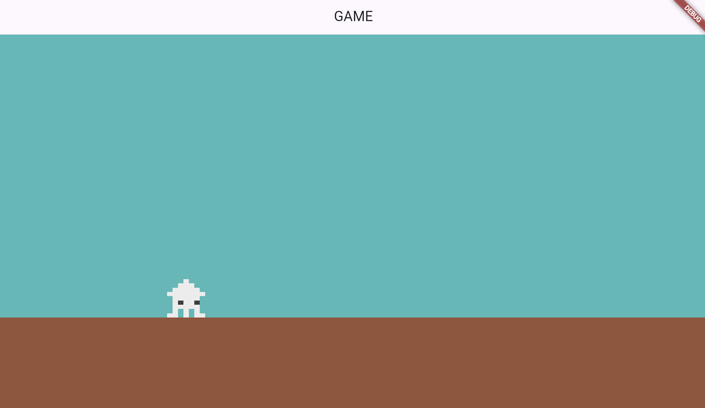

# **プレーヤーの表示**

## **geme.dart**

### **プレイヤーのクラスを呼び出す**

①プレイヤー描画  
②player.dartをimport

```dart

import 'package:flame/game.dart';
import 'package:flutter/material.dart';
import 'screen.dart';
import 'player.dart'; //②追加

// スクリーンサイズを保持する変数
late final Vector2 screenSize;

class MainGame extends FlameGame {
  final BuildContext context;
  MainGame(this.context);

  // スクリーンのサイズ変更（ブラウザの大きさ保存）
  @override
  void onGameResize(Vector2 size) {
    super.onGameResize(size);
    screenSize = size;
  }

  // 初期表示の設定
  @override
  Future<void> onLoad() async {
    await super.onLoad();

    // 背景の設定
    await ScreenRemove();
    // ①プレーヤーの設定
    await PlayerRemove();
  }

  // 背景の描画
  Future<void> ScreenRemove() async {
    await add(BackScreen());
    await add(ground());
  }

  // ①プレーヤーの描画
  Future<void> PlayerRemove() async {
    await add(Player());
  }
}


```

## **player.dart**



<br>

①スプライトの準備

`assets`フォルダを作成、その中に`images`フォルダを作成

<br>

**【pubspec.yaml】**

```dart

assets:
    - assets/images/

```

<br>

②スプライトの表示

**【setting.dart】**

```dart

var PLAYER_SIZE_X = 60.0;
var PLAYER_SIZE_Y = 60.0;

```

**【player.dart】**

```dart

import 'package:flame/components.dart';
import 'game.dart';
import 'setting.dart';

//プレーヤーの動きを制御
//---------------------------------------------------------------
class Player extends SpriteComponent with HasGameRef<MainGame> {
  @override
  Future<void> onLoad() async {
    sprite = await Sprite.load('ika2.png');
    size = Vector2(PLAYER_SIZE_X, PLAYER_SIZE_Y);
    position = Vector2(size.x / 2, Y_GROUND_POSITION - size.y / 2);
    anchor = Anchor.center;

    await super.onLoad();
  }
}

```

**【解説】**

**SpriteComponent**

画像を表示するためのwidget

**表示のために基本データを設定**

|  プロパティ  |  説明  | 使用方法  |
| :---- | :---- | ---- |
|  sprite  |  画像をロード  |  sprite = await Sprite.load('<画像ファイル名>');  |
|  size  |  画像のサイズ（x,y）  |  size = Vector2(<幅>, <高さ>);  |
|  position  |  表示位置（x,y）  |  position = Vector2(<X座標>, <Y座標>);  |
|  anchor  |  画像の基準位置  |  anchor = Anchor.center;<br>anchor = Anchor.topLeft;<br>anchor = Anchor.bottomLeft;<br>など |


<br>

## **プレーヤーを動かす（キーボード操作）**

**【game.dart】**

①パッケージ追加

```dart

import 'package:flame/input.dart';

```

②`HasKeyboardHandlerComponents`を追加

```dart

class MainGame extends FlameGame with HasKeyboardHandlerComponents {

```

<br>

**【player.dart】**

①パッケージ追加

```dart

import 'package:flutter/services.dart';

```

②`KeyboardHandler`を追加

```dart

class MySprite extends SpriteComponent with HasGameRef<MainGame>,KeyboardHandler {

```

③変数（移動量、スピード）

```dart

class MySprite extends SpriteComponent
    with HasGameRef<MainGame>, KeyboardHandler {

    
    Vector2 velocity = Vector2.zero();// ③移動量初期化
    final double moveSpeed = 200; // ③移動速度

    @override
    Future<void> onLoad() async {
      sprite = await Sprite.load('ika2.png');
      size = Vector2(PLAYER_SIZE_X, PLAYER_SIZE_Y);
      position = Vector2(size.x / 2, Y_GROUND_POSITION - size.y / 2);
      anchor = Anchor.center;

      await super.onLoad();
    }
```

④キーを検知して移動量追加

```dart

  // onLoad()の下に書く

  @override
  bool onKeyEvent(
    KeyEvent event,
    Set<LogicalKeyboardKey> keysPressed,
  ) {
    if (event is KeyDownEvent) {
      if (keysPressed.contains(LogicalKeyboardKey.arrowLeft)) {
        moveLeft();
      } else if (keysPressed.contains(LogicalKeyboardKey.arrowRight)) {
        moveRight();
      } else if (keysPressed.contains(LogicalKeyboardKey.space)) {
        jump();
      }
    } else if (event is KeyUpEvent) {
      stopMovement();
    }
    return true;
  }

  // 左移動
  void moveLeft() {
    velocity.x = -moveSpeed;
  }

  // 右移動
  void moveRight() {
    velocity.x = moveSpeed;
  }

  // ストップ
  void stopMovement() {
    velocity.x = 0;
  }

  // ジャンプ
  void jump() {}

```

⑤読み込み

```dart

//スプライトの更新
@override
  void update(double delta) {
    super.update(delta);

    position += velocity * delta;
  }

```

`delta`・・・PCのfps値、これを掛けることでPCのレートに合わせて動いてくれる  

<br>



<br>


【ソースコード】

【setting.dart】

```dart

import 'game.dart';

// 地上の位置
var Y_GROUND_POSITION = screenSize.y * 3 / 4;

// プレイヤーのサイズ
var PLAYER_SIZE_X = 60.0;
var PLAYER_SIZE_Y = 60.0;


```

【game.dart】

```dart

import 'package:flame/game.dart';
import 'package:flame/input.dart'; //①キーボード操作
import 'package:flutter/material.dart';
import 'screen.dart';
import 'player.dart';

// スクリーンサイズを保持する変数
late final Vector2 screenSize;

// ①キーボード操作
class MainGame extends FlameGame with HasKeyboardHandlerComponents {
  final BuildContext context;
  MainGame(this.context);

  // スクリーンのサイズ変更（ブラウザの大きさ保存）
  @override
  void onGameResize(Vector2 size) {
    super.onGameResize(size);
    screenSize = size;
  }

  // 初期表示の設定
  @override
  Future<void> onLoad() async {
    await super.onLoad();

    // 背景の設定
    await ScreenRemove();
    // プレーヤーの設定
    await PlayerRemove();
  }

  // 背景の描画
  Future<void> ScreenRemove() async {
    await add(BackScreen());
    await add(ground());
  }

  // プレーヤーの描画
  Future<void> PlayerRemove() async {
    await add(Player());
  }
}

```

【player.dart】

```dart

import 'package:flame/components.dart';
import 'package:flutter/services.dart';
import 'game.dart';
import 'setting.dart';

//アイテムの動きを作るクラス
//---------------------------------------------------------------

// ①キーボード操作（KeyboardHandler）
class Player extends SpriteComponent
    with HasGameRef<MainGame>, KeyboardHandler {
  // ①移動量
  Vector2 velocity = Vector2.zero();
  final double moveSpeed = 200; // 移動速度

  @override
  Future<void> onLoad() async {
    sprite = await Sprite.load('ika2.png');
    size = Vector2(PLAYER_SIZE_X, PLAYER_SIZE_Y);
    position = Vector2(size.x / 2, Y_GROUND_POSITION - size.y / 2);
    anchor = Anchor.center;

    await super.onLoad();
  }

  // ①キーボード操作
  @override
  bool onKeyEvent(
    KeyEvent event,
    Set<LogicalKeyboardKey> keysPressed,
  ) {
    if (event is KeyDownEvent) {
      if (keysPressed.contains(LogicalKeyboardKey.arrowLeft)) {
        moveLeft();
      } else if (keysPressed.contains(LogicalKeyboardKey.arrowRight)) {
        moveRight();
      } else if (keysPressed.contains(LogicalKeyboardKey.space)) {
        jump();
      }
    } else if (event is KeyUpEvent) {
      stopMovement();
    }
    return true;
  }

  // 左移動
  void moveLeft() {
    velocity.x = -moveSpeed;
  }

  // 右移動
  void moveRight() {
    velocity.x = moveSpeed;
  }

  // ストップ
  void stopMovement() {
    velocity.x = 0;
  }

  // ジャンプ
  void jump() {}

  // ①fps毎に動かす
  @override
  void update(double delta) {
    super.update(delta);

    position += velocity * delta;
  }
}


```